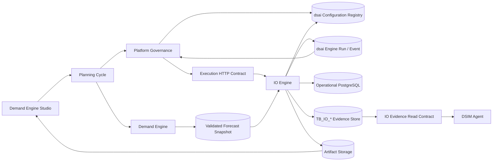
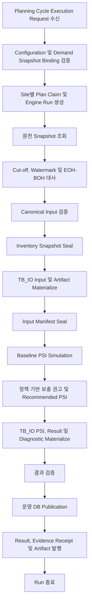

# DSIO Inventory Optimization Engine 목표 아키텍처

## 1. 문서 목적

본 문서는 기존 DB 프로시저 및 실행 프로그램에 포함된 재고 최적화 기능을 독립적인 Python 기반 IO Engine으로 전환하기 위한 목표 아키텍처와 구현 순서의 기준선이다.

주요 목적은 다음과 같다.

- Inventory Optimization의 업무 경계와 Supply Planning의 업무 경계 분리
- Demand Engine V3와 동일한 실행, 계약, Artifact, 추적 원칙 적용
- EngineStudio와 IO Engine 사이의 Control Plane 및 Execution Plane 분리
- Configuration의 버전 관리와 실행 시점 재현성 확보
- 기존 DB 프로시저를 단계적으로 Python UseCase로 전환하기 위한 Strangler 경로 정의

이 문서는 구현 완료 문서가 아니라 신규 프로젝트의 설계 기준 문서다. 계산식, 물리 테이블 매핑, 운영 배포 방식은 후속 분석과 검증을 거쳐 확정한다.

---

## 2. 현재 기준선

### 2.1 프로젝트 상태

- 현재 작업 디렉터리: `InventoryEngine`
- 목표 Repository 명칭: `DSIOInventoryOptimizationEngine`
- 현재 상태: 승인 Network 입력, Canonical·Cut-off·공통 PSI/행동 검증, 수학적 정책, 독립 합성 기반·ML/PPO와 0.8.0 안정성 검증을 구현했다. ML/PPO 성능 Gate 미달은 유지한다. 0.9.1 [Source 읽기/변환](IO_SOURCE_READ_CONTRACT.md)은 전체 로컬 검증 후 DB에 연결한다. [지정 Run 개발 DB 검증](IO_SOURCE_READ_VERIFICATION.md)은 0.9.0 당시 기록이다. 실제 Forecast 출력 봉인 Export·재고/정책 Source·전체 Runner·DB Evidence 저장은 후속
- Git 저장소: 미초기화 상태
- Python 패키지·테스트·Wheel 빌드: 구성 및 검증 완료. 배포와 공통 Runtime 연결은 미구성
- 기존 `main.py`와 연구 Notebook은 보존하며 Production 실행 경로로 사용하지 않음

2026-09-03 실제 구현·검증 상태와 우선순위는 [`IO_DEVELOPMENT_BASELINE.md`](IO_DEVELOPMENT_BASELINE.md), 이번 입력 경계의 상세 계약은 [`IO_NETWORK_INPUT_CONTRACT.md`](IO_NETWORK_INPUT_CONTRACT.md)를 따른다. 목표 설계의 계약 확정을 해당 서비스의 구현 완료로 해석하지 않는다. 특히 DSIM Agent와 조회 API는 아직 구현되지 않았다.

### 2.2 참조 아키텍처

Demand Engine V3의 다음 원칙을 참조 기준으로 사용한다.

- Python Runner가 전체 Pipeline과 단계 전이 소유
- PostgreSQL은 원천 조회, 실행 상태 저장, 결과 발행을 담당하는 Adapter
- 실행별 입력, 중간 결과, 최종 결과의 Run-scoped Artifact 관리
- Manifest 및 Hash를 통한 입력과 Configuration 재현성 확보
- Plan Claim, Idempotency, Unit of Work를 통한 중복 실행 방지
- Engine 계산과 Platform 운영 기능의 명확한 분리

참조 구현:

- `DemandEngine/src/run_demand/full_pipeline.py`
- `DemandEngine/docs/demand_engine_v3/architecture/05_start_to_end_architecture.md`

### 2.3 기존 IO 기준선

기존 구현은 DB 전처리 프로시저, `TB_ENG_*` 계열 중간 테이블, PSI 처리, 최적화 처리, 후처리 및 운영 DB 반영으로 구성된 것으로 파악된 상태다.

현재까지 확인된 핵심 특징은 다음과 같다.

- DB 프로시저가 Plan 상태 변경, 로그, 데이터 초기화, 중간 데이터 생성까지 수행
- 여러 하위 프로시저가 Engine 입력용 `TB_ENG_*` 데이터를 구성
- PSI와 최적화 계산이 DB에서 생성된 중간 테이블에 의존
- 프로시저 내부의 업무 규칙과 단순 데이터 변환이 혼재

하위 프로시저별 계산식과 전체 물리 테이블 매핑은 별도 역공학 결과로 확정해야 한다.

누적 역공학 결과는 [`IO_LEGACY_INBOUND_PROCEDURE_CHARACTERIZATION.md`](IO_LEGACY_INBOUND_PROCEDURE_CHARACTERIZATION.md)에서 관리한다.

향후 Multi-Echelon 확장과 Network Master·Neo4j Projection 계약은 [`IO_MULTI_ECHELON_NETWORK_CONTRACT.md`](IO_MULTI_ECHELON_NETWORK_CONTRACT.md)에서 별도로 관리한다.

---

## 3. 범위 정의

### 3.1 포함 범위

- Demand Forecast 결과 수신 및 Snapshot 고정
- 재고, 입출고, 발주, 리드타임, 자재 정책 데이터 준비
- 기간별 PSI 재고 흐름 시뮬레이션
- 안전재고, ROP, 목표 재고 및 정책 기반 보충 수량 계산
- 공통 PSI와 Source 제약을 사용하는 MATHEMATICAL/PREDICTIVE_ML/DEEP_RL 전략 지원. 실제 정책 산출기·모델 학습·운영 활성화는 단계별 검증
- 최적화 결과 검증 및 운영 DB 발행
- 실행 이력, 단계별 Event, Artifact, 오류와 진단 정보 생성
- Run별 입력 Snapshot, PSI 중간결과, 정책 계산과 권고 근거를 `TB_IO_*`에 적재
- DSIM Inventory Management Agent가 근거 설명과 의사결정 지원에 사용할 수 있는 IO 조회 계약 제공
- `POSM`과 `TGSM`을 Plan Type별 Adapter로 동시 지원
- 한 Run은 하나의 `site_cd`만 Claim하고 해당 Site의 Forecast·재고·정책을 계산
- Demand Engine Studio의 Planning Cycle에서 확정한 Demand Run, Forecast Snapshot, Calendar와 Master Revision을 소비
- EngineStudio에서 관리되는 Configuration 적용

### 3.2 제외 범위

- 수요예측 모델 학습 및 Forecast 생성
- 생산계획 및 생산 Capacity 최적화
- Site 내부 생산 Route, Resource, Capacity, BOM과 BOR를 이용한 공급 실행 가능성 계산
- 공급업체 Allocation과 조달 네트워크 최적화
- 운송 및 물류 네트워크 최적화
- Site 간 재고 이동과 Multi-echelon 최적화
- Legacy `TB_ENG_*` 중간 입력 Schema의 1:1 재생성
- 포괄적인 Supply Planning 전체 기능
- EngineStudio UI 및 Platform Governance 자체 구현

향후 공급계획 기능이 확대되면 IO Engine을 Supply Engine의 하위 Capability로 편입할 수 있으나, 초기 프로젝트 범위는 Inventory Optimization으로 제한한다.

---

## 4. 핵심 아키텍처 결정

### 4.1 프로젝트 및 패키지 명칭

- Repository 명칭: `DSIOInventoryOptimizationEngine`
- Python 최상위 패키지: `dsio_inventory_engine`
- Engine 식별자: `dsio.inventory-optimization`

Python 표준 라이브러리 `io`와의 충돌 방지를 위해 최상위 패키지에 `io` 단독 명칭을 사용하지 않는다.

### 4.2 구조 선택

전역 `domain/service/repository` 디렉터리 중심의 계층형 구조보다 기능별 Vertical Slice 구조를 적용한다.

선택 근거:

- 입력 준비, PSI, 최적화, 발행 단계의 변경 주기 분리
- 단계별 독립 테스트와 교체 가능성 확보
- DB 프로시저를 작은 UseCase 단위로 점진 전환 가능
- 계산 모듈과 저장 기술의 의존성 역전 가능
- 기능 단위 소유권과 장애 범위 명확화

각 Capability 내부에는 `domain`, `application`, `ports` 경계를 두고 외부 기술 구현은 `infrastructure`에 배치한다.

### 4.3 시스템 경계



- EngineStudio: Engine 등록, 권한 검증, Configuration 편집·발행, 실행 요청, 결과 조회를 담당하는 Control Plane
- IO Engine: Demand Engine과 동일하게 Run ID 생성, Plan Claim, Run Lifecycle, 입력 준비, PSI, 최적화, 결과 발행을 수행하는 Execution Plane
- Configuration: Control Plane에서 확정하고 IO Engine이 검증하는 버전형 실행 계약
- PostgreSQL `dsai`: Engine Registry, 승인된 Configuration Revision, Planning Cycle, Engine Run, append-only Run Event와 Outbox의 권위 데이터
- PostgreSQL `dsdm`: Demand Plan, Forecast Snapshot과 Demand 평가 결과의 업무 데이터
- PostgreSQL `dsim`: IO Plan, BOH, 입고예정, 재고정책, 보충 권고와 `TB_IO_*` Evidence의 업무 데이터
- PostgreSQL `dsim.TB_IO_*`: Run별 입력, 중간 계산, 결과와 근거를 조회 가능한 형태로 보존하는 IO 전용 Evidence Store
- Artifact Storage: 실행별 입력, 중간 결과, 최종 결과와 진단 정보 저장소
- IO Evidence Read Contract: DSIM과 EngineStudio에 물리 테이블 변경을 노출하지 않는 Read-only View 또는 Query API

IO Engine은 승인된 `dsai` 실행·설정 Schema와 IO 업무 Schema만 Adapter를 통해 조회하고 기록한다. EngineStudio 애플리케이션 내부 테이블과 UI Projection에는 의존하지 않으며, EngineStudio 역시 IO 계산 로직을 포함하지 않는다.

`TB_IO_*`는 Legacy `TB_ENG_*`의 이름만 바꾼 호환 계층이 아니다. IO Domain의 Canonical Grain과 Run Lineage를 기준으로 새로 설계하며, DSIM은 가능한 한 안정된 Read Contract를 통해 조회한다.

### 4.4 Schema 소유권과 물리 배치

`dsdm`과 `dsim`의 Schema 분리는 유지한다. `plan_source`를 의미 Key로 바꾸는 결정은 이 분리를 없애는 것이 아니라, 공통 실행 계층이 특정 물리 Table 이름에 결합되는 것을 막기 위한 것이다.

| Schema | 소유 책임 | 대표 데이터 |
|---|---|---|
| `dsai` | 공통 Engine Control Plane | Engine Registry, Configuration, Planning Cycle, Run, Event, Audit, Outbox |
| `dsdm` | Demand 업무 Domain | Demand Plan, Forecast, Demand Snapshot, 평가 결과 |
| `dsim` | Inventory 업무 Domain | IO Plan, BOH, 입고예정, 재고정책, `TB_IO_*` Evidence, 보충 권고 |

초기 목표 배치는 세 Schema를 **하나의 PostgreSQL Database 안에 분리**하는 방식이다.

```text
PostgreSQL Database
├── dsai  - 공통 실행과 통제
├── dsdm  - Demand 업무 데이터
└── dsim  - Inventory 업무 데이터
```

이 배치는 Schema별 소유권과 권한을 분리하면서도 다음을 가능하게 한다.

- `dsai` Run과 `dsim` IO Plan 사이의 Cross-schema FK
- Plan Claim, Attempt 할당, Run 생성과 첫 Event 기록의 단일 Unit of Work
- Demand Snapshot과 IO 입력 Binding의 일관된 조회
- Domain 업무 Table과 공통 실행 Table의 Lifecycle 분리

향후 `dsai`, `dsdm`, `dsim`을 서로 다른 PostgreSQL Database로 분리하면 Cross-database FK와 단일 Transaction을 전제로 할 수 없다. 이 경우에는 Outbox/Inbox, 보상 처리와 Reconciliation 계약을 별도 ADR로 확정한 뒤 전환한다.

### 4.5 논리 Plan Source 계약

공통 Run의 `plan_source_key`는 물리 Relation 이름이 아니라 **입력 Plan의 의미와 해석 계약을 나타내는 안정된 Key**다. 예를 들면 다음과 같다.

| `engine_key` | `plan_source_key` | Resolver Adapter | 현재 물리 Source 예시 |
|---|---|---|---|
| `demand` | `demand.forecast_plan` | `DsdmForecastPlanAdapter` | `dsdm.tb_pln_fcst` |
| `inventory-optimization` | `inventory.optimization_plan` | `DsimInventoryPlanAdapter` | `dsim`의 IO Plan Table |

물리 Table이 Partition, View 또는 신규 Version Table로 변경돼도 의미 계약이 같으면 Run 계약은 유지되고 Adapter와 Source Contract Version만 변경된다. 따라서 `dsdm`과 `dsim`의 역할 분리는 물리 저장 위치에서, `plan_source_key`는 공통 실행 계층과 Domain Adapter 사이의 의미 계약에서 각각 작동한다.

---

## 5. 목표 소스 구조

다음은 전체 목표 구조다. 실제 구현에는 Network 입력 준비, Canonical·Cut-off, 단일 Site Baseline/Recommended PSI, 수학적 정책, 독립 합성 기반과 생산 전략 평가 Adapter가 포함된다. 전체 Runner·저장/Publication과는 구분하며 실제 파일·미구현 단계는 개발 기준선을 따른다.

```text
DSIOInventoryOptimizationEngine/
├── pyproject.toml
├── README.md
├── .env.example
├── configs/
│   ├── application.yaml
│   └── replenishment_policy.example.yaml
├── schemas/
│   ├── engine_manifest.schema.json
│   ├── io_configuration.schema.json
│   └── dsim_evidence_contract.schema.json
├── src/
│   └── dsio_inventory_engine/
│       ├── __init__.py
│       ├── __main__.py
│       ├── bootstrap/
│       │   ├── settings.py
│       │   └── composition.py
│       ├── entrypoints/
│       │   ├── cli.py
│       │   ├── execution_api.py
│       │   ├── evidence_api.py
│       │   └── worker.py
│       ├── platform_contracts/
│       │   ├── engine_manifest.py
│       │   ├── execution_request.py
│       │   ├── execution_event.py
│       │   └── execution_result.py
│       ├── inventory_contracts/
│       │   ├── commands.py
│       │   ├── snapshots.py
│       │   ├── artifacts.py
│       │   └── results.py
│       ├── configuration/
│       │   ├── domain/
│       │   ├── application/
│       │   └── ports/
│       ├── run_inventory/
│       │   ├── domain/
│       │   ├── application/
│       │   └── ports/
│       ├── inventory_evidence/
│       │   ├── domain/
│       │   ├── application/
│       │   └── ports/
│       ├── prepare_inventory/
│       │   ├── domain/
│       │   ├── application/
│       │   └── ports/
│       ├── simulate_inventory/
│       │   ├── domain/
│       │   ├── application/
│       │   └── ports/
│       ├── recommend_replenishment/
│       │   ├── domain/
│       │   ├── application/
│       │   └── ports/
│       ├── deliver_inventory/
│       │   ├── application/
│       │   └── ports/
│       └── infrastructure/
│           ├── postgresql/
│           ├── parquet/
│           ├── replenishment/
│           ├── platform/
│           ├── observability/
│           └── transaction/
└── tests/
    ├── unit/
    ├── contract/
    ├── integration/
    ├── regression/
    └── e2e/
```

---

## 6. 모듈별 책임

| 모듈 | 책임 | 대표 UseCase 또는 객체 |
|---|---|---|
| `bootstrap` | 설정 로딩과 의존성 조립 | `build_inventory_engine_runner()` |
| `entrypoints` | CLI, HTTP, Worker 요청 수신 | `engine_run`, `POST /executions` |
| `platform_contracts` | Platform과 Engine 사이의 중립 계약 | `ExecutionRequest`, `ExecutionEvent` |
| `inventory_contracts` | IO 단계 간 Snapshot과 Artifact 계약 | `ForecastSnapshot`, `PsiResult` |
| `configuration` | 설정 Schema 검증과 불변 Snapshot Binding | `BindConfigurationUseCase` |
| `run_inventory` | Plan Claim, 상태 전이, 단계 조정, 재시작 | `ExecuteInventoryPlanUseCase` |
| `inventory_evidence` | Run별 `TB_IO_*` Manifest, 단계별 Materialization Receipt와 DSIM 조회 계약 | `MaterializeEvidenceUseCase`, `QueryInventoryEvidenceUseCase` |
| `prepare_inventory` | POSM/TGSM별 원천 조회, Canonical 입력 정규화와 `TB_IO_*` Input Materialization | `PrepareInventoryInputUseCase` |
| `simulate_inventory` | 공통 주차 전이·Baseline PSI. TB_IO Materialization은 후속 목표 | `RunPsiSimulationUseCase`, `advance_bucket` |
| `recommend_replenishment` | 세 전략 호출·행동 검증·주문 대기열·로컬 Recommended PSI. 실제 정책/모델은 후속 | `RunRecommendedPsiUseCase`, `ReplenishmentStrategy` |
| `deliver_inventory` | 결과 검증, Upsert, 발행 완료 처리 | `PublishInventoryResultUseCase` |
| `infrastructure` | DB, `TB_IO_*` Evidence, Parquet, Event와 DSIM Read Contract 기술 Adapter | PostgreSQL Repository, Evidence Store Adapter |

### 6.1 의존성 규칙

```text
Entrypoint
    -> Application UseCase
        -> Domain
        -> Port
            <- Infrastructure Adapter

run_inventory
    -> 각 단계의 Application Port
    -> inventory_contracts
    -> platform_contracts

inventory_evidence
    -> inventory_contracts
    -> Evidence Store Port
        <- PostgreSQL / Parquet Adapter
```

- Domain은 Python 표준 라이브러리와 명시적으로 허용된 수학 라이브러리 외의 기술 의존성 배제
- Application은 SQL, 파일 경로, HTTP 구현 세부사항 미인지
- Infrastructure가 Application Port 구현
- `inventory_contracts`와 `platform_contracts`는 특정 DB 테이블 및 UI 구조 미인지
- `bootstrap`만 구체 Adapter를 생성하고 Port에 주입

---

## 7. 실행 Pipeline



### 7.1 단계 상태 예시

```text
REQUESTED
  -> CLAIMED
  -> PREPARING
  -> INVENTORY_SEALED
  -> INPUT_SEALED
  -> SIMULATING
  -> RECOMMENDING
  -> VALIDATING
  -> PUBLISHING
  -> SUCCEEDED
```

모든 실행 단계는 `FAILED`로 전환될 수 있으며 실패 단계, 오류 코드, 오류 메시지, 재시작 가능 여부를 기록한다.

Platform이 실행 권한과 Project Scope를 검증한 뒤 Plan Claim, `engine_run_id` 생성,
`dsai.engine_runtime_runs`와 첫 append-only Event 기록을 하나의 PostgreSQL Unit of Work로
처리한다. Commit된 Claim은 `inventory-engine-execution-request-v1`로 IO Runtime에 전달한다.
Runtime은 전달받은 ID와 봉인 Binding을 변경하지 않고 계산 Event와 Publication을 Platform에
반환한다.

Planning Cycle은 Demand Engine을 먼저 실행하고 성공·검증된 Forecast Snapshot을 확정한 뒤 Site별 IO 실행을 요청한다. IO Engine은 요청에 포함된 `demand_run_id`, Forecast Snapshot ID와 Hash만 사용하며 최신 Forecast를 자체 검색하지 않는다.

### 7.2 트랜잭션 경계

- Plan Claim: 짧은 트랜잭션과 Compare-And-Set 적용
- Source Snapshot: 일관된 기준시점 또는 Snapshot 식별자 확보
- PSI 및 정책 기반 보충 권고 계산: DB 트랜잭션 외부 수행
- `TB_IO_*` Materialization: 단계별 Row 적재와 Manifest 확정을 각각 짧은 트랜잭션으로 처리
- Publication: 검증 완료 후 단일 트랜잭션 또는 명시적 Chunk 단위 처리
- Run 종료: Publication 결과와 Artifact 등록 완료 후 상태 확정

장시간 계산 동안 DB 트랜잭션을 유지하지 않는다.

---

## 8. 입출력 계약

### 8.1 주요 입력 Snapshot

| Snapshot | 논리 내용 |
|---|---|
| `PlanVersionSnapshot` | Planning Cycle ID, Version ID, Plan ID/Type, 시작·종료일, 계획 단위, Plan Scope와 Master 기준일 |
| `PlanHorizonSnapshot` | Horizon ID, 시작·종료일, Zone 시작일, 시간 단위와 Bucket 크기 |
| `ForecastSnapshot` | 선택된 Site의 품목별·기간별 확정 수요예측 수량, `demand_run_id`, Snapshot ID와 Hash |
| `InventorySnapshot` | Plan 시작 직전 기초재고와 재고 상태. `ACTUAL_BOH`, `SYNTHETIC_BOH`, `POLICY_PROXY` Source Type, Cut-off·Watermark·Seal 상태와 Simulation 계보를 명시 |
| `InboundSupplySnapshot` | 발주·공급 상태, 예정 입고 수량, 주차 및 Calendar로 해석한 입고일. `CONFIRMED`, `IN_TRANSIT`을 확정 입고로 분류하고 `RECOMMENDED`와 분리 |
| `OutboundDemandSnapshot` | 고객 확정 판매 주문, 순 Forecast와 계획 시작 전 실제 주문 Backorder를 서로 다른 수요 유형으로 보존 |
| `ItemPolicySnapshot` | Buffer별 Stock Policy, Lead Time, MOQ, Lot Size, Max, ROP, MOS와 수요 기준값 |
| `CalendarSnapshot` | Version 기간의 Bucket ID, 실제 시작·종료일, 순번, 기준 월 |
| `InventoryNetworkSnapshot` | 선택된 Site, Location, Item과 품목·거점별 Buffer 식별 및 기본 정책. 아래 운송 Network Master와 별개인 기존 논리 입력 |
| `ApprovedNetworkMasterSnapshot` | 명시적으로 지정한 승인 Network Revision 전체 Header/Node/Lane과 Hash. 단일 Site Context의 후보 경로를 만들며 현재 계산에 Lane을 자동 적용하지 않음 |

Forecast는 IO Engine이 생성하지 않는다. Demand Engine Studio의 Planning Cycle이 성공·검증 상태로 확정한 버전 고정 Forecast 결과만 `ForecastSnapshot`으로 소비한다.

### 8.2 주요 출력

| Output | 논리 내용 |
|---|---|
| `PsiResult` | 기간별 시작재고, 입고, 수요, 출고, Backorder, 종료재고 |
| `InventoryPolicyResult` | Source·계산·최종 적용을 구분한 안전재고, ROP, 목표 및 최대 재고 |
| `ReplenishmentProposal` | 품목별 권고 발주량과 권고 발주·입고 주차. 일자 계약이 활성화된 경우에만 정확한 일자 포함 |
| `ReplenishmentDiagnostics` | 정책 누락, 반올림, 품절 위험, 권고 생성 여부와 처리 시간 |
| `EvidenceStoreReceipt` | `TB_IO_*` Data Set별 Row Count, Hash, Schema Version과 저장 상태 |
| `ExecutionResult` | Run 상태, 처리 건수, Artifact 위치, 오류 및 경고 요약 |

물리 테이블명은 Infrastructure Adapter 매핑에서 관리하며 Domain 계약에 포함하지 않는다.

### 8.3 주간 시간 계약

목표 계약에서는 `YEARWEEK`과 `YEARPWEEK`을 동일한 Canonical `YYYYWW`로 간주한다. Demand와 IO는 Planning Cycle에 봉인된 동일 `CalendarSnapshot` Revision을 사용하며 `plan_yyyyww`를 PSI의 W0로 사용한다. Plan 시작·종료일과 Bucket 실제 날짜는 여전히 Calendar와 Plan Version에서 가져오고 `plan_yyyyww` 문자열만으로 임의 계산하지 않는다.

아래 항목은 목표 계약이 아니라 Migration 회귀 비교를 위해 보존하는 Legacy 관찰이다.

현재 확인된 Legacy 계약은 다음과 같다.

```text
TB_PLN_VERSION.PLAN_STRT_DT / PLAN_END_DT
    -> TB_ENG_VERSION.START_DTTM / END_DTTM
    -> TB_ENG_CALENDAR의 주차별 BK_ID / START_DTTM / END_DTTM / SEQ
    -> TB_ENG_PLAN_HORIZON_MST / DTL
```

- `TB_ENG_VERSION.FROZEN_UOM`은 `WEEK`으로 생성된다.
- `TB_ENG_CALENDAR.BK_ID`는 현재 경로에서 `TB_COM_CALENDAR.YEARWEEK`을 사용한다.
- `TB_ENG_PLAN_HORIZON_DTL.TIME_UOM`은 `PWEEK`으로 생성된다.
- Resource Capacity는 `TB_COM_CALENDAR.YEARPWEEK`으로 집계하고 `PWEEKSTART_DTTM/PWEEKEND_DTTM`을 기간으로 사용한다.
- Sales Order는 `FROZEN_UOM`에 따라 `YEARWEEK/YEARPWEEK`을 선택한다. 다만 `POSM`은 `PWEEK` Key에도 `WEEKSTART_DTTM`을 사용하므로 Legacy 의도와 구현을 구분해 검증해야 한다.
- 입고예정은 `DUEIN_WK=YEARPWEEK`으로 연결하면서 `WEEKSTART_DTTM`을 사용한다. 첫 Bucket과 입고일은 샘플 Calendar 비교 전 확정하지 않는다.
- `CalendarSnapshot`은 선택 입력이 아니라 Demand/IO 정합성과 Legacy 회귀 비교를 위한 필수 입력이다.
- PSI Bucket은 Date와 `YYYYWW`를 기준으로 계산하지만 ERP 거래의 Cut-off 전후 판정을 위해 Site의 `business_timezone`을 Inventory Snapshot과 Manifest에 고정한다. Timezone은 주차 Key를 대체하지 않는다.
- 실행 시 `planning_cycle_id`, `version_id`, Plan 시작·종료일, Calendar와 Horizon Hash를 함께 고정한다.
- 목표 계약은 `simulation_w0_yyyyww = plan_yyyyww`와 `YEARWEEK = YEARPWEEK = YYYYWW`를 사용한다. Legacy 차이는 Canonical 로직에 전파하지 않고 회귀 비교 Adapter에서만 처리한다.
- `master_as_of_date`는 시스템 실행일이 아니라 Planning Cycle의 Plan Version에 봉인된 기준일을 사용한다. Legacy 실행일은 Migration 회귀 비교에서만 별도 기록한다.

### 8.4 재고 Cut-off와 Snapshot 봉인 계약

PSI는 `SEALED` 상태의 Inventory Snapshot만 입력으로 허용한다. 수집 중이거나 대사에 실패한 Snapshot으로 계산을 시작하지 않는다.

```text
COLLECTING
    -> CUT_OFF_REACHED
    -> RECONCILING
    -> SEALED

대사 실패 -> REJECTED
새 Revision으로 대체 -> SUPERSEDED
```

- Cut-off 요일·시각과 `business_timezone`은 Site별 Versioned Configuration 또는 Calendar/Master Snapshot으로 전달하고 Manifest에 봉인한다.
- Source 이벤트는 실제 업무 발생시각 `business_occurred_at`, ERP 확정시각 `erp_posted_at`, IO 수집시각 `ingested_at`을 구분한다.
- 같은 PSI Run 안에서는 모든 Bucket에 대해 `BOH[t] = EOH[t-1]`이 성립해야 한다.
- 실제 마감 연속성은 `reported_boh[t] = sealed_actual_eoh[t-1] + approved_adjustment[t]`로 대사한다. 승인 조정은 원인, 승인자, 원천 문서와 Event Hash를 가져야 한다.
- 수량 허용오차는 UOM별 Configuration으로 관리한다. `EA` 같은 정수 UOM의 기본 허용오차는 0이며 중량·부피 UOM은 승인된 Decimal 허용오차를 사용한다.
- Cut-off 이후 동일 업무기간의 Late Posting이 발견되면 봉인된 Snapshot을 수정하지 않는다. 기존 Snapshot을 `SUPERSEDED`로 연결하고 새 Inventory Snapshot Revision과 새 Planning Cycle Revision을 생성한다.
- Late Posting 또는 BOH Source 변경은 입력 변경이므로 실패 Run의 Retry가 아니다. 새 `cycle_site_execution_id`와 `attempt_no=1`로 실행한다.
- `SYNTHETIC_BOH`에는 ERP Cut-off를 적용하지 않지만 동일한 Snapshot Seal, Hash와 `BOH[t] = EOH[t-1]` 불변조건을 적용한다. `POLICY_PROXY`는 Legacy 회귀 전용이다.
- IO Runtime의 `prepare_inventory`가 첫 Site Attempt 안에서 요청에 고정된 Cut-off·Watermark로 Inventory Snapshot을 생성·대사·봉인한다. 봉인된 Snapshot ID와 Hash는 PSI 시작 전에 Site Execution과 `engine_run_input_bindings`에 기록한다.
- 같은 Binding의 기술적 Retry는 Site Execution에 고정된 동일 Inventory Snapshot ID와 Hash를 재사용하고 원천을 다시 조회하지 않는다. Watermark 또는 Content가 바뀌면 Retry를 거부하고 새 Planning Cycle Revision을 요구한다.

Snapshot 봉인 전에는 최소한 Source Watermark, Row Count, Content Hash, EOH-BOH 대사 상태, Late Event 수와 UOM 검증 결과가 확정돼야 한다.

### 8.5 Plan Type과 기준시점 계약

Legacy Inbound는 `TGSM`과 `POSM`에서 단순 Parameter 차이가 아니라 서로 다른 Source와 업무 규칙을 사용한다.

| 구분 | `TGSM` | `POSM` |
|---|---|---|
| Buffer Stock Policy | Segmentation `PO_POLICY_CD` | 품목 Master `APPY_PO_POLICY_CD` |
| Demand | Forecast | Forecast + Backorder |
| Legacy 3.18 시작 Position | Segmentation `MAX_QTY`를 사용 | 실제 BOH + `_RAW` 가상재고 + 입고예정 |
| 정책 존재 조건 | Segmentation Join | `TB_PLN_PO_POLICY_QTY` 존재 확인 |

초기 Engine은 `POSM`과 `TGSM`을 동시 지원한다. 다만 Source Query와 검증은 `PosmInputAdapter`, `TgsmInputAdapter`로 분리하고, 공통 PSI와 보충 권고 계층에는 Canonical Snapshot만 전달한다.

- `plan_type`은 Run, `TB_IO_*`와 Artifact에 항상 보존한다.
- 목표 계약에서 `TGSM MAX_QTY`는 기초재고가 아니라 목표재고다. `TB_IO_INVENTORY_POLICY.TARGET_INVENTORY_QTY`에 저장하고 `SOURCE_SEMANTICS_CD='TGSM_SEGMENTATION_MAX_QTY'`로 근거를 보존하며 `TB_IO_INVENTORY_POSITION`에는 적재하지 않는다.
- 운영 실제재고 Source가 준비되기 전에는 Demand 이력과 재고정책으로 생성한 `SYNTHETIC_BOH`를 TGSM의 목표 Python 계약·E2E 검증에 사용한다. Legacy 동등성 비교는 `POLICY_PROXY` Mode에서만 `MAX_QTY`를 시작 Position으로 사용하며 두 Mode의 결과와 Evidence를 섞지 않는다.
- Plan Type별로 Source Row Count, 변환 결과와 Golden Dataset을 독립 검증한다.
- `PLAN_ID`, `PLAN_STRT_DT`, Forecast `BASE_DT`는 일부 Query에서 서로 같은 값으로 전제된다. 문자열 형식과 동일성 규칙을 입력 검증으로 고정해야 한다.
- Route, Resource, BOM과 BOR의 유효성은 `FN_GETDATE()`를 사용하지만 이는 Legacy 회귀 비교에만 적용한다. 목표 계약의 `master_as_of_date`는 Planning Cycle의 승인된 Plan Version 기준일로 고정한다.

### 8.6 TGSM 합성 시작재고 계약

초기 개발 환경은 최소 52주 Warm-up Inventory Simulation으로 W0 직전 종료재고와 미도착 주문을 생성한다.

```text
Demand History + 합성 재고정책
    -> W0-52 이전 정책 Lookback 확보
    -> W0-52 시작재고를 목표재고로 결정론적 Seed
    -> 주차별 수요·Backorder·주문·입고·재고 Simulation
    -> W0-1 EOH와 Open Order 확정
    -> SYNTHETIC_BOH + SYNTHETIC_PURCHASE_ORDER Snapshot 봉인
```

합성 정책의 기본식은 다음과 같다.

```text
average_weekly_demand = trailing 13주 또는 26주 평균
safety_stock = service_level_factor * demand_stddev * sqrt(lead_time_weeks)
rop = average_weekly_demand * lead_time_weeks + safety_stock
target_inventory = rop + average_weekly_demand * replenishment_cycle_weeks
inventory_position = available_qty + open_order_qty - backorder_qty
order_qty = ceil_to_lot(max(moq, target_inventory - inventory_position))
```

- `policy_lookback_weeks`는 13 또는 26으로 Configuration과 Manifest에 봉인한다.
- `lead_time_weeks`는 Demand에서 추정하지 않는다. Item Policy/Master 값을 우선 사용하고 값이 없을 때만 Versioned Synthetic Policy Profile의 결정론적 값을 사용한다.
- `service_level_factor`, 표준편차 계산 방식, `replenishment_cycle_weeks`, MOQ와 Lot Multiple의 Source도 Generator Policy Snapshot과 Hash에 포함한다.
- 미래 수요 누수를 막기 위해 각 Simulation 주차는 그 주차 이전 Demand만 사용한다. 따라서 필요한 최소 Demand 이력은 `warmup_weeks + policy_lookback_weeks`이며 기본 26주 Lookback이면 최소 78주다.
- Warm-up 최초 BOH는 해당 시점의 합성 목표재고로 Seed하며 난수를 사용하지 않는다. Base Scenario의 `reserved_qty`는 0이고 별도 Reserved Scenario에서만 명시값을 사용한다.
- 주차별 `available_qty`, Fulfilled Demand, EOH와 Backorder를 계산하고 `inventory_position <= rop`이면 주문한다. 주문은 Lead Time 이후 `SYNTHETIC_PURCHASE_ORDER`로 입고한다.
- `TGSM MAX_QTY`는 Source 목표재고로 보존한다. `SYNTHETIC_BOH` 개발 Profile에서 수식으로 생성한 목표재고는 `POLICY_SOURCE_TYPE='SYNTHETIC_POLICY'`로 구분하고 원본 `MAX_QTY`를 덮어쓰지 않는다.
- 합성 생성기는 IO Engine PSI·정책 계산 구현과 분리된 Versioned Fixture Generator로 둔다. 동일 구현이 입력과 기대값을 함께 만드는 자기검증을 피하기 위해 대표 Scenario의 입력·기대 결과를 불변 Golden Artifact로 별도 검토·봉인한다.
- `POLICY_PROXY`는 Legacy 회귀 비교 전용이고 `SYNTHETIC_BOH`는 목표 Python 계약과 Demand→IO E2E 전용이다. Production에서는 두 Source Type을 실제재고로 게시할 수 없다.

Canonical 시작재고에는 다음 계보를 포함한다.

```text
PLANNING_CYCLE_ID, PLANNING_CYCLE_REVISION_ID, CYCLE_SITE_EXECUTION_ID
COMPANY_CD, SUBS_CD, SITE_CD, ITEM_ID
POSITION_DATE, ON_HAND_QTY, RESERVED_QTY, AVAILABLE_QTY
POSITION_SOURCE_TYPE, SIMULATION_RUN_ID, GENERATOR_VERSION
DEMAND_SNAPSHOT_ID, POLICY_SNAPSHOT_ID, CONTENT_HASH
```

입고예정은 `SITE_CD + ITEM_ID + DUE_DATE + DUE_QTY` Grain의 별도 Dataset으로 만들고 `SUPPLY_TYPE='SYNTHETIC_PURCHASE_ORDER'`를 기록한다.

필수 Scenario는 정상재고, BOH 0, 안전재고 이하, 과잉재고, W0 품절, Backorder, 입고예정, 입고지연, MOQ·Lot 반올림, 간헐수요, 단종·감소수요, 정책 누락과 고아 품목이다.

### 8.7 단일 Site 실행 계약

- 한 `engine_run_id`는 정확히 하나의 `site_cd`를 처리한다.
- Forecast, BOH, 입고예정, 정책, Item과 Buffer는 모두 동일 `site_cd` Scope를 통과해야 한다.
- 한 Site 안의 여러 Item과 Buffer는 함께 계산할 수 있지만 다른 Site의 재고를 이동시키거나 공유하지 않는다.
- 현재 DSDM 계약에서 `dsdm.tb_mst_site_country.site_cd`는 PK이고 `subs_cd`는 NOT NULL이며 `dsdm.tb_mst_subs_region.subs_cd`를 참조한다. 따라서 Site는 정확히 하나의 Subs에 속하고 Subs는 여러 Site를 가질 수 있다.
- 실행 요청은 `site_cd`를 필수로 받고 `(site_cd, subs_cd)`가 `dsdm.tb_mst_site_country`의 동일 행과 일치하는지 검증한다. `subs_cd`만으로 Site를 자동 선택하거나 여러 Site로 확장하지 않는다.
- 초기 배포는 단일 Company로 고정한다. `company_cd`는 사용자 선택값이 아니라 배포 또는 Tenant Binding의 불변값이며 모든 Plan·Item·Forecast·Inventory Row가 이 값과 일치해야 한다. 요청에 값이 포함되면 Binding과 다를 경우 Fail Closed한다.
- 초기 Core는 Forecast, 재고와 정책을 이용해 PSI·품절 위험·보충 필요량·필요일·권고 발주량을 계산한다. 생산 실행 가능성은 범위 밖이므로 Phase 3.10~3.15의 Route Group, Route, Resource, Capacity, BOM과 BOR를 Canonical Snapshot에서 제외한다.
- Buffer Universe의 기준 집합은 선택 Site의 `USE_FLAG='Y'`, `STOCK_FLAG='Y'`인 유효 재고관리 Item이다. Forecast, BOH, Due-in과 Policy는 이 집합에만 결합한다.
- Fact가 기준 Item을 참조하지 않으면 고아 Row로 간주해 실행을 Fail Closed하고 Diagnostic에 남긴다. POSM BOH와 적용 Policy는 PSI 대상 Buffer의 필수 입력이며 Due-in 부재는 0으로 처리한다. Forecast 부재를 0으로 처리하려면 Demand Snapshot 계약이 Sparse Zero를 명시해야 하며 그렇지 않으면 누락으로 실패시킨다.

### 8.8 `TB_IO_*` Evidence Store

`TB_IO_*`는 Python 계산의 Run별 입력과 중간 산출물을 DSIM이 조회하고 설명 근거로 사용할 수 있도록 저장한다. Legacy `TB_ENG_*`와 1:1로 대응시키지 않고 다음 Canonical Data Set을 기준으로 설계한다.

| 계층 | 후보 Table | Grain 후보 | 용도 |
|---|---|---|---|
| Manifest | `TB_IO_SNAPSHOT_MANIFEST` | `ENGINE_RUN_ID + SNAPSHOT_TYPE` | Schema Version, Row Count, Hash, Cut-off·Watermark와 Seal 상태 |
| Context | `TB_IO_PLAN_CONTEXT` | `ENGINE_RUN_ID` | Plan, Type, Site, Version, 기간과 기준일 |
| Time | `TB_IO_CALENDAR_BUCKET` | `ENGINE_RUN_ID + BUCKET_ID` | 주차 시작·종료일, 순번과 기준 월 |
| Master | `TB_IO_LOCATION` | `ENGINE_RUN_ID + LOCATION_ID` | 선택 Site의 Location 정보 |
| Master | `TB_IO_ITEM` | `ENGINE_RUN_ID + ITEM_ID` | 계산 대상 품목과 Source Semantics |
| Master/Policy | `TB_IO_BUFFER` | `ENGINE_RUN_ID + BUFFER_ID` | 품목·Site Buffer, Lot과 Stock Policy |
| Input | `TB_IO_DEMAND` | `ENGINE_RUN_ID + BUFFER_ID + BUCKET_ID + DEMAND_TYPE` | 고객 확정 주문, Gross·소비·순 Forecast와 실제 주문 Backorder |
| Input | `TB_IO_INVENTORY_POSITION` | `ENGINE_RUN_ID + BUFFER_ID + POSITION_TYPE` | BOH 또는 Plan Type별 시작 Position |
| Input | `TB_IO_SCHEDULED_RECEIPT` | `ENGINE_RUN_ID + BUFFER_ID + BUCKET_ID + SUPPLY_TYPE` | 공급 상태별 원본 수량·예정일, Scenario 포함 여부와 제외 사유 |
| Input | `TB_IO_INVENTORY_POLICY` | `ENGINE_RUN_ID + BUFFER_ID + EFFECTIVE_FROM` | Max, ROP, MOS, MOQ와 Lot 정책 |
| Validation | `TB_IO_INVENTORY_RECONCILIATION` | `ENGINE_RUN_ID + INVENTORY_SNAPSHOT_ID + BUFFER_ID + RECONCILIATION_TYPE` | Cut-off, Source Ledger, EOH-BOH와 UOM 대사 결과 |
| Intermediate | `TB_IO_PSI_BUCKET` | `ENGINE_RUN_ID + BUFFER_ID + BUCKET_ID + PSI_SCENARIO_TYPE` | Baseline·Recommended·미확인 입고 민감도별 시작재고, 입고, 수요, 출고, Backorder와 종료재고 |
| Result | `TB_IO_POLICY_RESULT` | `ENGINE_RUN_ID + BUFFER_ID + EFFECTIVE_FROM` | Source·Python 계산·최종 적용 안전재고, ROP, 목표·최대 재고와 선택 근거 |
| Result | `TB_IO_REPLENISHMENT_PROPOSAL` | `ENGINE_RUN_ID + PROPOSAL_ID` | 권고 발주량·발주주차·입고주차와 근거 연결 |
| Diagnostic | `TB_IO_REPLENISHMENT_DIAGNOSTIC` | `ENGINE_RUN_ID + DIAGNOSTIC_CODE` | 정책 누락, Override·Fallback, 제약 적용, 반올림, 품절 위험과 품질 진단 |

공통 저장 원칙은 다음과 같다.

- `TB_IO_*`는 `ENGINE_RUN_ID` 기준 Append-only이며 성공한 과거 Run을 덮어쓰지 않는다.
- `TB_IO_SNAPSHOT_MANIFEST`에는 Inventory Snapshot의 `snapshot_revision`, `snapshot_status`, `cutoff_at`, `business_timezone`, `source_watermark`, `prior_snapshot_id`, `superseded_by_snapshot_id`, `reconciliation_status`, `late_event_count`, `row_count`, `content_hash`, `sealed_at`을 저장한다.
- `TB_IO_INVENTORY_RECONCILIATION`에는 `previous_actual_eoh_qty`, `approved_adjustment_qty`, `expected_boh_qty`, `reported_boh_qty`, `variance_qty`, `tolerance_qty`, 상태, 원인 Code, Source 문서 수, Late Event 수와 Evidence Hash를 저장한다.
- 대사 유형은 최소 `EOH_BOH_CONTINUITY`, `SOURCE_LEDGER_BALANCE`, `CUT_OFF_COMPLETENESS`, `UOM_CONSISTENCY`, `ORPHAN_BUFFER`를 지원한다.
- `TB_IO_SCHEDULED_RECEIPT`에는 Source의 원본 상태·수량·예정일, Canonical `supply_type`, `included_in_baseline`, `exclusion_reason`, 적용 가능한 Scenario와 Source Row Hash를 함께 저장한다.
- `dsai` Run/Event는 실행 상태의 권위 데이터이고 `TB_IO_*`는 IO 업무 Evidence다. Run을 중복 생성하지 않는다.
- Demand Engine과 동일하게 Artifact를 먼저 생성·검증하고 Manifest를 봉인한 뒤, 대응하는 `TB_IO_*` Batch를 짧은 Transaction으로 게시한다.
- DB 게시 결과는 Data Set별 Row Count, Content Hash, Manifest Hash와 Schema Version을 포함하는 `EvidenceStoreReceipt`로 반환한다. Coordinator는 Receipt를 검증한 뒤에만 해당 단계와 최종 Run을 완료한다.
- Artifact 저장과 PostgreSQL 게시를 하나의 분산 Transaction으로 묶지 않는다. Artifact 성공 후 DB 게시가 실패하면 Run은 실패 상태로 두고 봉인된 Artifact를 보존하며, 동일 `engine_run_id + snapshot_type + content_hash`의 멱등 재게시 또는 Reconciliation으로 복구한다.
- DB 게시 성공 전에 Artifact 봉인에 실패하면 DB를 쓰지 않는다. DB 게시 후 Run 완료 전 실패하면 Receipt를 기준으로 이미 게시된 Batch를 검증하고 중복 Insert 없이 완료 또는 실패로 수렴시킨다.
- 모든 수량은 정확한 Numeric Type과 UOM을 사용하고 `9999999` 같은 무제한 상수를 업무 값으로 저장하지 않는다.
- Parquet Artifact는 불변 재현·장기 보존본, `TB_IO_*`는 DSIM과 운영 조회용 Online Evidence로 사용한다. 두 저장소의 Row Count와 Hash를 Manifest로 대조한다.
- DSIM에는 물리 Table 직접 결합보다 Versioned Read-only View 또는 Query API를 제공한다.

### 8.9 보충 권고 Capability 경계

초기 IO Core의 계산 흐름은 다음으로 고정한다.

```text
Forecast + 재고 + 정책
    -> PSI 및 품절 위험
    -> 보충 필요량·필요일·권고 발주량
```

- 권고안은 Inventory Replenishment Proposal이며 생산계획 또는 실행 가능한 공급계획이 아니다.
- 필요일에서 권고 발주일을 계산할 때는 정책 Snapshot의 Lead Time, MOQ, Lot Multiple, 주문주기와 Calendar를 사용한다.
- 확정 입고예정은 PSI 공급으로 반영하지만, 신규 권고량에 대한 생산 Resource·Capacity·BOM 제약은 계산하지 않는다.
- 수식 전용 V1을 세 전략 지원으로 확장한다. 수학적 기준 전략을 먼저 구현하고 ML/DRL은 동일 PSI·제약·평가 환경에 연결한다. 범용 Solver와 EOQ는 이번 범위 밖이며 DRL 행동·보상·학습 계약은 실제 모델 구현 전에 고정한다.
- Phase 3.10~3.15는 초기 Migration 대상에서 제외한다. 향후 공급 실행 가능성 Capability는 별도 Architecture Decision과 입력 계약을 거쳐 추가한다.

### 8.10 PSI 업무 규칙

2026-09-03 로컬 Baseline 구현의 입력 구조·가용/물리 재고 구분·Golden과 현재 한계는 [`IO_CANONICAL_PSI_CONTRACT.md`](IO_CANONICAL_PSI_CONTRACT.md)를 따른다. 이 구현은 이미 봉인된 입력의 검증과 주간 계산이며, 실제 ERP 수집·영속 봉인·Run 성공 게시를 포함하지 않는다.

`Firm Order`라는 용어는 수요와 공급을 모두 의미할 수 있으므로 Canonical 계약에서 사용하지 않는다.

| Canonical 수량 | 의미 | PSI 처리 |
|---|---|---|
| `confirmed_customer_order_qty` | 고객과 확정된 판매 주문 수량 | 수요로 차감하고 미충족분은 실제 주문 Backorder로 이월 |
| `net_forecast_qty` | 확정 고객 주문과 중복되지 않도록 소비된 순 Forecast | 수요로 차감하되 미충족분은 Backorder로 이월하지 않고 Forecast Shortage로 기록 |
| `confirmed_supplier_receipt_qty` | 벤더가 수량·납기를 확약했거나 운송 중인 공급 | Baseline과 Recommended PSI 모두에 가산 |
| `recommended_receipt_qty` | IO Engine이 새로 권고한 미래 입고 | Recommended PSI에만 가산 |

공급 상태 Code는 다음과 같이 구분한다.

```text
PLANNED
ORDERED
CONFIRMED
IN_TRANSIT
RECEIVED
CANCELLED
UNVERIFIED_DUE_IN
LEGACY_ASSUMED_CONFIRMED
```

- 초기 기본 규칙은 `CONFIRMED`, `IN_TRANSIT`만 `confirmed_supplier_receipt_qty`에 포함한다.
- `RECEIVED`는 이미 실제재고 Snapshot에 반영된 수량이므로 예정 입고로 다시 가산하지 않는다.
- `PLANNED`, `CANCELLED`는 PSI 공급에서 제외한다.
- `ORDERED`는 운영 Baseline에 포함하지 않는다. 벤더의 확약 상태·수량·납기 Source가 확보돼 `CONFIRMED`로 승격된 경우에만 운영 Baseline에 포함한다.
- `TB_PLN_INV_DUEIN`처럼 확약 상태를 판정할 수 없는 행은 `UNVERIFIED_DUE_IN`으로 분류하고 운영 Baseline에서 제외한다. 원본 수량·예정일과 `exclusion_reason='VENDOR_COMMITMENT_NOT_VERIFIED'`를 Evidence에 보존한다.
- `UNVERIFIED_DUE_IN_SENSITIVITY` Scenario는 미확인 입고가 예정대로 도착한다고 가정해 Baseline 대비 영향을 계산한다. 정책 권고 효과를 나타내는 `RECOMMENDED`와 섞지 않는다.
- Legacy 회귀에서만 미확인 입고를 `LEGACY_ASSUMED_CONFIRMED`로 분류해 가산한다. 이 값은 운영 Baseline이나 운영 권고에 사용할 수 없다.

주차 내 수요 처리 순서는 기존 실제 주문 Backorder, 고객 확정 주문, 순 Forecast다. 각 단계는 가용재고 범위에서 부분 충족을 허용한다.

```text
available_qty
    = boh_qty
    + confirmed_supplier_receipt_qty
    + scenario_recommended_receipt_qty

actual_order_demand_qty
    = backorder_open_qty
    + confirmed_customer_order_qty

eoh_qty
    = available_qty
    - fulfilled_backorder_qty
    - fulfilled_confirmed_customer_order_qty
    - fulfilled_forecast_qty
```

- `BASELINE`의 `scenario_recommended_receipt_qty`는 0이다.
- `RECOMMENDED`에만 `recommended_receipt_qty`를 반영한다.
- 실제 주문의 미충족분만 `backorder_close_qty`로 다음 주에 이월한다.
- 순 Forecast의 미충족분은 `forecast_shortage_qty`로 기록하고 다음 주 Backorder로 이월하지 않는다.
- 동일 Run의 연속 Bucket은 `boh_qty[t] = eoh_qty[t-1]`을 만족해야 한다.
- 원천 Forecast가 확정 주문을 포함한 Gross 값이면 `site_cd + item_id + yyyyww`의 동일 Bucket에서 `net_forecast_qty = max(gross_forecast_qty - confirmed_customer_order_qty, 0)`으로 소비한다. 전후 주차를 넘나드는 Consumption Window는 V1에서 사용하지 않는다.
- Adapter는 `gross_forecast_qty`, `forecast_consumed_qty`, `net_forecast_qty`를 모두 보존하고 `forecast_netting_mode=SAME_BUCKET_CONSUMPTION`을 기록한다.
- 이미 순 Forecast가 전달되면 재차 차감하지 않고 `forecast_netting_mode=UPSTREAM_NETTED`와 원천 Snapshot ID·Hash를 기록한다.

`PSI_SCENARIO_TYPE`은 최소 `BASELINE`, `RECOMMENDED`, `UNVERIFIED_DUE_IN_SENSITIVITY`를 지원한다. Legacy 회귀 결과는 운영 Scenario와 구분되는 `LEGACY_REGRESSION`으로 기록한다.

### 8.11 재고정책 적용 계약

2026-09-03 이후 공통 전략·시간·행동 검증 계약은 [보충 전략 계약](IO_REPLENISHMENT_STRATEGY_CONTRACT.md)을 따른다. 계약 지원과 실제 정책 산출기·학습 모델 구현은 구분한다. 합성 BOH Generator의 기존 승인 수식은 유지한다.

최종 목표에서는 Python 계산값을 실제 권고의 기본값으로 사용한다. Source를 전부 무시하지 않고 업무·물리 제약과 승인 목표는 입력 계약으로 사용한다.

> 업무·물리 제약은 Source가 결정하고, 수요를 이용해 산출하는 재고정책은 Python이 계산한다.

| 정책 성격 | 예시 | 실제 권고 기준 |
|---|---|---|
| 물리·계약 제약 | MOQ, 주문 배수, 최소 주문량, 물리 최대용량, 유통기한, 주문 Calendar | 검증된 Source 우선 |
| 승인된 운영 목표 | Service Level, 목표 MOS 범위, Lead Time | Source를 Python 계산 입력으로 사용 |
| 파생 계산 결과 | 안전재고, ROP, 목표재고, 예상 품절, 권고 발주량 | Python 계산값 우선 |
| 수동 예외 | 특정 품목의 승인된 기간형 정책 Override | 승인 Override 우선 |
| Legacy 계산값 | 기존 `ROP_QTY`, 계산 `MAX_QTY`, 이동평균 수요 | 회귀 비교용이며 자동 우선하지 않음 |

정책 값은 덮어쓰지 않고 `source_*`, `python_calculated_*`, `effective_*`로 분리한다. 최종 적용 우선순위는 다음과 같다.

```text
1. 유효하고 승인된 Override
2. Python 계산값에 Source Hard Constraint 적용
3. 승인된 Source Policy Fallback
4. 명시적으로 허용된 Legacy Fallback
5. 계산 제외 또는 오류
```

- Override는 `override_value`, `override_reason`, `approved_by`, `approved_at`, `effective_from`, `effective_to`, `policy_revision_id`를 기록하고 Source Hard Constraint를 위반할 수 없다.
- `MOQ`, `ORDER_MULTIPLE`, `MIN_ORDER_QTY`, `PHYSICAL_MAX_CAPACITY`, `SHELF_LIFE`, `ORDER_CALENDAR`, `APPROVED_SERVICE_LEVEL`, `LEAD_TIME`은 Source 계약을 우선하고 품질 검증을 통과해야 한다.
- `SAFETY_STOCK`, `ROP`, `TARGET_INVENTORY`, `EXPECTED_STOCKOUT`, `RECOMMENDED_ORDER_QTY`는 Python이 계산한다.
- 수요 이력이 충분하면 `effective_policy_source=PYTHON_CALCULATED`를 사용한다. 이력이 부족하고 승인 Source Policy가 있으면 `SOURCE_FALLBACK`과 사유를 기록하며, 둘 다 없으면 해당 Buffer를 계산 제외하거나 오류로 처리한다.
- `ROP_QTY`, `MA03_DMD_QTY`, `DMD_AVG_QTY`와 기존 계산 목표재고는 회귀 비교 필드로 보존한다.
- `LOT_MAX_QTY`, `RMOS`, `EMOS`는 이름으로 의미를 확정하지 않는다. 생성 주체와 업무 정의를 확인해 물리 한도, 승인 정책 입력 또는 Legacy 계산 결과로 분류한다.
- Migration 검증 기간에는 기존 Source 권고를 운영 기준으로 유지하고 Python 권고를 Shadow 계산한다. Golden Scenario와 대표 POSM/TGSM Plan의 합격 기준을 통과한 승인 Revision부터 Python 권고를 활성화한다.

```text
effective_policy
    = approved_override
      or constrain(python_calculated_policy, source_hard_constraints)
      or approved_source_fallback
      or explicitly_allowed_legacy_fallback
```

0.4.0 로컬 수학적 구현은 [수학적 정책 계약](IO_MATHEMATICAL_POLICY_CONTRACT.md)을 따른다. W0 이전 13/26주 이력·Profile·승인 레코드를 추가 Snapshot Hash로 고정하고 SS/ROP/목표재고를 계산한다. 수학적 Golden 통과는 운영 서비스수준 달성이나 실제 Legacy Column 의미 확인의 완료를 뜻하지 않는다.

### 8.12 DSIM Read Contract

아래는 미래 DSIM Consumer의 목표 계약이며 DSIM Agent·Query API의 현재 구현을 뜻하지 않는다. DSIM 개발은 IO 입력·PSI 개발의 선행 조건이 아니다.

DSIM의 기본 조회는 Site Execution의 `effective_run_id`가 가리키는 `SUCCEEDED + VERIFIED` Run을 사용한다. 감사, 회귀 비교와 장애 분석에서는 명시적인 `engine_run_id`로 불변 과거 Evidence를 조회한다.

- 외부 계약은 Versioned Read-only Query API를 기본으로 한다. 내부 Versioned Read-only View는 API의 Projection Adapter로 사용할 수 있지만 DSIM이 물리 `TB_IO_*`에 직접 결합하지 않는다.
- 기본 응답 Grain은 `planning_cycle_revision + site + item(buffer) + bucket + psi_scenario_type`이다.
- 응답은 Plan·Demand·Inventory·Policy Snapshot ID와 Hash, Cut-off·Seal·대사 상태, 수요·공급 구성, Source/Python/Effective 정책, 품절 원인과 보충 권고의 Evidence Link를 포함한다.
- 일반 질의는 `effective_run_id`를 자동 해석하고, 감사 질의는 호출자가 `engine_run_id`를 필수로 지정한다. 조회 시점의 임의 최신 Run을 검색하지 않는다.
- 권한은 Query API에서 Tenant/Project와 단일 Company Binding을 먼저 검증하고 Subs·Site Scope를 제한한다. View를 직접 노출하는 경우에도 동일 Row-level 권한 정책을 적용한다.
- `effective_run_id` 승격과 해당 Run의 Evidence Publication은 일관되게 노출돼야 한다. Receipt가 `VERIFIED`되기 전인 Run은 기본 조회 대상이 아니다.
- API Contract Version을 응답에 포함하고 하위 호환이 깨지는 Grain·필드 변경은 새 Version으로 제공한다.

### 8.13 후속 물리 설계 질문 — `TB_IO_*`

DSIM Read Contract는 확정됐지만 다음 물리 DDL 항목은 P0-13에서 설계한다. 다만 운영 보존기간·Archive/Restore, 상세 Publication 복구 정책과 정식 회귀 합격 Gate는 각각 P0-14, P0-18, P0-19로 명시적으로 보류하며 초기 Schema·Domain 구현의 차단 조건으로 사용하지 않는다.

- 각 Data Set의 Column, PK/FK, Null, Numeric Precision, UOM과 Code Set
- `ENGINE_RUN_ID`, `SITE_CD`, `BUFFER_ID`, `BUCKET_ID`의 참조 무결성과 삭제 금지 규칙
- DSIM 주요 질의에 필요한 최소 Index와 Run 기준 물리 접근 경로. 기간 Partition과 Online 보존기간은 P0-14 재개 시 확정
- Manifest·Artifact·DB Batch의 Hash 계산 단위. 상세 멱등 재게시 Key와 과거 결과 정정 규칙은 P0-18 재개 시 확정
- 실패 Batch를 정상 완료로 노출하지 않는 기본 Reconciliation. Archive 이후 조회와 Restore 절차는 P0-14 재개 시 확정

---

## 9. Artifact 및 재현성

```text
artifacts/{run_id}/
├── manifest.json
├── configuration/
│   └── effective_configuration.json
├── input/
│   ├── plan_version.parquet
│   ├── plan_horizon.parquet
│   ├── calendar.parquet
│   ├── forecast.parquet
│   ├── inventory.parquet
│   ├── inbound_supply.parquet
│   ├── outbound_demand.parquet
│   ├── item_policy.parquet
│   └── inventory_network.parquet
├── inventory_reconciliation/
│   ├── close_manifest.json
│   ├── movement_snapshot.parquet
│   ├── reconciliation_result.parquet
│   ├── late_event_adjustment.parquet
│   └── seal_receipt.json
├── synthetic_inventory/                 # SYNTHETIC_BOH Mode only
│   ├── generator_manifest.json
│   ├── warmup_psi.parquet
│   ├── inventory_position.parquet
│   └── scheduled_receipt.parquet
├── psi/
│   ├── baseline_psi.parquet
│   ├── recommended_psi.parquet
│   ├── unverified_due_in_sensitivity_psi.parquet
│   └── legacy_regression_psi.parquet             # Legacy 회귀 Mode only
├── replenishment/
│   ├── inventory_policy_result.parquet
│   ├── policy_comparison.parquet
│   ├── replenishment_proposal.parquet
│   └── diagnostics.json
└── publication/
    └── publication_receipt.json
```

동일한 논리 Data Set을 `TB_IO_*`와 Artifact에 기록하되 역할을 분리한다. Artifact는 불변 재현본이며 `TB_IO_*`는 DSIM과 운영자가 Run별 근거를 빠르게 조회하기 위한 Online Evidence다. Demand Engine과 같은 순서로 Artifact를 봉인하고 DB Batch를 원자적으로 게시한 다음 Receipt를 검증한다. 두 저장소를 분산 Transaction으로 묶지는 않지만 한쪽만 성공한 상태를 정상 완료로 보지 않으며, 봉인 Artifact와 멱등 게시 Key를 이용해 재게시·대사한다.

Manifest 필수 정보:

- `run_id`, `tenant_id`, `project_id`
- Engine ID 및 Engine Version
- Planning Cycle ID, Planning Cycle Revision ID, Site Execution ID, `demand_run_id`, Forecast Snapshot ID와 Hash
- Plan ID, Type, Version ID, 시작·종료일, 계획 주차 및 `master_as_of_date`
- Calendar와 Plan Horizon의 Schema, Row Count와 SHA-256
- Configuration ID, Version, Schema Version, SHA-256
- 입력 Snapshot별 Source Version, Row Count, Schema, SHA-256
- 실제재고 Mode의 Cut-off, Site 업무 Timezone, Source Watermark, Snapshot Revision·상태, EOH-BOH 대사 결과와 Seal Receipt
- 합성 Mode인 경우 Simulation Run ID, Generator Version, Warm-up/Lookback, Policy Source와 합성 BOH·입고예정 SHA-256
- 단계별 Artifact 위치와 Hash
- 실행 시작·종료 시각과 최종 상태

동일 입력과 동일 Configuration, 동일 Engine Version으로 실행한 결과를 추적하고 비교할 수 있어야 한다.

---

## 10. EngineStudio 연동

### 10.1 책임 분리

| 구분 | Demand Engine Studio 및 Platform | IO Engine |
|---|---|---|
| Engine 관리 | Engine 등록, 버전 활성화, 배포 대상 선택 | Manifest와 Capability 제공 |
| Configuration | Draft 작성, 승인, Version 발행, Project Binding | Schema 및 업무 규칙 검증 |
| 권한 | Tenant, Project, RBAC 검증 | 전달된 Scope의 무결성 재검증 |
| Planning Cycle | Cycle과 Plan Version 생성, Demand 우선 실행, Forecast 검증, Site별 IO 실행 순서 통제 | 전달된 Cycle·Demand Snapshot Binding 검증 |
| 실행 | 실행 권한 검증, Configuration Revision 고정, Site별 명령 전달 | Run ID 생성, Plan Claim, Engine Run·Event 생성, 단계 실행 |
| 결과 | Artifact와 실행 결과 표시 | 결과, 근거, 진단 Artifact 발행 |
| Audit | 요청자와 변경 이력 관리 | 적용된 실행 계약과 Hash 기록 |

### 10.2 공통 계약

Demand Engine Studio와 IO Engine은 다음 여섯 계약으로 연결한다.

1. `EngineManifest`
2. `ConfigurationSnapshot`
3. `PlanningCycleBinding`
4. `ExecutionRequest`
5. `ExecutionEvent`
6. `ExecutionResult`

### 10.3 Engine Manifest 예시

```yaml
engine_id: dsio.inventory-optimization
engine_version: 1.0.0
contract_version: 1

capabilities:
  - inventory_preparation
  - psi_simulation
  - replenishment_recommendation
  - result_publication

supported_plan_types:
  - POSM
  - TGSM

inventory_position_modes:
  - ACTUAL_BOH
  - SYNTHETIC_BOH
  - POLICY_PROXY

execution_scope:
  site_cardinality: 1

configuration_schema:
  version: 1
  path: schemas/io_configuration.schema.json

inputs:
  - plan_version_snapshot
  - plan_horizon_snapshot
  - calendar_snapshot
  - forecast_snapshot
  - inventory_snapshot
  - inbound_supply_snapshot
  - outbound_demand_snapshot
  - item_policy_snapshot
  - inventory_network_snapshot

outputs:
  - psi_result
  - inventory_policy_result
  - replenishment_proposal
  - replenishment_diagnostics
  - evidence_store_receipt
```

### 10.4 Execution Request 예시

```json
{
  "contract_id": "inventory-optimization-execution-request-v1",
  "contract_version": "1.0.0",
  "engine_id": "dsio.inventory-optimization",
  "engine_version": "1.0.0",
  "tenant_id": "customer-id",
  "project_id": "project-id",
  "planning_cycle_id": "planning-cycle-id",
  "planning_cycle_revision_id": "planning-cycle-revision-id",
  "cycle_site_execution_id": "cycle-site-execution-id",
  "attempt_no": 1,
  "retry_of_engine_run_id": null,
  "demand_run_id": "validated-demand-run-id",
  "forecast_snapshot_id": "forecast-snapshot-id",
  "forecast_snapshot_hash": "sha256",
  "calendar_snapshot_revision": "calendar-revision-id",
  "master_snapshot_revision": "master-revision-id",
  "master_as_of_date": "2026-09-01",
  "inventory_cutoff_at": null,
  "inventory_source_watermark": "generator-manifest-hash",
  "business_timezone": "Asia/Seoul",
  "inventory_position_mode": "SYNTHETIC_BOH",
  "synthetic_inventory_profile": {
    "generator_version": "1.0.0",
    "warmup_weeks": 52,
    "policy_lookback_weeks": 26
  },
  "plan_id": "io-plan-id",
  "plan_type": "POSM",
  "version_id": "io-version-id",
  "scope": {
    "company_cd": "company-id",
    "subs_cd": "subsidiary-id",
    "plant_cd": "plant-id",
    "site_cd": "site-id",
    "plan_yyyyww": "202636"
  },
  "config_id": "configuration-id",
  "config_revision_id": "configuration-revision-id",
  "config_hash": "configuration-hash",
  "runtime_snapshot_hash": "runtime-snapshot-hash",
  "requested_by": "user-id",
  "request_id": "request-id",
  "correlation_id": "correlation-id",
  "execution_request_hash": "execution-request-hash",
  "idempotency_key_hash": "idempotency-key-hash"
}
```

장시간 Batch 실행을 고려하여 요청과 최종 결과를 동기 HTTP 응답 하나로 묶지 않는다.
Platform은 Claim 성공 또는 동일 Idempotency 요청의 Replay로 확정한 `engine_run_id`를 Runtime에
전달하고, Runtime은 접수 상태를 즉시 반환한 뒤 진행 상황을 Event/Publish Callback으로 보낸다.
요청의 `site_cd`는 필수이며 한 Run에서 하나만 허용한다. `plan_id`, `plan_type`, `plan_yyyyww`,
`version_id`는 Plan 선택자이며, 실행 전에 Planning Cycle, Demand Run, Forecast Snapshot,
Calendar, Horizon, Master 기준일과 Inventory Cut-off·Watermark를 불변 계약으로 고정한다.
첫 Attempt의 Inventory Snapshot은 `prepare_inventory`가 이 고정값으로 생성·봉인하고,
Retry는 Site Execution에 이미 고정된 Snapshot ID와 Hash만 재사용한다. IO Engine은 Forecast 등
외부 Snapshot의 누락 ID를 최신값 조회로 보완하지 않는다.

### 10.5 Planning Cycle 집계와 Site Retry 계약

`cycle_site_execution_id`는 Planning Cycle Revision에서 Site 하나를 처리하는 논리 작업이고 `engine_run_id`는 실제 실행 시도 한 번이다.

```text
planning_cycle_revision_id + site_cd
    -> cycle_site_execution_id
        -> engine_run_id attempt 1 FAILED
        -> engine_run_id attempt 2 SUCCEEDED
        -> effective_run_id = attempt 2
```

- 한 Site 실패는 다른 Site의 성공 결과를 무효화하지 않는다. 성공 Run과 검증된 Evidence는 그대로 유지한다.
- 기술적 실패는 같은 Demand/Calendar/Master/Configuration Snapshot을 유지하고 새 `engine_run_id`, 증가한 `attempt_no`, 직전 `retry_of_engine_run_id`로 실패 Site만 재시도한다.
- Forecast, BOH, Master, Calendar 또는 Configuration ID/Hash가 바뀌면 Retry가 아니다. 새 Planning Cycle Revision과 새 `cycle_site_execution_id`, `attempt_no=1`로 실행한다.
- `effective_run_id`는 `SUCCEEDED`이면서 모든 필수 Evidence Receipt가 `VERIFIED`인 Run만 가리킨다.
- 초기 V1은 요청된 모든 Site를 `REQUIRED`로 취급하고 Optional Site와 Waiver를 지원하지 않는다. 향후 도입 시 별도 Architecture Decision과 승인·철회 Audit 계약을 먼저 확정한다.

Planning Cycle 상태는 다음과 같다.

| Site 실행 집계 | Planning Cycle 상태 |
|---|---|
| 아직 실행 전 | `READY` |
| 하나 이상 실행 중 | `RUNNING` |
| 성공 Site와 실패 Site가 함께 존재 | `PARTIALLY_SUCCEEDED` |
| 실패 Site Retry 진행 중 | `RECOVERING` |
| 모든 REQUIRED Site의 Effective Run과 Evidence 검증 완료 | `SUCCEEDED` |
| 모든 Site 실패, 실행 가능한 Retry 없음 | `FAILED` |

`PARTIALLY_SUCCEEDED`는 중간 또는 복구 대기 상태이며 모든 REQUIRED Site가 완료되기 전에 `SUCCEEDED`로 승격할 수 없다.

### 10.6 Planning Cycle 최소 물리 계약

초기 물리 계약은 역할별 Table을 모두 분리하지 않고 **신규 2개 Table, 기존 Run Table 1개 확장, 기존 Event/Audit Table 재사용**으로 제한한다.

| 구분 | 물리 Object | 역할 |
|---|---|---|
| 신규 | `dsai.planning_cycle_revisions` | 논리 Planning Cycle과 Revision을 한 행 모델에 결합한다. 주차, Plan Version, Demand·Forecast·Calendar·Master·Configuration Binding, 상태, Binding Hash와 `row_version`을 저장한다. |
| 신규 | `dsai.planning_cycle_site_executions` | Revision 안에서 Site 하나를 처리하는 논리 작업이다. Site 상태, `next_attempt_no`, `effective_run_id`, 봉인된 Inventory Snapshot ID/Hash와 `row_version`을 저장한다. V1의 모든 Site는 REQUIRED다. |
| 확장 | `dsai.engine_runtime_runs` | 실제 시도 한 번을 나타낸다. `cycle_site_execution_id`, `attempt_no`, `retry_of_engine_run_id`, `site_binding_hash`, `evidence_status`를 추가한다. |
| 재사용 | `dsai.engine_runtime_run_events` | 시도별 단계와 상태 Event를 Append-only로 기록한다. |
| 재사용 | `dsai.governance_audit_events` | Cycle Revision 생성과 상태 변경 Audit을 기록한다. |

초기에는 별도 `planning_cycles`, `planning_cycle_attempts`, `planning_cycle_effective_runs`, `planning_cycle_waivers`, `planning_cycle_events` Table을 만들지 않는다.

- `planning_cycle_revision_id`가 Revision Row의 PK이고 `(tenant_id, project_id, planning_cycle_id, revision_no)`는 Unique다. 별도 Cycle Master 없이 `planning_cycle_id`가 Revision들을 묶는 논리 식별자다.
- `cycle_site_execution_id`가 Site Execution의 PK이며 `(planning_cycle_revision_id, site_cd)`는 Unique다. 한 Revision에서 같은 Site 논리 작업을 중복 생성하지 않는다.
- `engine_runtime_runs`의 `(cycle_site_execution_id, attempt_no)`는 Unique다. `retry_of_engine_run_id`는 같은 Site Execution의 직전 Attempt만 참조해야 한다.
- Attempt 번호는 Site Execution의 `next_attempt_no`와 `row_version`을 조건으로 증가시키는 CAS로 할당한다. 번호를 조회한 뒤 별도 Insert하는 방식은 동시 Retry에서 중복될 수 있으므로 허용하지 않는다.
- `effective_run_id`는 같은 Site Execution과 Binding Hash를 가진 `SUCCEEDED + VERIFIED` Run만 가리킨다. Site Execution의 `row_version`을 조건으로 CAS 갱신해 늦게 끝난 이전 Attempt가 최신 성공 Run을 덮어쓰지 못하게 한다.
- 첫 Attempt가 Inventory Snapshot을 봉인할 때 Site Execution의 빈 `inventory_snapshot_id/hash`를 `row_version` CAS로 한 번만 고정한다. Retry는 이 값을 재사용하며 다른 Hash로 교체할 수 없다.
- Site 상태와 Cycle 상태 집계는 같은 PostgreSQL Transaction에서 Revision과 관련 Site Execution을 잠그고 갱신한다. 모든 REQUIRED Site가 Effective Run을 가질 때만 `SUCCEEDED`로 전이한다.
- V1에는 Waiver Column과 `COMPLETED_WITH_WAIVER` 상태를 추가하지 않는다. 모든 Site가 성공·검증돼야 Cycle을 완료하며 Waiver가 실제 요구될 때 별도 Schema와 Audit 계약을 설계한다.

현재 `dsai.engine_runtime_runs`는 이름과 달리 `dsai.demand_engine_config*`를 FK로 참조하고 `plan_source='dsdm.tb_pln_fcst'`만 허용하므로 그대로는 IO Run을 저장할 수 없다. 목표 계약은 기존 Run/Event Table을 IO용으로 복제하지 않고 공통 Engine Configuration 소유권과 의미 기반 Plan Source 계약으로 일반화하는 것이다. 기존 Demand 데이터와 API는 호환 Migration으로 유지하며, P0-11에서는 이 결정을 전제로 실제 PK/FK, CAS와 상태 집계 UoW를 설계한다.

### 10.7 공통 Run과 입력 계보 계약

`dsai.engine_runtime_runs`는 모든 Engine의 실행 시도를 저장하는 공통 Lifecycle Table로 사용한다. 최소 공통 식별 계약은 다음과 같다.

```text
engine_run_id
engine_key
plan_source_key
plan_source_contract_version
plan_id
plan_key_hash
config_revision_id
planning_cycle_id
status
```

- `engine_key`로 Demand와 Inventory Optimization을 구분한다.
- `plan_source_key`에는 `dsdm.tb_pln_fcst` 같은 물리 Table 이름을 저장하지 않는다.
- `plan_source_contract_version`으로 같은 의미 Key의 Schema와 해석 규칙 Version을 고정한다.
- 기존 `plan_source='dsdm.tb_pln_fcst'` 값은 호환 Migration에서 `demand.forecast_plan`으로 Backfill한다.
- 전환 기간에는 기존 Demand API의 입출력을 유지하되 내부 저장과 신규 API는 의미 Key를 사용한다.

허용 Source와 Adapter는 공통 Registry로 관리한다.

```text
dsai.engine_plan_sources
- engine_key
- plan_source_key
- contract_version
- resolver_adapter_key
- status
```

IO Run은 Forecast 하나만으로 재현되지 않으므로 Plan Source 외에 실제 계산 입력의 계보를 별도로 저장한다.

```text
dsai.engine_run_input_bindings
- engine_run_id
- input_type
- source_contract_key
- source_snapshot_id
- source_content_hash
- source_contract_version
```

대표 `input_type`은 `DEMAND_FORECAST`, `INVENTORY_POSITION`, `INVENTORY_POLICY`, `CALENDAR`, `MASTER`다. 이 구조는 Source가 `dsdm`인지 `dsim`인지 구분하면서도 Run Table에 Engine별 Column을 계속 추가하지 않게 한다.

Network를 사용하는 실행은 `INVENTORY_NETWORK`와 `source_contract_key=inventory.network_master`, 승인 Revision ID/Hash를 추가한다. 이번 구현은 Manifest DTO 생성까지이며 `engine_run_input_bindings` Migration·Insert를 수행하지 않는다. Run Claim, Cycle Binding 검증과 Artifact 봉인은 공통 Runner/영속 저장 구현에서 연결한다.

업무 Plan과 강한 참조 무결성이 필요한 경우에는 다형 FK를 Run Table에 넣지 않고 Engine별 Typed Binding을 둔다. 예를 들어 `dsim.io_engine_run_plan_bindings`가 `engine_run_id`, `io_plan_id`, `planning_cycle_id`, `site_cd`를 연결할 수 있다. 이 Table은 IO 전용 Run Lifecycle 복제가 아니라 공통 Run과 IO 업무 Plan 사이의 관계만 소유한다.

---

## 11. Configuration 설계

### 11.1 설정 분류

| 설정 종류 | 예시 | 관리 위치 |
|---|---|---|
| 업무 정책 | 서비스 수준, 품절 처리, 안전재고 방식, Forecast Consumption과 공급 상태 포함 규칙 | EngineStudio |
| 실행 선택값 | 계획 주차, Horizon, 법인, Scenario | EngineStudio Run 요청 |
| 자재별 정책 | MOQ, Lot Size, Lead Time, 재고 상·하한 | 운영 Master DB Snapshot |
| Runtime | Worker 수, Timeout, Artifact 경로 | 배포 환경 |
| Secret | DB Password, API Key | Secret Manager |
| Engine 기본값 | 기본 Horizon, 정책 계산 방식, 수량·UOM 허용 범위 | Engine 코드 및 Manifest |

대량의 품목별 정책을 JSON Configuration에 저장하지 않는다. Configuration은 정책 선택, 기본값, 허용 범위만 포함하며 품목별 값은 버전형 Master Snapshot으로 제공한다.

- `policy_activation_mode`은 `SHADOW` 또는 `ACTIVE`이며 승인된 Revision으로만 변경한다.
- `SHADOW`에서는 기존 운영 권고를 변경하지 않고 Source·Python 차이와 원인만 Evidence로 게시한다.
- `ACTIVE`는 Golden·대표 Plan 회귀 기준을 통과한 Configuration Revision에서만 허용한다.
- `UNVERIFIED_DUE_IN`의 Baseline 제외는 운영 Configuration으로 완화할 수 없다. 벤더 확약 Source가 확보돼 Canonical 상태가 `CONFIRMED/IN_TRANSIT`으로 바뀐 새 Snapshot을 사용해야 한다.

### 11.2 적용 우선순위

```text
Engine Default
    < Tenant Configuration
    < Project Configuration
    < Run Override
```

- `Run Override`는 Schema에서 허용한 필드만 변경 가능
- Configuration Version 발행 후 내용 변경 금지
- 변경 필요 시 새로운 Version 발행
- 실행 시 Effective Configuration을 Canonical JSON으로 생성
- Canonical JSON의 SHA-256을 Run과 Manifest에 저장
- IO Engine이 실행 도중 최신 Configuration을 재조회하는 동작 금지

### 11.3 설정 생명주기

```text
DRAFT -> VALIDATED -> PUBLISHED -> DEPRECATED -> RETIRED
```

실행 가능한 상태는 `PUBLISHED`로 제한하며, 기존 Run은 Configuration이 `DEPRECATED` 또는 `RETIRED`로 변경되어도 당시 Snapshot을 통해 재현 가능해야 한다.

---

## 12. Idempotency, 동시성 및 오류 처리

### 12.1 Idempotency

- Platform Claim UoW가 생성한 `engine_run_id`를 Engine 전체의 Canonical Run ID로 사용
- `idempotency_key_hash`에 대한 중복 요청은 동일 Run 반환
- 동일 Plan에 대한 동시 실행 허용 여부를 Configuration이 아닌 실행 정책으로 관리
- Publication은 `run_id`와 업무 Key를 기준으로 중복 반영 방지

### 12.2 Plan Claim

- Demand Engine과 동일하게 예상 Ready 상태의 Plan CAS, Engine Run 생성, 첫 Event 기록을 하나의 PostgreSQL Unit of Work로 처리
- Claim 시점에 Plan 전체 식별값, Configuration Revision과 Hash를 다시 검증
- Claim 실패 시 이미 실행 중인 Run 정보 반환
- 강제 재실행은 별도 권한과 Audit 사유 요구

`dsai` 실행 Schema와 IO Plan Schema가 서로 다른 물리 Database에 위치해 단일 트랜잭션을 사용할 수 없는 경우에는 이 계약을 그대로 구현하지 않는다. 먼저 물리 배치와 트랜잭션 경계를 확정하고 Outbox 또는 보상 절차를 별도 ADR로 결정한다.

### 12.3 오류 분류

| 오류 분류 | 예시 | 처리 방향 |
|---|---|---|
| `VALIDATION_ERROR` | 필수 입력 누락, Schema 불일치 | 실행 전 실패 |
| `SOURCE_ERROR` | DB 연결 실패, Snapshot 조회 실패 | 재시도 가능 |
| `DOMAIN_ERROR` | 음수 Lead Time, 잘못된 정책 범위 | 대상 격리 또는 실행 실패 |
| `CALCULATION_ERROR` | PSI 보존식 위반, 정책 계산 실패, 유효하지 않은 반올림 결과 | 진단 저장 후 실행 실패 |
| `PUBLICATION_ERROR` | Upsert 또는 Transaction 실패 | 계산 Artifact 유지 후 재발행 |
| `PLATFORM_ERROR` | Event 발행 실패 | Outbox 기반 재전송 |

---

## 13. 기존 프로시저 전환 전략

기존 프로시저를 Python에서 그대로 순서대로 호출하는 구조는 최종 목표가 아니다. 다만 초기 결과 보존과 비교를 위해 호환 Adapter로 일시 사용한다.

### 단계 1. 실행 외곽선 도입

- Python Runner, Plan Claim, Run Lifecycle 구현
- 기존 전처리 프로시저를 PostgreSQL Compatibility Adapter로 호출
- 기존 PSI 및 보충 결과를 Run ID와 연결
- 결과 변경 없이 실행 추적 구조 우선 확보

### 단계 2. 입력 계약 고정

- `TB_ENG_*` 결과를 논리 Snapshot 계약으로 매핑
- 테이블별 Schema, Key, Null, 중복, Row Count 검증 추가
- 기존 결과를 Golden Dataset으로 보관

### 단계 3. 전처리 UseCase 전환

- 하위 프로시저를 업무 Capability 단위로 분류
- 단순 조회 및 Join은 PostgreSQL Adapter에 유지 가능
- 업무 규칙과 계산은 `prepare_inventory` UseCase로 이전
- 프로시저와 Python 결과의 Row-level 회귀 비교

### 단계 4. PSI 전환

- 기간 Bucket, 입고·출고 우선순위, Backorder, 재고 이월 규칙 확정
- `simulate_inventory` Domain 모델 구현
- 기존 PSI 결과와 품목·기간 단위 비교

### 단계 5. 정책 기반 보충 권고 전환

- 안전재고, ROP와 목표재고의 Source·계산·최종 적용값 대응표 작성
- Lead Time, MOQ, Lot Multiple과 주문주기를 적용한 결정론적 권고 구현
- Baseline PSI와 Recommended PSI의 결과 차이 및 반올림 근거 검증

### 단계 6. Publication 전환

- 운영 결과 테이블 Mapping과 Upsert 정책 확정
- 재발행 및 부분 실패 복구 구현
- 기존 후처리 프로시저 제거 여부 판단

---

## 14. 테스트 전략

| 테스트 유형 | 목적 |
|---|---|
| Unit | PSI 수식, 재고 이월, 실제 주문 Backorder, Forecast Shortage와 Lot 반올림 검증 |
| Contract | Snapshot, Configuration, Execution Request Schema 호환성 검증 |
| Integration | PostgreSQL Repository, Transaction, Artifact 저장 검증 |
| Regression | 기존 프로시저 및 기존 Engine 결과와 Row-level 비교 |
| Property-based | 재고 보존식, 음수 금지, 상·하한 등 불변조건 검증 |
| Performance | 대량 품목과 Horizon에서 처리 시간 및 메모리 검증 |
| E2E | EngineStudio Run 요청부터 DB Publication까지 전체 검증 |

핵심 불변조건 예시:

```text
Ending Inventory
= Beginning Inventory
+ Confirmed Supplier Receipt
+ Scenario Recommended Receipt
- Fulfilled Backorder
- Fulfilled Confirmed Customer Order
- Fulfilled Forecast
```

`Scenario Recommended Receipt`는 Recommended PSI에서만 사용한다. 실제 주문 미충족분은 Backorder로 이월하고 순 Forecast 미충족분은 Forecast Shortage로만 기록한다.

---

## 15. 구현 작업 순서

이 절은 누적 계약과 과제의 추적 목록이다. 아래의 `완료`는 명시된 계약 확정을 포함하며 코드·배포 완료와 다르다. 실제 개발의 현재 순서는 [`IO_DEVELOPMENT_BASELINE.md`](IO_DEVELOPMENT_BASELINE.md)의 입력/Golden → Cut-off → PSI → 정책 권고 → 공통 실행/Evidence → Publication/E2E를 따른다.

### 현재 기준선 — 완료

- IO Engine과 포괄적 Supply Engine의 범위 구분
- Demand Engine V3를 참조한 실행 원칙 선정
- EngineStudio, Configuration, IO Engine의 책임 경계 정의
- Platform Claim UoW가 Run ID·Attempt·CAS Projection을 소유하고 IO Runtime이 계산과
  단계 Event·Publication Callback을 담당하는 방향 확정
- Legacy Inbound가 주 단위 Version, Calendar와 Horizon을 생성하는 구조임을 확인
- Phase `3.1`부터 `3.18`까지 모든 Inbound 본문의 Source, Target, 주요 Key와 변환 규칙 분석
- `TGSM/POSM`별 Buffer, Demand, Inventory Source 차이 확인
- Route, Capacity, Sales Order와 입고예정의 `YEARWEEK/PWEEK` 사용 위치 확인
- `POSM/TGSM`을 Plan Type별 Adapter로 동시 지원하기로 확정
- 한 Run이 하나의 Site만 처리하는 독립 Buffer 모델 확정
- `TGSM MAX_QTY`를 기초재고가 아닌 목표재고로 확정
- TGSM 목표 계약·E2E는 최소 52주 Warm-up의 `SYNTHETIC_BOH`, Legacy 회귀는 `POLICY_PROXY`로 분리
- 합성 BOH와 입고예정에 Simulation Run, Generator Version, 입력 Snapshot과 Content Hash를 보존하기로 확정
- DSDM `tb_mst_site_country`를 기준으로 Site 1개가 Subs 1개에 속하고 Subs 1개가 여러 Site를 가질 수 있음을 확인
- 초기 Company Scope를 배포/Tenant Binding의 단일 `company_cd`로 고정
- 선택 Site의 유효 재고관리 Item을 Buffer 기준 집합으로 사용하고 고아 Fact를 Fail Closed하기로 확정
- 보충 계산을 PSI, 품절 위험, 필요량·필요일·권고 발주량으로 한정하고 Phase 3.10~3.15 생산·이송 Network를 초기 Core Migration에서 제외
- 목표 Calendar에서 `YEARWEEK = YEARPWEEK = YYYYWW`로 간주하고 Demand/IO가 동일 Calendar Revision을 공유하기로 확정
- `master_as_of_date`를 Planning Cycle의 Plan Version 기준일로 고정하고 Legacy 실행일은 회귀 비교에서만 사용하기로 확정
- Demand Engine과 동일한 Artifact 봉인, DB 원자 게시, Receipt 검증 방식의 이중 기록을 적용하기로 확정
- Planning Cycle은 Site별 실행을 독립 집계하고 일부 실패 시 `PARTIALLY_SUCCEEDED`, 실패 Site Retry 시 `RECOVERING`으로 처리
- 동일 입력 Retry는 새 `engine_run_id`와 증가한 Attempt를 사용하고 입력·Configuration 변경은 새 Cycle Revision으로 분리
- Legacy `TB_ENG_*` 대신 Run별 Canonical 중간 산출물을 `TB_IO_*` Evidence Store에 보존하는 방향 확정
- 재고 Cut-off, Site 업무 Timezone, Source Watermark와 EOH-BOH 대사 후 `SEALED` Snapshot만 PSI에 허용하기로 확정
- Late Posting은 봉인 Snapshot 수정이나 Retry가 아니라 새 Inventory Snapshot과 Planning Cycle Revision으로 처리하기로 확정
- 모호한 `Firm Order`를 제거하고 고객 확정 주문, 벤더 확정 입고와 IO 권고 입고를 분리
- 수식 전용 V1을 공통 PSI·행동 검증과 세 보충 전략으로 확장. 수학적 기준 전략을 먼저 구현하며 EOQ·범용 Solver는 별도 범위
- Cut-off Evidence는 `TB_IO_SNAPSHOT_MANIFEST` 확장과 `TB_IO_INVENTORY_RECONCILIATION` 1개 추가로 최소화
- `tb_mst_site_country`는 Site 정적 속성만 유지하고 Multi-Echelon 관계·운송 Lead Time은 별도 Versioned Network/Node/Lane에 저장
- PostgreSQL Network Revision을 권위 데이터로 두고 Neo4j는 Outbox 기반 경로·영향도 조회 Projection으로 사용
- Baseline PSI와 Recommended PSI를 `PSI_SCENARIO_TYPE`으로 분리
- 목표 소스 구조와 단계별 Pipeline 초안 정의
- 승인 Network 입력 준비 UseCase·PostgreSQL 읽기 Adapter·CLI·Schema 구현, Unit 27건/Producer 호환 1건/개발 읽기 전용 통합 5건 통과(10개 Network·50개 Site). 이 검증은 Network 단독 범위
- 후속 Canonical·Cut-off·Baseline PSI 구현 완료: 독립 Golden 14개/45개 PSI Row, 단위 58건·계약 3건·오프라인 CLI 통합 3건 통과. 위 Network 검증 이후 로컬 PSI가 추가됐으며 전체 Run/Evidence 영속화는 아직 미구현
- 0.3.0 당시 공통 전략/PSI·행동 검증·주문 대기열 추가: 단위 86건·계약 5건·오프라인 프로세스 통합 4건 통과. 당시 수학적 정책 산출기·ML/PPO 모델은 미구현이었다.
- 0.4.0 수학적 정책 산출기·기간형 정책 선택·권고 Golden 구현: 단위 111건·계약 7건·오프라인 통합 7건 통과. [수학적 정책 계약](IO_MATHEMATICAL_POLICY_CONTRACT.md)과 [검증 기록](IO_MATHEMATICAL_POLICY_VERIFICATION.md)을 따른다. 당시 ML/PPO 모델과 Run/Evidence 영속화는 미구현이었다.
- 0.7.0 ML/PPO 모델: 실제 CPU 소규모 학습·JSON 추론·공통 Guard·동일 조건 평가와 종료 민감도 점검 완료. [학습·추론 계약](IO_LEARNED_STRATEGIES_CONTRACT.md)을 따르며 Run/Evidence 서비스 영속화·모델 운영 승인과는 구분한다.
- 0.8.0 학습 안정성: Seed3개×후보2개, TRAIN/VALIDATION 선정 Hash 고정 후 새104주 TEST Seed3개 및 종료 민감도 검증 완료. [검증 기록](IO_LEARNING_STABILITY_VERIFICATION.md)에 ML/PPO 성능 미달과 거부 이유를 보존한다. 기능 구현 완료가 모델 운영 합격은 아니다.

### Legacy 동등성 근거 확인 — 진행 중

- 상위 Main 프로시저에서 Phase 전후 상태 변경, 선행 Delete, Commit과 오류 전파 확인
- 회귀 비교에 필요한 `TB_ENG_*` DDL의 PK, Unique, FK, Null과 실제 Row Count 확인
- `WEEK`, `YEARWEEK`, `PWEEK`, Plan 시작·종료일과 `plan_yyyyww`의 대응 확인 필요
- `ITEM@SITE`와 `ITEMV_SITE`, `PLAN_ID`와 `PLAN_STRT_DT` 불일치가 실제 데이터에서도 발생하는지 확인

완료 조건은 Legacy 결과를 Golden Dataset으로 재현하는 데 필요한 실행·데이터 의미가 확인되는 상태다. Phase 3.10~3.15의 완전한 Python 이식은 완료 조건이 아니다.

### Canonical 입력 의미 확정 — 진행 중

- 완료: `TGSM MAX_QTY`를 `TARGET_INVENTORY_QTY`로 정규화
- 완료: TGSM `POLICY_PROXY`와 `SYNTHETIC_BOH` Mode 분리
- 완료: Active Stock Item 기반 Buffer Universe와 고아 Fact Fail Closed 규칙
- 완료: `tb_mst_site_country` 기반 `(site_cd, subs_cd)` 검증 및 Site 필수 Scope
- 완료: 단일 Company Binding과 전 Source Row의 `company_cd` 일치 검증
- 완료: 목표 계약의 `YEARWEEK = YEARPWEEK = YYYYWW`와 Plan Version 기준 `master_as_of_date`
- 완료: Canonical Buffer 업무 Key를 `(site_cd, item_id)`로 고정하고 Legacy `ITEM@SITE`, `ITEMV_SITE`는 Source Evidence로만 보존
- 완료: 고객 확정 주문, 순 Forecast, 벤더 확정 입고와 IO 권고 입고의 수요·공급 의미 분리
- 완료: 같은 `site + item + yyyyww` Bucket의 Forecast Consumption과 `UPSTREAM_NETTED` 예외 계약
- 완료: 상태 미확인 Due-in을 `UNVERIFIED_DUE_IN`으로 분류하고 Baseline 제외, 민감도·Legacy 회귀 Scenario로 분리
- 다음 작업: `PLAN_ID`, `PLAN_STRT_DT`, Forecast `BASE_DT` 동일성 규칙 확인
- 다음 작업: 고객 확정 주문 Source와 `TB_PLN_INV_DUEIN`의 상태·확약일 Source Column 확인

완료 조건은 POSM/TGSM Source가 손실 없이 동일 Canonical Snapshot 계약으로 변환되고 의미 차이가 명시적 Code로 남는 상태다.

### PSI와 재고정책 업무 계약 — 진행 중

- 완료: 실제 주문 Backorder → 고객 확정 주문 → 순 Forecast 처리 순서와 부분 충족
- 완료: 실제 주문 미충족은 Backorder로 이월하고 Forecast 미충족은 Shortage로만 기록
- 완료: `BASELINE`, `RECOMMENDED`, `UNVERIFIED_DUE_IN_SENSITIVITY`, `LEGACY_REGRESSION` 분리
- 완료: Source Hard Constraint·승인 목표, Python 파생 정책과 승인 Override의 적용 우선순위
- 완료: Migration Shadow 계산 후 승인 Revision부터 Python 권고 활성화
- 다음 작업: `LOT_MAX_QTY`, `RMOS`, `EMOS`의 생성 주체와 업무 의미 확인
- 다음 작업: Source/Python/Effective 정책 대응표와 POSM/TGSM Golden 기대값 작성

완료 조건은 Source 의미가 분류되고 모든 Scenario의 수작업 기대값과 Python 결과가 일치하는 상태다.

### 보충 공급 가능성 범위 확정 — 완료

- Forecast, 재고와 정책으로 PSI와 품절 위험을 계산
- 보충 필요량, 필요일과 정책의 Lead Time·MOQ·Lot Multiple을 이용해 권고 발주량과 발주시점 계산
- 생산계획과 공급 실행 가능성은 초기 Core 범위에서 제외
- Phase 3.10~3.15 Route, Resource, Capacity, BOM과 BOR는 Python Migration 대상에서 제외

향후 생산능력 제약이 필요하면 현재 Core를 확장하지 않고 별도 Supply Feasibility Capability로 재검토한다.

### TGSM 합성 BOH Generator 계약 — 로컬 구현 완료 / 운영 봉인 후속

세부 제안 계약은 [`IO_SYNTHETIC_BOH_GENERATOR_CONTRACT.md`](IO_SYNTHETIC_BOH_GENERATOR_CONTRACT.md)에서 관리한다.

- 완료: `warmup_weeks >= 52`, 13/26주 Policy Lookback과 필요한 최소 Demand History 계약
- 완료: Lead Time, Service Level Factor, 표준편차 방식, 보충주기, MOQ와 Lot Multiple의 Source·기본값
- 완료: Warm-up Seed, 주차별 Inventory Position, Backorder, Order와 Arrival의 결정론적 Formula·Event 순서
- 완료: `SYNTHETIC_POLICY`와 원본 TGSM `MAX_QTY`의 비교·우선순위 및 Source Semantics
- 완료: 독립 Reference Generator와 합성 BOH·Scheduled Receipt 입출력 Schema, 기존 Canonical/PSI 호환 테스트
- 완료: G01~G14의 수작업 기대값/거부 조건 대응과 입력·출력 Hash. 실제 불변 Artifact 봉인·사용자 업무 승인은 후속
- 완료: 생산 PSI·정책 산출기를 import하지 않는 Architecture Test와 미래 정보 비노출 테스트
- 현재 기준선: [학습·평가 계약](IO_TRAINING_EVALUATION_CONTRACT.md), [생산 전략 평가 연결](IO_PRODUCTION_EVALUATION_CONTRACT.md), [ML/PPO 계약](IO_LEARNED_STRATEGIES_CONTRACT.md), 0.8.0 [학습 안정성 계약](IO_LEARNING_STABILITY_CONTRACT.md). 동일 World의 다중 Seed·비반복 장기 검증 완료와 ML/PPO 성능 미달을 구분한다. 운영 Source 검증과 모델 개선은 후속

완료 조건은 같은 입력·Generator Version이 항상 같은 BOH, Open Order와 Hash를 만들고, Golden Scenario가 IO 구현과 독립적으로 검토 가능한 상태다.

### Planning Cycle 집계 원칙 — 완료

- Site별 독립 실행과 성공 결과 보존
- 일부 Site 실패 시 `PARTIALLY_SUCCEEDED`, Retry 중 `RECOVERING`
- 실패 Site만 동일 Snapshot으로 새 `engine_run_id`를 생성해 재시도
- 입력 또는 Configuration 변경 시 새 Planning Cycle Revision과 논리 실행 생성
- 모든 REQUIRED Site의 Evidence가 검증돼야 `SUCCEEDED`
- 초기에는 모든 요청 Site를 `REQUIRED`로 설정
- 초기 V1은 Optional Site, Waiver와 `COMPLETED_WITH_WAIVER` 상태를 지원하지 않음

### Planning Cycle 실행 Schema — 진행 중

- 완료: 신규 `planning_cycle_revisions`, `planning_cycle_site_executions` 2개 Table로 Cycle Revision과 Site 논리 실행을 저장하는 최소 구조 확정
- 완료: Attempt는 기존 `engine_runtime_runs`, 실행 Event는 `engine_runtime_run_events`, Cycle 변경 Audit은 `governance_audit_events`를 재사용
- 완료: 별도 Effective Run·Attempt·Waiver·Cycle Event Table을 초기 범위에서 제외하고 `effective_run_id`와 Attempt Column으로 관리
- 완료: Run/Event를 Engine별로 복제하지 않고 `engine_key`, 의미 기반 `plan_source_key`와 Contract Version을 사용하는 공통 Run/Configuration 계약으로 일반화
- 완료: `dsai`, `dsdm`, `dsim`을 초기에는 동일 PostgreSQL Database의 독립 Schema로 배치해 Cross-schema FK와 Claim-and-Start 단일 UoW를 지원
- 다음 작업: 기존 Demand 전용 FK와 물리 `plan_source` 값을 무중단 전환하는 호환 Migration DDL 작성
- 다음 작업: IO의 Forecast·Inventory·Policy·Calendar·Master Snapshot 계보를 저장하는 `engine_run_input_bindings` DDL과 무결성 규칙 확정
- 다음 작업: 첫 Attempt의 Inventory Snapshot ID/Hash 고정, `attempt_no` 할당, `effective_run_id` 승격과 Cycle 상태 집계의 CAS·Transaction DDL 및 Repository/UoW 검증

완료 조건은 Demand 성공 Snapshot 하나와 Site별 IO Attempt가 같은 Binding으로 추적되고 부분 실패·복구 상태가 결정론적으로 집계되는 상태다.

### DSIM Read Contract — 계약 완료 / 서비스 미구현

- 일반 질의는 Site Execution의 `effective_run_id`에 연결된 `SUCCEEDED + VERIFIED` Evidence를 조회
- 감사·회귀·장애 분석은 명시적인 `engine_run_id`로 불변 과거 Run을 조회
- Versioned Read-only Query API를 기본 외부 계약으로 사용하고 내부 View는 Projection Adapter로만 사용
- `planning_cycle_revision + site + item(buffer) + bucket + psi_scenario_type`을 기본 Grain으로 사용
- Query API에서 Tenant/Project, 단일 Company Binding과 Subs·Site 권한을 검증
- Snapshot·Hash, Cut-off·대사, 정책 적용과 권고 원인을 Evidence Link로 제공

### `TB_IO_*` Evidence 물리 계약 — 다음 작업

- 후보 Table별 필드, PK/FK, Null, Numeric/UOM과 Canonical Key 확정
- `TB_IO_SNAPSHOT_MANIFEST`의 Cut-off·Watermark·Seal 필드와 `TB_IO_INVENTORY_RECONCILIATION`의 대사 Grain·Code Set 확정
- `TB_IO_PSI_BUCKET`의 `BASELINE/RECOMMENDED` Scenario Grain과 수요·공급별 수량 Column 확정
- `ENGINE_RUN_ID` 기반 Append-only와 Demand Engine형 Artifact→DB Publication→Receipt의 최소 물리 구조 구현
- 대표 Row 수와 DSIM 조회 경로를 기준으로 초기 Index를 설계하고, 보존기간 기반 Partition·Archive 최적화는 P0-14까지 보류
- Parquet Artifact와 `TB_IO_*` 간 Hash·Row Count 일치와 기본 Reconciliation을 구현하고, 멱등 재게시·과거 결과 정정 상세는 P0-18까지 보류
- 확정된 Query API 응답에 필요한 Versioned Projection View와 Repository Query 설계

이 단계는 Migration 구현보다 먼저 완료하며 실제 Migration 적용은 별도 승인을 받는다.

### Golden Dataset 작성 — 진행 / 정식 회귀 합격 Gate — 보류

- `POSM`과 `TGSM` 대표 Plan의 Source, 관련 Legacy `TB_ENG_*`와 Canonical `TB_IO_*` Mapping Row Count 확보
- Legacy의 `YEARWEEK != YEARPWEEK`, 월 경계, Backorder, 입고예정과 TGSM `MAX_QTY` 오용이 드러나는 사례 선정
- `POLICY_PROXY`와 `SYNTHETIC_BOH`의 PSI 차이 및 정상·0·부족·과잉·품절·입고지연·MOQ/Lot·간헐수요·단종·정책누락·고아 Scenario 비교
- 동일 Plan의 Legacy 결과를 불변 Artifact로 보존
- Core Migration 대상인 3.1~3.9, 3.16~3.18의 Key·날짜·수량 비교 자료를 만든다. 정식 합격 판정 수치, UOM별 허용오차와 운영 전환 Gate는 P0-19 재개 시 확정한다.

Golden Scenario의 수작업 기대값과 Domain 단위 Test는 P0-10, P0-15와 P0-16 검증을 위해 계속 작성한다. P0-19 보류는 운영 전환을 판정하는 Legacy 회귀 Gate만 미루는 것이며 계산 정확성 검증을 생략한다는 의미가 아니다.

실제 DB 조회와 Legacy 실행이 필요하면 개발 PostgreSQL 대상과 Read/Write 범위를 구분해 별도 승인을 받는다.

### 계약과 Configuration 확정 — 진행 중

- 완료: Runtime Execution Request/Receipt, Event/Result Callback 계약과 Offline 통합 검증
- 완료: IO Plan 식별값과 Ready/Claim/Terminal 상태 전이, 의미 기반 Plan Source와 Input Binding 계약
- 완료: 공통 Engine Configuration·Config Revision과 Demand 호환 Migration 초안
- 다음 작업: Engine Manifest 전체 조립과 Runtime 영속 Submission/Worker 계약
- 다음 작업: Migration 074 개발 적용 전 DDL/UoW 대사와 실제 DB E2E 승인

이 단계는 EngineStudio Backend의 공통 실행 계약과 직렬로 맞춰야 한다.

### 프로젝트 기반 구성 — 진행 중

- 완료: Python 3.12 기반 `pyproject.toml`, `src` Layout, Network CLI·테스트·Ruff와 Wheel 빌드 검증
- 완료: 독립 Git 저장소와 `inventory_engine_dev` Branch·GitHub `origin` 구성
- 완료: Runtime HTTP 접수·Platform Callback·Worker Orchestration의 Mock/Offline 경계
- 다음 작업: 실제 계산 Handler, 영속 Queue/Worker, Type Check·구조화 Logging과 배포 환경 구성
- 다음 작업: 전체 Engine Manifest/Contract Version 구성. 현재 Network Wire Contract Version은 `1.0.0`

완료 조건은 빈 Runner가 동일한 설정과 Run ID로 CLI 및 테스트에서 실행되고 구조 검증을 통과하는 상태다.

### IO Pipeline 구현 — 다음 작업

- `run_inventory` 실행 Lifecycle 구현
- 완료: `prepare_inventory`의 Network 준비와 Canonical Snapshot/Hash·Cut-off/EOH–BOH 검증. 다음 작업: 실제 Source 수집·Snapshot 봉인 저장
- 완료: `simulate_inventory` 공통 주차 전이와 단일 Site Baseline PSI
- 완료: `recommend_replenishment` 공통 계약·Guard·Recommended PSI·수학적 정책·Golden, 독립 합성 기반·생산 평가·ML/PPO 및 0.8.0 학습 안정성 검증, 0.9.0 Source 읽기/매핑·개발 PostgreSQL 읽기 검증과 0.9.1 DB 연결 전 입력 검증. ML/PPO 성능은 미달. 다음 작업: 실제 봉인 Export·Source 준비 조건 해결과 공통 Run·모델/Evidence 연결. Source Reader 완료를 ERP Collector/봉인·운영 입력 준비 완료로 해석하지 않는다
- `deliver_inventory` 검증 및 Publication 구현

단계별 구현은 앞 단계의 Contract와 Golden Dataset 확정 이후 직렬 진행한다.

### 개발 환경 통합 검증 — 일부 완료 / 실제 Run Write 승인 필요

- 완료: 개발 PostgreSQL의 명시적 승인 Network Revision 10개·Site 50개 읽기 전용 검증
- 다음 작업: Forecast·Inventory·Policy 등 나머지 Snapshot 조회
- EngineStudio 개발 환경에서 Run 요청 및 상태 추적
- 실제 결과 테이블 대상 E2E Write 검증
- 기존 Engine과 병렬 실행 후 결과 차이 분석

실제 DB Write, 대량 데이터 처리, Migration 적용 전 사용자 승인이 필요하다.

### 변경사항 정리 — 다음 작업

- 구현 단계별 독립 Commit 구성
- 대상 Repository와 Branch를 명시한 Push 및 MR 준비
- 실행 증적, 성능 결과, 회귀 비교 결과 문서화

---

## 16. 주요 위험과 검증 항목

| 위험 | 영향 | 대응 |
|---|---|---|
| 기존 프로시저 규칙 누락 | 기존 결과와 불일치 | Characterization Test와 Golden Dataset 확보 |
| PSI 재고 정의 불일치 | 전 기간 결과 연쇄 오차 | 재고 상태와 Bucket 기준 명세 |
| Forecast 버전 미고정 | 실행 재현 불가 | Forecast Snapshot Version 및 Hash 저장 |
| Configuration 가변 참조 | 동일 Run 재현 불가 | 불변 Snapshot과 Canonical Hash 적용 |
| 장시간 DB Transaction | Lock과 운영 장애 | Claim, 계산, Publication 트랜잭션 분리 |
| 품목별 설정 JSON 적재 | 설정 비대화와 조회 지연 | Master Snapshot으로 분리 |
| IO Engine의 비승인 Platform 테이블 또는 UI Projection 접근 | 강결합과 독립 배포 훼손 | 승인된 `dsai` 실행·설정 Schema와 IO Adapter만 사용 |
| Legacy `WEEK`, `YEARWEEK`, `PWEEK` 의미 혼합 | Bucket 시작과 월 귀속 오류 | 목표 계약은 단일 `YYYYWW`를 사용하고 Legacy 차이는 회귀 Adapter에 격리 |
| 하위 프로시저 오류가 재발생되지 않음 | 실패 은폐와 후속 Phase 오실행 | Python Runner에서 Stable Error를 전파하고 즉시 Run 실패 처리 |
| Resource, Capacity, BOM, BOR의 범위 혼입 | 단일 Site IO가 Supply/Production Planning으로 확대 | Phase 3.10~3.15를 초기 Core Migration에서 제외하고 별도 Capability 승인 시 재검토 |
| `FN_GETDATE()` 기반 Master 유효성 | 동일 Plan도 실행일에 따라 Network가 바뀌어 재현 불가 | Plan Version 기준 `master_as_of_date`를 실행 Snapshot에 봉인 |
| `TGSM/POSM` 입력 의미 차이 | 같은 Schema로 처리할 때 정책·수요·재고 의미 혼동 | Plan Type별 Adapter와 Validation을 분리하고 지원 범위 명시 |
| `ITEM@SITE`와 `ITEMV_SITE` 혼재 | 존재하지 않는 Buffer를 Stock이 참조할 가능성 | DDL과 실제 데이터로 Key 규칙 확인 후 Canonical Key 도입 |
| `999999/9999999` 무제한 상수 | 정책 수량과 권고 결과 왜곡 | 무제한 Domain 값을 Null 또는 명시적 Code로 분리하고 설정·근거 기록 |
| Site·Location `UNION ALL` | 중복 Master와 Unique 위반 | Source 우선순위 및 중복 거부 규칙 정의 |
| `TB_IO_*` 무제한 Run 보존 | 테이블·Index 급증과 DSIM 조회 저하 | 보존기간, Partition과 Parquet Archive 정책 확정 |
| DB와 Artifact 이중 기록의 부분 성공 | 서로 다른 근거가 노출되어 설명 신뢰도 저하 | Artifact 선봉인, DB 원자 게시, Receipt 검증과 멱등 Reconciliation 적용 |
| DSIM의 물리 Table 직접 의존 | Schema 변경이 Agent 기능 장애로 전파 | Versioned View 또는 Query API를 Read Contract로 제공 |
| POSM/TGSM 의미를 강제 통합 | 목표재고 `MAX_QTY`가 실제 BOH로 해석 | `MAX_QTY`는 정책 목표재고에만 저장하고 TGSM 시작재고를 별도 계약으로 요구 |
| 단일 Site Run의 Source Scope 누락 | 다른 Site의 Forecast·재고 혼입 | 모든 Snapshot에 Site Scope 검증과 고아 Row 거부 적용 |
| 합성 BOH의 미래 수요 누수 | W0 시작재고가 미래 수요를 미리 반영해 검증 결과 왜곡 | 각 Simulation 주차 이전 Demand만 사용하고 Warm-up+Lookback 최소 이력 검증 |
| Generator와 IO 계산 구현 공유 | 같은 결함으로 입력과 결과가 함께 맞는 자기검증 | 독립 Versioned Generator와 별도 검토한 불변 Golden Artifact 사용 |
| `POLICY_PROXY`의 운영 혼입 | 목표재고가 실제재고처럼 게시되어 잘못된 의사결정 유발 | 개발/회귀 전용 Source Type과 Production Write Gate로 차단 |
| Retry에 입력 변경 혼입 | 실패 복구와 새 계산의 이력이 뒤섞임 | Binding Hash가 같을 때만 Attempt 증가, 변경 시 새 Cycle Revision 생성 |
| ERP Late Posting으로 BOH 과대계상 | 잘못된 재고에서 전 기간 PSI와 발주량 왜곡 | Site Cut-off·Watermark·EOH-BOH 대사 후 SEALED Snapshot만 허용하고 Late Posting은 새 Revision으로 재계산 |
| 고객 확정 주문과 Forecast 중복 차감 | 수요 과대계상과 과잉 발주 | Forecast Consumption 규칙과 순 Forecast 계보를 Snapshot에 기록 |
| 미확약 `ORDERED` 또는 상태 미확인 Due-in 가산 | 예정 입고 과신으로 품절 위험 누락 | `UNVERIFIED_DUE_IN`으로 운영 Baseline에서 제외하고 민감도·Legacy 회귀에만 격리 |
| Legacy 정책의 자동 우선 | 산출 근거가 없는 ROP·목표재고가 운영 권고를 지배 | Source/Python/Effective 값을 분리하고 승인 Override·Hard Constraint·Fallback 순서를 적용 |

---

## 17. 의사결정 목록

### 17.1 확정된 의사결정

| 항목 | 결정 |
|---|---|
| 실행 권한 | EngineStudio/Platform이 권한과 Configuration Revision을 검증해 Site Attempt를 Claim하고, Runtime에는 변경 불가능한 실행 계약만 전달한다. |
| Run 소유권 | Platform이 `engine_run_id`, Claim, CAS Projection을 소유하고 IO Runtime은 계산 실행과 단계 Event·Publication Callback을 소유한다. |
| 실행 저장 | 승인된 `dsai` Configuration, Run, Event Schema와 IO 업무 Schema를 Infrastructure Adapter로 사용한다. |
| Platform 조회 | EngineStudio는 Run과 결과의 Projection을 조회하며 IO 계산 로직과 Plan 상태 전이를 소유하지 않는다. |
| 주간 실행 | Legacy `TB_ENG_VERSION.FROZEN_UOM='WEEK'`을 기준으로 초기 IO Engine을 주 단위로 구성한다. |
| Calendar | `PlanVersionSnapshot`, `CalendarSnapshot`, `PlanHorizonSnapshot`을 필수 실행 입력으로 고정한다. |
| 기준시점 재현성 | 실행일에 따라 Master가 달라지지 않도록 `master_as_of_date`를 입력 Snapshot과 Manifest에 봉인한다. |
| Timezone | PSI Bucket은 `YYYYWW`를 유지하되 ERP Cut-off 판정을 위해 Site의 `business_timezone`을 Inventory Snapshot, 실행 요청과 Manifest에 봉인한다. |
| Plan Type | 초기 Release부터 `POSM`과 `TGSM`을 함께 지원하되 Source Adapter와 검증을 분리한다. |
| 실행 Scope | 한 Run은 정확히 하나의 `site_cd`를 처리하며 Site 간 재고 이동을 계산하지 않는다. |
| Company Scope | 초기 배포는 단일 Company이며 `company_cd`는 배포/Tenant Binding의 불변값이다. 요청과 모든 Source Row는 이 값과 일치해야 한다. |
| Site/Subs 관계 | `tb_mst_site_country`의 PK/FK를 기준으로 Site는 하나의 Subs에 속한다. 요청의 `(site_cd, subs_cd)` 일치를 검증하고 Subs만으로 Site를 자동 선택하지 않는다. |
| Buffer Universe | 선택 Site의 유효 재고관리 Item을 기준 집합으로 사용하며 Forecast·BOH·Due-in·Policy의 고아 Fact는 Fail Closed한다. |
| TGSM 목표재고 | Segmentation `MAX_QTY`는 `TARGET_INVENTORY_QTY`이며 시작 Position으로 사용하지 않는다. |
| TGSM 시작재고 | Legacy 비교는 `POLICY_PROXY`, 목표 Python 계약·E2E는 Demand 이력과 최소 52주 Warm-up으로 만든 `SYNTHETIC_BOH`를 사용한다. |
| 합성 재고 계보 | Simulation Run, Generator Version, Demand/Policy Snapshot, Content Hash와 `SYNTHETIC_PURCHASE_ORDER`를 봉인한다. |
| 보충 계산 범위 | Forecast, 재고와 정책으로 PSI·품절 위험·보충 필요량·필요일·권고 발주량을 계산한다. |
| Network 범위 | Phase 3.10~3.15 Route, Resource, Capacity, BOM과 BOR는 초기 Core Migration에서 제외한다. |
| Network Master | 기존 `dsdm.tb_mst_site_country`는 유지하고 신규 Versioned Network/Node/Lane은 Inventory 소유권에 맞춰 `dsim.tb_mst_inventory_network*`에 저장한다. Master에는 Run Evidence용 `TB_IO_*` 이름을 사용하지 않는다. |
| Graph 저장 | `dsim` Network Revision을 System of Record로 사용한다. 승인/폐기 Event는 `dsim.inventory_network_projection_outbox`에 기록하고 Neo4j `Inventory*` Label로 Projection한다. Revision+Lane 복합 식별자를 사용하며 애플리케이션 이중 쓰기는 금지한다. |
| Network 개발 적용 기준선 | 2026-09-03 개발 PostgreSQL `dsim`의 10/50/80건·DEVELOPMENT APPROVED와 지정 DSDM 개발 Neo4j Inventory Projection 검증 완료. InventoryEngine의 ID/Hash 기반 읽기 전용 입력 준비도 구현했다. Run Claim/입력 영속화·PSI·운영 물류 검증·상시 Worker는 후속 작업이고 DSIM은 미구현이다. |
| Planning Cycle | Demand Engine Studio가 Demand를 먼저 실행해 검증된 Snapshot을 확정하고, IO는 전달받은 `demand_run_id`, Snapshot ID/Hash로 Site별 실행한다. |
| Cycle 부분 실패 | 성공 Site 결과를 유지하고 혼합 성공/실패는 `PARTIALLY_SUCCEEDED`, 실패 Site Retry 중에는 `RECOVERING`으로 집계한다. |
| Site Retry | 같은 Binding의 Retry는 새 `engine_run_id`와 증가한 Attempt를 사용한다. 입력·Configuration 변경은 새 Cycle Revision이며 Retry가 아니다. |
| Site 필수성 | 초기에는 요청 Site를 모두 `REQUIRED`로 두며 모든 Effective Run의 Evidence가 검증돼야 Cycle을 `SUCCEEDED`로 완료한다. |
| Waiver | 초기 V1은 Optional Site, Waiver와 `COMPLETED_WITH_WAIVER`를 지원하지 않는다. 모든 요청 Site를 성공·검증해야 완료한다. |
| Planning Cycle 물리 구조 | 초기에는 `planning_cycle_revisions`, `planning_cycle_site_executions` 2개만 신설하고 Attempt는 `engine_runtime_runs`, Event와 Cycle Audit은 기존 공통 Table을 재사용한다. |
| Schema 소유권 | `dsai`는 공통 실행·통제, `dsdm`은 Demand, `dsim`은 Inventory 업무 데이터를 소유한다. 초기에는 동일 PostgreSQL Database의 독립 Schema로 배치한다. |
| Plan Source | 공통 Run에는 물리 Table 이름이 아닌 의미 기반 `plan_source_key`와 `plan_source_contract_version`을 저장하고 실제 Relation은 Engine별 Adapter가 해석한다. |
| 공통 Run·Configuration | Demand/IO가 공통 Run/Event와 Engine Registry·Configuration 계약을 사용한다. IO 전용 Run Table은 만들지 않고 기존 Demand 계약은 호환 Migration으로 유지한다. |
| IO 입력 계보 | Forecast, Inventory Position, Policy, Calendar와 Master는 Run별 Input Binding에 Snapshot ID, Hash와 Contract Version을 기록한다. |
| Calendar | 목표 계약은 `YEARWEEK = YEARPWEEK = YYYYWW`이며 Demand와 IO가 동일 Calendar Revision을 사용한다. |
| Master 기준일 | `master_as_of_date`는 Planning Cycle의 Plan Version 기준일이며 Legacy 실행일은 회귀 비교에만 사용한다. |
| Evidence 이중 기록 | Demand Engine과 같이 Artifact 봉인 후 DB를 원자 게시하고 Receipt 검증 후 Run을 완료한다. 부분 성공은 멱등 재게시·대사한다. |
| 중간 산출물 | Legacy `TB_ENG_*`를 복제하지 않고 IO 전용 Canonical 입력·중간결과·근거를 `TB_IO_*`로 저장한다. |
| 재고 Cut-off | Site 업무 Timezone과 Source Watermark 기준으로 EOH-BOH를 대사하고 `SEALED` Inventory Snapshot만 PSI 입력으로 허용한다. |
| Late Posting | 봉인 Snapshot을 수정하지 않고 새 Inventory Snapshot Revision과 새 Planning Cycle Revision을 생성한다. 입력 변경이므로 Retry로 취급하지 않는다. |
| PSI 수요·공급 용어 | 고객 확정 판매 주문, 순 Forecast, 벤더 확정 입고와 IO 권고 입고를 분리하고 모호한 `Firm Order`는 사용하지 않는다. |
| PSI Scenario | 권고 입고를 제외한 `BASELINE`과 권고 입고를 반영한 `RECOMMENDED` PSI를 별도 Evidence로 저장한다. |
| Forecast Consumption | Gross Forecast는 동일 `site + item + yyyyww` Bucket의 고객 확정 주문만 소비해 순 Forecast로 만들고, 이미 순 Forecast이면 `UPSTREAM_NETTED`로 재차감하지 않는다. |
| 미확인 Due-in | 상태 미확인 행은 `UNVERIFIED_DUE_IN`으로 분류해 운영 Baseline에서 제외하고 Evidence와 별도 민감도 Scenario에 보존한다. Legacy 회귀에서만 `LEGACY_ASSUMED_CONFIRMED`로 가산한다. |
| 정책 적용 우선순위 | 승인 Override → Python 계산값과 Source Hard Constraint → 승인 Source Fallback → 명시적 Legacy Fallback → 계산 제외 순으로 적용한다. |
| 정책 값 계보 | Source·Python 계산·최종 적용값을 분리하고 Legacy 정책은 비교 또는 승인 Fallback 외에는 자동 우선하지 않는다. |
| 보충 전략 확장 | 공통 PSI·제약 검증 위에 MATHEMATICAL/PREDICTIVE_ML/DEEP_RL을 연결한다. 수학적 기준 전략부터 구현하며 실제 학습·운영 활성화는 별도 검증한다. EOQ·범용 Solver·Multi-Echelon은 이번 범위 밖이다. |
| Cut-off Evidence | 기존 `TB_IO_SNAPSHOT_MANIFEST`를 확장하고 `TB_IO_INVENTORY_RECONCILIATION` 1개만 추가하며 상세 Movement·Late Event는 Artifact로 보존한다. |
| DSIM 연계 | DSIM의 일반 질의는 Effective Run, 감사 질의는 명시적 Run을 사용하며 Versioned Read-only Query API로 Evidence에 접근한다. 내부 View는 Projection Adapter로만 사용한다. |

### 17.2 P0 — 구현 전에 확정 또는 증거 확인이 필요한 항목

| ID | 상태 | 의사결정 대상 | 필요한 결정 또는 증거 | 완료 조건 |
|---|---|---|---|---|
| P0-1 | 진행 중 | 기존 프로시저 경계 | 3.1~3.18 Inbound 본문 분석은 완료. 상위 Main의 상태 변경, Delete, Commit과 오류 전파 확인 | 전체 실행 경계와 재시작 단위가 작성됨 |
| P0-2 | 완료 | IO Plan Identity와 Claim | 단일 Company Binding, `(SITE_CD, SUBS_CD)`, Planning Cycle Revision과 Site 논리 실행을 Claim Scope로 사용 | 단일 Site CAS와 Plan Key Hash 입력 계약을 확정함 |
| P0-3 | 완료 | 트랜잭션 물리 경계 | 초기 `dsai`, `dsdm`, `dsim`을 동일 PostgreSQL Database의 독립 Schema로 배치 | Cross-schema FK와 Demand Engine형 Claim-and-Start 단일 UoW를 목표 계약으로 확정함 |
| P0-4 | 완료 | 시간·Calendar 계약 | 목표 계약에서 `YEARWEEK = YEARPWEEK = YYYYWW`, `simulation_w0 = plan_yyyyww`, 동일 Calendar Revision 사용 | Legacy 차이는 회귀 Adapter에 격리하고 목표 Calendar 규칙을 확정함 |
| P0-5 | 완료 | Canonical 입력 Mapping | `(site_cd, item_id)`를 업무 Key로 사용하고 내부 식별자는 UUID/Hash, Legacy `@/V_` Key는 Source Evidence로 보존 | Snapshot별 Canonical Key와 Fail Closed 규칙을 고정함 |
| P0-6 | 완료 | TGSM 개발 시작재고 | Legacy는 `POLICY_PROXY`, 목표 검증은 최소 52주 Warm-up `SYNTHETIC_BOH` 사용 | 목표재고와 시작재고를 분리하고 운영 실제재고 부재 시 개발 계약을 확정함 |
| P0-7 | 완료 | 단일 Site Buffer Universe | Active Stock Item 기준 집합, 고아 Fact Fail Closed, 필수 BOH·Policy와 Due-in 0 처리 | 포함·제외와 누락 Source 규칙을 확정함 |
| P0-8 | 완료 | 보충 공급 가능성 모델 | PSI·품절 위험·보충 필요량·필요일·권고 발주량으로 범위 한정 | Phase 3.10~3.15 제외를 확정함 |
| P0-9 | 완료 | Master 기준일 | Planning Cycle의 Plan Version 기준일 사용, Legacy 실행일은 회귀 비교 전용 | `master_as_of_date` Source와 재실행 규칙을 확정함 |
| P0-10 | 진행 중(로컬 완료) | 합성 BOH Generator 검증 | 0.5.0 독립 Reference·Schema·G01~G14 대응·Canonical 호환 검증 완료. 운영 Artifact 봉인·사용자 업무 검토는 후속 | 로컬 Hash/Golden 검증과 실제 불변 저장·업무 승인을 구분 |
| P0-11 | 진행 중 | Planning Cycle 물리 계약 | 신규 2개 Table, 공통 Run/Event/Audit 재사용, 의미 기반 Source 계약은 확정. 호환 Migration PK/FK, Input Binding, CAS·상태 집계 UoW 상세 필요 | 부분 실패와 Retry를 원자적으로 집계하는 Schema/UoW와 무중단 Migration DDL이 승인됨 |
| P0-12 | 완료 | DSIM Read Contract | 일반 Effective Run·명시적 감사 Run, 응답 Grain, Versioned Query API와 Tenant/Company/Subs/Site 권한 계약 | 물리 Schema와 분리된 Read Contract를 확정함 |
| P0-13 | 다음 작업 | `TB_IO_*` 물리 Schema | DSIM Access Pattern과 Canonical Data Set에 맞춘 Column, Grain, PK/FK, Numeric/UOM, Index와 Partition | DDL 초안과 무결성 Test Case가 승인됨 |
| P0-14 | 보류 | Evidence 보존·일관성 | Artifact 선봉인·DB 원자 게시·Receipt·기본 Reconciliation은 유지. PostgreSQL Online 보존기간, Archive 시점, 성공·실패 Run 차등 보존, Restore 목표와 민감정보 처리는 운영 용량·규정 확인 후 결정 | 운영 배포 또는 보존 자동화 착수 전에 Retention과 Restore 규칙이 고정됨 |
| P0-15 | 진행 중 | PSI 업무 규칙 검증 | Forecast Consumption, 미확인 Due-in 처리, 부분 충족, 실제 주문 Backorder, Forecast Shortage와 Scenario 계약은 승인됨. 고객 확정 주문과 공급 상태 Source Mapping 및 Golden 기대값 검증 필요 | POSM/TGSM 대표 및 경계 사례의 기대 PSI 결과가 검증됨 |
| P0-16 | 진행 중 | 재고 정책 계약 검증 | 수학적 산출기·Source/Python/Effective 계보·승인 Override/Fallback·로컬 Golden 완료. 실제 `LOT_MAX_QTY/RMOS/EMOS` 의미와 Source Adapter 대응 검증은 남음 | 운영 Source Mapping과 정책 Profile의 적합성 검증 |
| P0-17 | 완료(확장 합의) | 보충 전략 구조 | 수식 전용 V1을 공통 PSI·행동 검증 + MATHEMATICAL/PREDICTIVE_ML/DEEP_RL로 확장 | 공통 계약·로컬 수학적 산출기 구현 완료. ML/PPO 학습·운영 배포 완료를 뜻하지 않음 |
| P0-18 | 보류 | Publication 계약 | Run별 Append-only와 `effective_run_id` CAS 원칙은 유지. 실제 게시 대상, 멱등 Key, 상세 재발행·부분 실패 복구와 과거 결과 정정 규칙은 Publication 구현 착수 전에 결정 | 동일 Run Replay와 새 Run 발행 결과가 명확히 구분됨 |
| P0-19 | 보류 | 회귀 합격 기준 | Golden Scenario와 비교 자료 작성은 계속하되 정식 Legacy Row-level 합격 Gate, `POLICY_PROXY/SYNTHETIC_BOH` 구분과 수량·반올림 허용오차는 운영 전환 검증 전에 결정 | `POSM/TGSM` Golden Dataset 자동 판정 기준이 확정됨 |
| P0-20 | 완료 | 재고 Cut-off와 봉인 | Site Timezone, Watermark, EOH-BOH 대사, SEALED-only 입력과 Late Posting의 새 Revision 처리 | PSI 앞단 방어 계약과 최소 Evidence 구조를 확정함 |

### 17.3 P1 — P0 계약 이후 선택할 항목

| ID | 의사결정 대상 | 선택 시점과 기준 |
|---|---|---|
| P1-1 | 제약 기반 Solver 재검토 | 생산·공급 실행 가능성 또는 다중 제약 최적화가 별도 Capability로 승인될 때 수학 모델, 성능, 기능, 비용과 배포 제약으로 선택 |
| P1-2 | Artifact Storage | Artifact 크기와 보존 요구 확정 후 저장 기술, 암호화, 접근권한과 보존 기간 선택 |
| P1-3 | 성능과 분할 전략 | 대표·최대 품목 수와 Horizon으로 기준 성능 측정 후 Worker, Partition과 Timeout 결정 |
| P1-4 | 실패 후 재처리 범위 | 기본 전체 Retry를 기준으로 단계별 Artifact 재사용의 안전성이 증명된 단계만 부분 재처리 허용 |
| P1-5 | Calendar 일자 확장 | 기본 Calendar Snapshot을 유지하면서 영업일 Lead Time, Site 휴일 또는 정확한 주문·입고일이 필요한 경우 Versioned 확장 |
| P1-6 | Multi-Echelon Network 실행 | 단일 Site Core가 검증된 후 PostgreSQL의 Versioned Network/Node/Lane을 Snapshot으로 소비하고, Site별 결과를 Hub-Spoke 제약으로 조정하는 별도 Capability를 활성화 |
| P1-7 | Neo4j Network Projection | 승인된 PostgreSQL Network Revision을 Outbox 기반으로 멱등 Projection하고 경로·영향도 조회의 가치와 운영비용을 검증한 뒤 DSIM Graph 조회를 활성화 |

명시적으로 보류한 P0-14, P0-18과 P0-19는 초기 Domain·Application·Schema 초안 구현의 차단 조건에서 제외한다. 다만 각각 운영 보존 자동화, Publication 구현, Legacy 회귀 기반 운영 전환에 들어가기 전에는 반드시 재개해 확정한다. 그 외 활성 P0 항목이 확정되기 전에는 기존 결과와 동일한 IO Engine 구현이 완료된 것으로 판단하지 않는다. P1 항목은 관련 계약과 측정 근거 없이 기술부터 선택하지 않는다.

---

## 18. 최종 원칙

1. IO Engine은 Forecast를 생성하지 않고 버전이 고정된 Demand Forecast를 입력으로 소비한다.
2. IO Engine의 범위를 Inventory Optimization으로 제한하고 Supply Planning 전체로 확대하지 않는다.
3. Demand Engine Studio는 Planning Cycle, 실행 순서, 요청 권한과 Configuration을 통제하고, IO Engine Runtime은 Site별 Run ID, Plan Claim, Lifecycle과 계산을 소유한다.
4. Configuration은 실행 시점의 불변 Snapshot으로 고정한다.
5. PostgreSQL은 Configuration, Run, Event의 권위 저장소이자 업무 Source 및 Publication Adapter로 사용하며 DB 프로시저가 실행 Orchestrator 역할을 담당하지 않는다.
6. PSI와 정책 기반 보충 권고 업무 규칙은 Domain과 Application 계층에 위치시킨다.
7. 실행별 입력, 중간 결과, 최종 결과와 근거를 Artifact로 보존한다.
8. 기존 프로시저는 즉시 폐기하지 않고 회귀 비교가 완료된 기능부터 순차 대체한다.
9. 실제 DB Migration, 대량 Write, Full Load, 개발·운영 배포는 명시적 승인 후 수행한다.
10. 목표 계약은 `YEARWEEK = YEARPWEEK = YYYYWW`와 `simulation_w0 = plan_yyyyww`를 사용하되 Version 시작·종료일, Calendar와 Horizon Snapshot을 함께 봉인한다.
11. 초기 Core Migration은 단일 Site 독립 Buffer 모델로 한정하고 Route, Resource, Capacity, BOM과 BOR를 제외한다.
12. `POSM/TGSM`을 함께 지원하되 `plan_type`별 Source Adapter와 검증을 분리하고 서로 다른 의미를 암묵적으로 합치지 않는다.
13. Master 유효성 기준일은 Planning Cycle의 Plan Version 기준 `master_as_of_date`로 봉인하고 시스템 현재시각을 Domain Query에서 직접 참조하지 않는다.
14. 입력, PSI 중간결과, 정책 결과와 권고 근거는 Run별 Append-only `TB_IO_*`와 불변 Artifact에 이중 기록하며 Legacy `TB_ENG_*`를 Domain 계약으로 복제하지 않는다.
15. DSIM은 물리 `TB_IO_*` 변경으로부터 보호되는 Versioned Read-only View 또는 Query API를 통해 근거를 조회한다.
16. 한 Run은 정확히 하나의 `site_cd`만 Claim하며 모든 Forecast, 재고, 공급과 정책의 Site Scope를 검증한다.
17. `TGSM MAX_QTY`는 목표재고이며 실제 시작재고를 대신하지 않는다.
18. IO Engine은 전달받은 `demand_run_id`, Forecast Snapshot ID/Hash, Calendar와 Master Revision만 사용하고 최신 Forecast를 자체 탐색하지 않는다.
19. Artifact를 먼저 봉인하고 DB Evidence를 짧은 Transaction으로 게시한 뒤 Receipt가 검증돼야 Run을 완료한다.
20. 초기 `company_cd`는 배포/Tenant Binding의 단일 불변값이며 사용자 실행 선택값으로 확장하지 않는다.
21. TGSM Legacy 회귀는 `POLICY_PROXY`, 목표 Python 검증은 독립 Versioned Generator의 `SYNTHETIC_BOH`를 사용하고 Production 실제재고와 구분한다.
22. Planning Cycle은 Site별 성공을 보존하고 부분 실패를 격리하며, 같은 Binding의 Retry마다 새 `engine_run_id`를 생성한다.
23. 입력 또는 Configuration이 바뀌면 Retry가 아니라 새 Planning Cycle Revision과 새 `cycle_site_execution_id`로 분류한다.
24. `dsai`, `dsdm`, `dsim`은 역할별 Schema로 분리하되 초기에는 하나의 PostgreSQL Database에 배치해 Cross-schema FK와 짧은 단일 Transaction을 사용한다.
25. 공통 Run의 Plan Source는 물리 Table명이 아닌 의미 기반 Key와 Contract Version으로 기록하고 물리 Source 해석은 Engine별 Adapter에 위임한다.
26. IO의 Forecast, Inventory Position, Policy, Calendar와 Master 입력은 Run별 Snapshot ID, Hash와 Contract Version으로 별도 Binding한다.
27. PSI는 Site 업무 Timezone과 Source Watermark 기준 Cut-off, EOH-BOH 대사와 UOM 검증을 통과한 `SEALED` Inventory Snapshot만 사용한다.
28. 봉인 후 Late Posting은 기존 Snapshot을 수정하지 않고 새 Inventory Snapshot과 Planning Cycle Revision으로 재계산한다.
29. 고객 확정 주문, 순 Forecast, 벤더 확정 입고와 IO 권고 입고를 분리하고 Baseline·Recommended PSI를 별도 Evidence로 보존한다.
30. 수학적 기준 전략과 향후 ML/DRL은 공통 PSI·Source 제약·행동 승인 계약을 사용한다. 전략과 BASELINE/RECOMMENDED 시나리오를 분리한다. EOQ·범용 Solver·Multi-Echelon은 이번 범위 밖이다.
31. Forecast Consumption은 동일 Site·Item·주차 안에서 수행하고, 상태 미확인 Due-in은 운영 Baseline에서 제외해 별도 민감도 Scenario로만 평가한다.
32. 최종 정책은 승인 Override, Source Hard Constraint를 적용한 Python 계산값, 승인 Source Fallback과 명시적 Legacy Fallback 순으로 결정하며 모든 후보값과 선택 근거를 보존한다.
33. DSIM 일반 질의는 `effective_run_id`, 감사 질의는 명시적 `engine_run_id`를 사용하고 물리 `TB_IO_*` 대신 Versioned Read-only Query API에 의존한다.
34. Site의 정적 국가·시장 속성은 `dsdm.tb_mst_site_country`에 유지하고, Versioned 공급 관계와 운송 Lead Time은 Inventory Domain의 `dsim.tb_mst_inventory_network*`에 저장한다. 신규 Master와 실행별 `TB_IO_*` Evidence를 구분한다.
35. PostgreSQL Network Revision을 권위 데이터로 사용하며 Neo4j는 Outbox로 동기화되는 경로·영향도 조회용 파생 Projection으로 운영한다.
