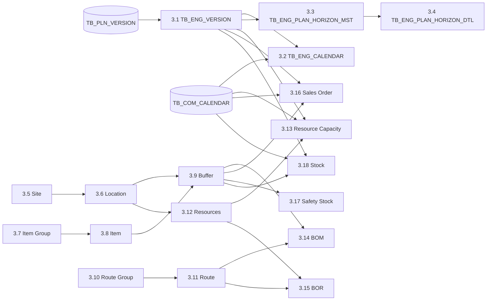

# IO Legacy Inbound Procedure Characterization

## 1. 문서 목적과 상태

이 문서는 기존 DSIO Inbound 프로시저를 Python 기반 IO Engine의 Snapshot과 UseCase로 전환하기 위한 역공학 기록이다. 프로시저 호출 순서, Source와 Target, 데이터 Grain, 업무 변환, 트랜잭션과 오류 전파를 누적해서 정리한다.

현재 상태는 **Inbound 본문 분석 완료, 실행·소비 계약 분석 진행 중**이다.

- 확인된 호출 순서: Phase `3.1`부터 `3.18`
- 상세 본문 확인 완료: Phase `3.1`부터 `3.18`
- 추가 확인 필요: 상위 Orchestrator의 전체 트랜잭션, Target Constraint, 실제 계산 프로시저의 소비 관계
- 근거: 2026-09-02 대화에서 제공된 프로시저 정의
- 실제 DB Schema, Constraint, Index, 데이터 분포와 실행 결과: 미검증

이 문서의 `확인`은 제공된 SQL 본문에서 직접 읽은 사실을 뜻한다. Target Key는 DDL 확인 전까지 `후보`로 기록하며 구현 계약으로 확정하지 않는다.

---

## 2. 전체 호출 순서

| Phase | Procedure | Capability | 상세 본문 | 현재 판단 |
|---|---|---|---|---|
| 3.1 | `SP_DSIO_ENG_IN_VERSION` | 실행 Version | 확인 | Plan 기간과 주 단위 기준 생성 |
| 3.2 | `SP_DSIO_ENG_IN_CALENDAR` | Calendar Snapshot | 확인 | Version 기간의 주차 Bucket 생성 |
| 3.3 | `SP_DSIO_ENG_IN_PLAN_HORIZON_MST` | Plan Horizon | 확인 | Version 기간을 Horizon Master로 복제 |
| 3.4 | `SP_DSIO_ENG_IN_PLAN_HORIZON_DTL` | Plan Horizon 설정 | 확인 | `PWEEK`, Bucket 크기와 시작일 생성 |
| 3.5 | `SP_DSIO_ENG_IN_SITE` | Site Master | 확인 | Partner Site와 회사의 전체 Subs Code를 합쳐 Site 생성 |
| 3.6 | `SP_DSIO_ENG_IN_LOCATION` | Location Master | 확인 | Site와 동일 Source를 Location으로 투영 |
| 3.7 | `SP_DSIO_ENG_IN_ITEM_GRP` | Item Group Master | 확인 | 재고대상 품목의 제품유형 그룹 생성 |
| 3.8 | `SP_DSIO_ENG_IN_ITEM` | Item Master | 확인 | 완제품과 `_RAW` 가상 원재료를 함께 생성 |
| 3.9 | `SP_DSIO_ENG_IN_BUFFER` | Inventory Buffer | 확인 | BOD Network를 기준으로 품목·거점 Buffer와 발주정책 생성 |
| 3.10 | `SP_DSIO_ENG_IN_ROUTE_GRP` | Route Group | 확인 | `PROD`, `DIST` 두 고정 그룹 생성 |
| 3.11 | `SP_DSIO_ENG_IN_ROUTE` | Route | 확인 | 생산 BOM과 거점 간 BOD Route 생성 |
| 3.12 | `SP_DSIO_ENG_IN_RESOURCES` | Resource Master | 확인 | 생산·이송 Resource 생성, 이송 Capacity는 무제한 상수 |
| 3.13 | `SP_DSIO_ENG_IN_RESOURCE_CAPACITY` | Resource Capacity | 확인 | 생산 Capacity를 `YEARPWEEK` 단위로 집계 |
| 3.14 | `SP_DSIO_ENG_IN_BOM` | BOM | 확인 | Route별 생산·소모 Buffer 관계 생성 |
| 3.15 | `SP_DSIO_ENG_IN_BOR` | BOR | 확인 | Route별 Resource, Run Time과 Move Time 생성 |
| 3.16 | `SP_DSIO_ENG_IN_SALES_ORDER` | Outbound Demand | 확인 | Forecast와 Backorder를 Plan Type별 Sales Order로 변환 |
| 3.17 | `SP_DSIO_ENG_IN_SAFETY_STOCK` | Inventory Policy | 확인 | 월별 Max, ROP, MOS와 이동평균 수요 생성 |
| 3.18 | `SP_DSIO_ENG_IN_STOCK` | Inventory/Supply | 확인 | 기초재고, 가상 원재료 재고와 입고예정을 Stock으로 변환 |

호출 순서가 곧 물리 FK를 증명하지는 않는다. SQL 참조와 생성 ID로 확인한 논리 의존성은 다음과 같다.

---

## 3. 공통 호출 계약

상위 프로시저는 Phase `3.1`부터 `3.18`까지 순차 호출하며 다음 실행 범위를 반복해서 전달한다.

| Parameter | 의미 | 확인 상태 |
|---|---|---|
| `company_cd` | 회사 범위 | 확인 |
| `subs_cd` 또는 `bu_cd` | 법인·사업 단위 범위 | 명칭 불일치, 의미 확인 필요 |
| `plan_id` | Plan 식별자 | 확인 |
| `plan_type` | Plan 유형 | 확인 |
| `version_id` | Engine 입력 Version 식별자 | 확인 |
| `tar_db` | 동적 Target Schema | 확인, 신뢰 경계 필요 |
| `parent_log_id` | 상위 실행 로그 연결 | 확인 |

`SP_DSIO_ENG_IN_CALENDAR`는 두 번째 인자를 `p_bu_cd`로 선언하지만 상위 호출은 `V_SUBS_CD`를 전달한다. Calendar SQL 본문은 이 값을 실제 필터에 사용하지 않는다. 단순 명칭 차이인지 Scope 누락인지 후속 확인이 필요하다.

---

## 4. 상세 프로시저 분석

### 4.1 Phase 3.1 — `SP_DSIO_ENG_IN_VERSION`

**역할**

- Plan Version을 Engine 실행 Version으로 변환한다.
- 후속 Calendar와 Horizon의 기간 및 Bucket 단위 기준을 제공한다.

**Source와 Target**

| 구분 | Object | 조건 또는 Grain |
|---|---|---|
| Source | `TB_PLN_VERSION` | `COMPANY_CD + SUBS_CD + PLAN_ID + PLAN_TYPE` |
| Target | `<V_TAR_DB>.TB_ENG_VERSION` | 제공된 본문 기준 `VERSION_ID` 중심 |

**주요 Mapping**

| Target | Source 또는 값 | 해석 |
|---|---|---|
| `VERSION_ID` | 입력 `p_version_id` | 실행 입력 Version |
| `VERSION_DTTM` | `PLAN_STRT_DT` | Version 기준일 |
| `START_DTTM` | `PLAN_STRT_DT` | 계획 시작일 |
| `END_DTTM` | `PLAN_END_DT` | 계획 종료일 |
| `FROZEN_UOM` | `'WEEK'` | 주 단위 Version |
| `STATUS` | `'R'` | 상태 코드 의미 확인 필요 |
| `COMPANY_CD` | Source | 회사 Scope |
| `SUBS_CD` | Source | 법인 Scope |
| `PLAN_TYPE` | Source | Plan 유형 |
| `PLAN_ID` | Source | Plan 식별자 |

**확인된 의미**

- Legacy 시간 범위의 직접 근거는 `plan_yyyyww`가 아니라 `PLAN_STRT_DT`와 `PLAN_END_DT`다.
- `FROZEN_UOM='WEEK'`이므로 주간 실행이라는 점은 확인된다.
- `VERSION_ID`가 Calendar, Horizon과 후속 Inbound 데이터의 공통 실행 식별자로 사용된다.

### 4.2 Phase 3.2 — `SP_DSIO_ENG_IN_CALENDAR`

**역할**

- Version 기간에 포함되는 Calendar 행을 Engine Bucket으로 집계한다.
- 주차별 시작일, 종료일, 순번과 기준 월을 생성한다.

**Source와 Target**

| 구분 | Object | 조건 또는 Grain |
|---|---|---|
| Source | `TB_COM_CALENDAR` | `TB_ENG_VERSION.START_DTTM`부터 `END_DTTM`까지의 일자 |
| Source | `<V_TAR_DB>.TB_ENG_VERSION` | 입력 `VERSION_ID` 한 건 |
| Target | `<V_TAR_DB>.TB_ENG_CALENDAR` | `VERSION_ID + BK_ID` |

**Bucket 선택 규칙**

| `FROZEN_UOM` | `BK_ID` Source |
|---|---|
| `MONTH` | `YEARMONTH` |
| `WEEK` | `YEARWEEK` |
| `PWEEK` | `YEARPWEEK` |
| `DAY` | `YYYYMMDD` |

현재 `SP_DSIO_ENG_IN_VERSION`이 `FROZEN_UOM='WEEK'`을 생성하므로 제공된 경로의 Calendar `BK_ID`는 `YEARWEEK`이다.

**집계 규칙**

- `START_DTTM = MIN(YYYYMMDD_DTTM)`
- `END_DTTM = MAX(YYYYMMDD_DTTM)`
- `SEQ = ROW_NUMBER() OVER (ORDER BY BK_ID) - 1`
- `BASE_MONTH = 수요일의 YEARMONTH`, 없으면 Bucket의 최소 `YEARMONTH`

`BASE_MONTH`가 수요일을 사용하므로 월 경계를 걸치는 주차의 귀속 월에 별도 업무 의미가 있을 가능성이 높다. 이를 단순 ISO Week 변환으로 제거하면 안 된다.

### 4.3 Phase 3.3 — `SP_DSIO_ENG_IN_PLAN_HORIZON_MST`

**역할**

- Engine Version의 시작일과 종료일을 Plan Horizon Master로 복제한다.

**Source와 Target**

| 구분 | Object | 조건 또는 Grain |
|---|---|---|
| Source | `<V_TAR_DB>.TB_ENG_VERSION` | 입력 `VERSION_ID` |
| Target | `<V_TAR_DB>.TB_ENG_PLAN_HORIZON_MST` | `VERSION_ID + PLAN_HORIZON_ID` 후보 |

**주요 Mapping**

- `PLAN_HORIZON_ID = VERSION_ID`
- `START_DTTM = TB_ENG_VERSION.START_DTTM`
- `END_DTTM = TB_ENG_VERSION.END_DTTM`
- `DESCRIPTION = TB_ENG_VERSION.DESCRIPTION`

### 4.4 Phase 3.4 — `SP_DSIO_ENG_IN_PLAN_HORIZON_DTL`

**역할**

- Plan Horizon의 시간 단위와 Bucket 크기를 생성한다.

**Source와 Target**

| 구분 | Object | 조건 또는 Grain |
|---|---|---|
| Source | `<V_TAR_DB>.TB_ENG_PLAN_HORIZON_MST` | 입력 `VERSION_ID` |
| Target | `<V_TAR_DB>.TB_ENG_PLAN_HORIZON_DTL` | `VERSION_ID + PLAN_HORIZON_ID` 후보 |

**주요 Mapping**

- `ZONE_START_DTTM = PLAN_HORIZON_MST.START_DTTM`
- `TIME_UOM = 'PWEEK'`
- `TIME_BUCKET = 1`
- `DATE_FORMAT = 'yyyy/MM/dd'`

Version과 Calendar는 `WEEK/YEARWEEK`을 사용하지만 Horizon Detail은 `PWEEK`을 사용한다. `PWEEK`이 단순 주간 동의어인지 별도 계획주차 체계인지 확인되기 전에는 Python에서 ISO Week 하나로 통합하지 않는다.

### 4.5 Phase 3.5 — `SP_DSIO_ENG_IN_SITE`

- **Target Grain 후보:** `VERSION_ID + SITE_ID`
- **Source:** 현재 Subs의 `TB_MST_PARTNER`와 회사 전체의 `TB_COM_CODE(GROUP_CD='SUBS_CD')`
- Partner의 `SITE_CD`와 Subs Code를 `UNION ALL`로 합쳐 `TB_ENG_SITE`에 적재한다.
- 두 Source에 같은 ID가 있으면 중복될 수 있으므로 Target Unique Key와 실제 중복 여부를 확인해야 한다.
- 두 번째 Source는 현재 `SUBS_CD`로 제한되지 않는다. 따라서 Site Snapshot은 요청 Subs 하나보다 넓은 회사 Network Scope를 포함한다.

### 4.6 Phase 3.6 — `SP_DSIO_ENG_IN_LOCATION`

- **Target Grain 후보:** `VERSION_ID + LOCATION_ID`
- **Source:** Site와 동일한 `TB_MST_PARTNER`, `TB_COM_CODE`
- `LOCATION_ID = SITE_ID`이고 Location과 Site를 사실상 1:1로 생성한다.
- Site와 동일하게 전체 회사 Subs Code가 포함되며 `UNION ALL` 중복 가능성이 있다.

### 4.7 Phase 3.7 — `SP_DSIO_ENG_IN_ITEM_GRP`

- **Target Grain 후보:** `VERSION_ID + ITEM_GRP_ID`
- **Source:** `TB_MST_OPER_PART`, 제품 코드명 `TB_COM_CODE`
- `USE_FLAG='Y'`, `STOCK_FLAG='Y'`인 품목만 대상으로 `PROD_TYPE`별 그룹을 생성한다.
- `PROD_TYPE`이 Null이면 빈 문자열을 Group ID로 사용한다.
- 이 프로시저는 `TB_MST_OPER_PART.SUBS_CD`로 범위를 제한하지만 Item은 `SITE_CD`를 사용한다. 두 Column의 업무상 동일성 여부가 필요하다.

### 4.8 Phase 3.8 — `SP_DSIO_ENG_IN_ITEM`

- **Target Grain 후보:** `VERSION_ID + ITEM_ID`
- **Source:** `TB_MST_OPER_PART`
- 재고대상 품목 한 건에서 완제품 `ITEM_ID=OPER_PART_NO`, `ITEM_TYPE='P'`와 가상 원재료 `ITEM_ID=OPER_PART_NO+'_RAW'`, `ITEM_TYPE='M'` 두 행을 생성한다.
- `_RAW`는 Source Master의 별도 원재료가 아니라 Legacy 최적화 Network를 위한 파생 품목이다.

### 4.9 Phase 3.9 — `SP_DSIO_ENG_IN_BUFFER`

- **Target Grain 후보:** `VERSION_ID + BUFFER_ID`, `BUFFER_ID=ITEM_ID+'@'+SITE_ID`
- **Source:** `TB_MST_BOD`, `TB_MST_BOD_DTL`, `TB_MST_OPER_PART`, `TB_PLN_VERSION`, `TB_PLN_SEGMTN_PART_INFO`
- BOD를 이용해 Target Subs로 들어오는 Network의 From/To Site를 임시 테이블로 만들고, From Site에는 `_RAW` Buffer를, From·To Site에는 완제품 Buffer를 생성한다.
- `TGSM`은 Segmentation의 `PO_POLICY_CD`, `POSM`은 품목 Master의 `APPY_PO_POLICY_CD`를 `STOCK_POLICY`로 사용한다.
- 최소·배수 Lot, Stock Keeping Time, 24개월 평균수요, Capacity Plan 적용 여부를 Buffer 정책에 포함한다.
- 지원되지 않는 `PLAN_TYPE`에서는 실행 Query가 생성되지 않는다. 목표 계약은 허용 Plan Type을 명시적으로 검증해야 한다.

### 4.10 Phase 3.10 — `SP_DSIO_ENG_IN_ROUTE_GRP`

- **Target Grain 후보:** `VERSION_ID + ROUTE_GRP_ID`
- Source Table 없이 `PROD/PRODUCT`, `DIST/DISTRIBUTE` 두 행을 고정 생성한다.
- `UFN_GETDATE()`를 사용하며 대다수 프로시저의 `FN_GETDATE()`와 함수명이 다르다.

### 4.11 Phase 3.11 — `SP_DSIO_ENG_IN_ROUTE`

- **Target Grain 후보:** `VERSION_ID + ROUTE_ID`
- 생산 Route는 `TB_MST_BOM`, 이송 Route는 `TB_MST_BOD/BOD_DTL`에서 생성한다.
- Route ID는 각각 `PROD_{SITE_CD}_{ROUTE_ID}`, `DIST_{BOD_ID}_{OPER_PART_NO}` 규칙을 사용한다.
- 유효 종료일은 Version 시작일이 아니라 프로시저 실행 당일 `FN_GETDATE()`와 비교한다. 동일 Plan 재실행 시 실행일에 따라 Master Snapshot이 달라질 수 있다.

### 4.12 Phase 3.12 — `SP_DSIO_ENG_IN_RESOURCES`

- **Target Grain 후보:** `VERSION_ID + RESOURCE_ID`
- 생산 Resource는 `TB_MST_RESOURCE`, 이송 Resource는 `TB_MST_BOD/BOD_DTL`에서 생성한다.
- 생산 ID는 `PROD_{SITE_CD}_{RESOURCE_ID}`이며 Capacity를 초 단위로 변환한다.
- 이송 ID는 `DIST_{BOD_ID}`이며 Capacity를 `999999`로 고정한다.
- 생산 Resource도 실행 당일 기준 유효 종료일을 적용한다. 또한 Resource Source의 `SITE_CD`를 요청 Subs로 직접 제한하지 않아 동일 Resource ID가 여러 Site에 존재할 때 범위를 확인해야 한다.

### 4.13 Phase 3.13 — `SP_DSIO_ENG_IN_RESOURCE_CAPACITY`

- **Target Grain 후보:** `VERSION_ID + RESOURCE_ID + START_DTTM`
- **Source:** BOD Network, `TB_MST_RESOURCE`, `TB_MST_CAPACITY`, `TB_COM_CALENDAR`, `TB_ENG_VERSION`
- Version 시작·종료일 내 일별 Capacity를 `YEARPWEEK`으로 묶고 `PWEEKSTART_DTTM/PWEEKEND_DTTM` 구간으로 합산한다.
- 이 프로시저는 `PWEEK`이 단순 표시값이 아니라 실제 Capacity 집계 Calendar임을 보여준다.
- 이송 Resource Capacity는 별도 생성하지 않고 Resource Master의 `999999` 상수만 존재한다.

### 4.14 Phase 3.14 — `SP_DSIO_ENG_IN_BOM`

- **Target Grain 후보:** `VERSION_ID + ROUTE_ID + BUFFER_ID + BOM_TYPE`
- 이송 Route는 From Buffer를 `C`로 소모하고 To Buffer를 `P`로 생산한다.
- 생산 Route는 `PROD_ITEM_CD` Buffer를 생산하고 `CONS_ITEM_CD` Buffer를 소모한다.
- 제공된 SQL은 모든 `BOM_RATE`를 `1`로 고정한다. 실제 수율·소요량이 다른 경우 어디서 적용되는지 계산 프로시저 확인이 필요하다.
- BOD/BOM 유효성은 실행 당일을 기준으로 판정한다.

### 4.15 Phase 3.15 — `SP_DSIO_ENG_IN_BOR`

- **Target Grain 후보:** `VERSION_ID + ROUTE_ID + RESOURCE_ID`
- 생산 BOR는 `TB_MST_BOR.RUN_TIME`을 초로 변환하고, 이송 BOR는 `TRANSP_TIME`을 `MOVE_TIME`으로 변환한다.
- 이송 BOR의 `RUN_TIME=1`, 모든 Efficiency와 Capacity Rate는 `1`이다.
- Route와 Resource를 연결하므로 Capacity 제약을 쓰는 Legacy 계산 경로의 핵심 후보지만 실제 소비 여부는 계산 프로시저로 확인해야 한다.

### 4.16 Phase 3.16 — `SP_DSIO_ENG_IN_SALES_ORDER`

- **Target Grain 후보:** `VERSION_ID + SALES_ORDER_ID`
- **Source:** `TB_PLN_INV_DMD`, `TB_PLN_INV_BO`, `TB_PLN_VERSION`, Segmentation, 품목 Master, Calendar
- Forecast Source의 `BASE_DT`는 임시 적재 시 `PLAN_STRT_DT`와 결합한다. `POSM` 본 Query는 다시 `BASE_DT=PLAN_ID`를 요구하므로 현재 데이터에서 `PLAN_ID=PLAN_STRT_DT`인지 확인해야 한다.
- `TGSM`은 Forecast만 생성하고, `POSM`은 Forecast `DEMAND_TYPE='SO'`와 계획 시작 하루 전 Backorder `DEMAND_TYPE='BO'`를 합친다.
- Legacy Target의 `DEMAND_TYPE='SO'` 명칭만으로 고객 확정 판매 주문이라고 판단할 수 없다. 제공된 Query의 `SO` Source는 `TB_PLN_INV_DMD` Forecast이므로 목표 계약의 `confirmed_customer_order_qty` Source가 별도 존재하는지 확인해야 한다.
- `TGSM`은 `WEEK`이면 `WEEKSTART_DTTM`, `PWEEK`이면 `PWEEKSTART_DTTM`을 사용한다.
- `POSM`은 주차 Key는 `YEARWEEK/YEARPWEEK`으로 분기하지만 시작일은 두 경우 모두 `WEEKSTART_DTTM`을 사용한다. 의도인지 결함인지 Golden Data로 확인해야 한다.

### 4.17 Phase 3.17 — `SP_DSIO_ENG_IN_SAFETY_STOCK`

- **Target Grain 후보:** `VERSION_ID + BUFFER_ID + START_DTTM`
- **Source:** `TB_PLN_PO_POLICY_QTY`, `TB_MST_OPER_PART_MA`
- 월 단위로 시작일과 말일을 만들고 Max Level, ROP, `RMOS+EMOS`, 3개월 이동평균 또는 평균수요를 적재한다.
- 안전재고 자체 수량보다 Max/ROP/MOS 정책 값을 제공한다. 목표 Engine은 MOQ·Lot·Lead Time 같은 Source Hard Constraint와 승인 목표를 Python 계산 입력으로 사용하고 안전재고·ROP·목표재고·권고량은 Python 계산값을 기본으로 사용한다. Legacy 값은 비교 또는 승인 Fallback 근거로 보존한다.
- `LOT_MAX_QTY`, `RMOS`, `EMOS`는 생성 주체와 업무 정의를 확인해 물리 한도, 승인 정책 입력 또는 Legacy 계산 결과로 분류해야 한다.

### 4.18 Phase 3.18 — `SP_DSIO_ENG_IN_STOCK`

- **Target Grain 후보:** `VERSION_ID + STOCK_ID`
- `TGSM`은 Segmentation의 `MAX_QTY`를 기초재고로 사용하고 모든 일자를 Plan 시작 하루 전으로 설정한다.
- `POSM`은 `TB_PLN_INV_BOH` 기초재고, `_RAW` Buffer의 가상 무한재고 `9999999`, `TB_PLN_INV_DUEIN` 입고예정을 합친다.
- 입고예정은 `DUEIN_WK=YEARPWEEK`으로 결합하지만 실제 일자는 `WEEKSTART_DTTM`을 사용한다. `PWEEKSTART_DTTM`과의 차이를 확인해야 한다.
- 제공된 Inbound Query에는 벤더 확약 상태가 보이지 않는다. 상태를 증명할 수 없는 행은 `UNVERIFIED_DUE_IN`으로 분류해 운영 Baseline에서 제외하고, 별도 민감도 Scenario와 Legacy 회귀의 `LEGACY_ASSUMED_CONFIRMED`에서만 가산한다. `TB_PLN_INV_DUEIN` 또는 상위 Source의 상태·확약일은 향후 `CONFIRMED/IN_TRANSIT` 승격 근거로 확인한다.
- 일반 Buffer ID는 `ITEM+'@'+SUBS`인데 일부 TGSM Safety Stock Join과 POSM 입고예정 Buffer는 `ITEM+'V_'+SUBS`를 사용한다. 실제 FK가 성립하는지, 오타 또는 별도 가상 Buffer 규칙인지 확인이 필요하다.
- POSM 가상 원재료 Stock은 `TB_ENG_BUFFER`를 직접 참조하므로 Buffer가 명시적 선행 입력이다.

---

## 5. 트랜잭션과 오류 처리

상세 확인된 18개 프로시저는 공통적으로 다음 패턴을 사용한다.

1. 하위 Log ID 생성
2. `USP_LOG_TRANS_START`
3. Phase 시작 기록
4. 동적 `INSERT ... SELECT` 실행
5. `ROW_COUNT` 수집 및 Phase 종료 기록
6. 실행 Log 종료
7. `WHEN OTHERS`에서 오류 정보 수집, 오류 Log 기록, `ROLLBACK`, `RAISE NOTICE`

현재 본문에는 오류를 다시 `RAISE`하는 코드가 없다. 따라서 하위 프로시저 실패가 상위 Phase 실행을 확실히 중단하는지, `ROLLBACK` 이후 상위 호출과 Log가 어떤 상태가 되는지 실제 PostgreSQL 동작과 상위 프로시저 본문으로 검증해야 한다.

Buffer와 Sales Order는 Session Temp Table을 `DROP TABLE IF EXISTS` 후 다시 생성하고 Index와 `ANALYZE`를 수행한다. 동일 DB Session에서의 재실행을 전제한 구조이며, Python 전환에서는 이 임시 적재를 명시적 Snapshot 변환 단계로 분리해야 한다.

동적 Target Schema인 `p_tar_db`는 문자열 치환으로 SQL에 삽입된다. Python Adapter에서는 임의 사용자 입력을 허용하지 않고 배포 설정 또는 승인된 Schema Binding의 Allowlist로 제한해야 한다.

---

## 6. 목표 아키텍처에 반영할 사실

### 확인됨

- Legacy 실행은 주 단위다.
- 시간 계약은 Plan Version의 `START_DTTM/END_DTTM`, `VERSION_ID`, Calendar Bucket과 Horizon 설정을 함께 사용한다.
- `CalendarSnapshot`은 선택 입력이 아니라 Legacy 호환을 위한 핵심 입력이다.
- Calendar는 `BK_ID`, 실제 시작·종료일, 0 기반 순번과 월 귀속값을 제공한다.
- Inbound 공통 실행 식별자는 현재 자료 기준 `COMPANY_CD + SUBS_CD + PLAN_ID + PLAN_TYPE + VERSION_ID`다.
- `TGSM`과 `POSM`은 Buffer 정책, Sales Order 구성, 기초재고 Source가 서로 다른 별도 입력 계약이다.
- Forecast와 입고예정 주차 해석에 `TB_COM_CALENDAR`가 직접 사용되므로 Calendar는 수요·공급 일자 변환에도 필수다.
- `ResourceCapacity`는 `YEARPWEEK`과 `PWEEKSTART/END_DTTM`을 사용하므로 Legacy 전체 입력을 재현하려면 Planning Week 의미가 필요하다.
- Buffer ID의 기본 조합은 `ITEM_ID + '@' + LOCATION_ID`이며 Route/BOM/Stock을 연결하는 Network Key다.
- Python IO Engine은 초기 Release부터 `POSM`과 `TGSM`을 Plan Type별 Adapter로 동시 지원한다.
- 한 Python Run은 하나의 Site만 처리하며 다른 Site의 재고를 이동하거나 공유하지 않는다.
- DSDM `tb_mst_site_country`는 `site_cd` PK, `subs_cd` NOT NULL FK이므로 Site 하나는 정확히 하나의 Subs에 속한다. 실행 시 `(site_cd, subs_cd)` 일치를 검증한다.
- 선택 Site의 유효 재고관리 Item을 Buffer 기준 집합으로 사용하고 Forecast·BOH·Due-in·Policy 고아 Fact는 Fail Closed한다.
- 목표 계약에서 `TGSM MAX_QTY`는 기초재고가 아니라 목표재고이며 `TB_IO_INVENTORY_POLICY.TARGET_INVENTORY_QTY`로 정규화한다.
- TGSM Legacy 비교는 `POLICY_PROXY`, 목표 Python 계산·계약·E2E는 Demand 이력과 최소 52주 Warm-up으로 만든 `SYNTHETIC_BOH`를 사용한다.
- 합성 시작재고와 미도착 주문은 Simulation Run, Generator Version, Demand/Policy Snapshot과 Content Hash를 보존한다.
- 초기 `company_cd`는 배포/Tenant Binding의 단일 불변값이며 모든 Source Row가 이 값과 일치해야 한다.
- Python의 중간 산출물은 Legacy `TB_ENG_*` 복제가 아니라 Run별 Canonical `TB_IO_*` Evidence로 저장한다.
- 초기 보충 계산은 Forecast·재고·정책에서 PSI·품절 위험·보충 필요량·필요일·권고 발주량을 생성한다.
- Phase 3.10~3.15의 Route, Resource, Capacity, BOM과 BOR는 단일 Site Core Migration에서 제외한다.
- 목표 Calendar는 `YEARWEEK = YEARPWEEK = YYYYWW`, `simulation_w0 = plan_yyyyww`로 고정하며 Demand와 IO가 같은 Calendar Revision을 사용한다.
- `master_as_of_date`는 Planning Cycle의 Plan Version 기준일로 고정하고 Legacy 실행일은 회귀 비교에만 사용한다.
- Demand Engine과 동일하게 Artifact를 먼저 봉인하고 DB Batch를 원자적으로 게시한 뒤 Receipt를 검증한다.
- Planning Cycle은 Site별 실행을 집계하고 혼합 성공/실패는 `PARTIALLY_SUCCEEDED`, 실패 Site Retry 중에는 `RECOVERING`으로 처리한다.
- 동일 Binding의 Retry는 새 `engine_run_id`와 증가한 Attempt를 사용하며 입력·Configuration 변경은 새 Cycle Revision이다.

### 아직 확정할 수 없음

- Legacy에서 `plan_yyyyww`가 `PLAN_STRT_DT`, 첫 `BK_ID`와 실제로 일치하는지
- Legacy `YEARWEEK`과 `YEARPWEEK` 차이가 기존 결과에 미친 영향
- `BASE_MONTH`의 수요일 기준이 IO 결과에 미치는 영향
- `TB_ENG_ROUTE*`, `RESOURCE*`, `BOM`, `BOR`의 Legacy 후속 소비 관계와 회귀 비교 범위
- 하위 프로시저 실패 시 상위 실행 중단과 Rollback 범위
- 합성 BOH Generator의 상세 계약 초안은 작성됐으나 Formula 승인, 독립 Reference 구현과 Golden 결과 검증은 미완료
- `ITEM@SITE`와 `ITEMV_SITE` Buffer ID가 서로 다른 논리 Key인지 단순 오류인지
- `PLAN_ID`, `PLAN_STRT_DT`, Forecast `BASE_DT`의 동일성 계약

---

## 7. 위험 및 안티패턴 기록

| 항목 | 영향 | 전환 원칙 |
|---|---|---|
| 동적 Schema 문자열 치환 | 잘못된 Schema 접근 또는 SQL Injection | 승인된 Schema Binding Allowlist 사용 |
| `WHEN OTHERS` 후 재발생 없음 | 실패 은폐와 다음 Phase 진행 가능성 | Python에서는 Stable Error Code로 실패를 전파하고 Run을 중단 |
| `WEEK`와 `PWEEK` 혼재 | Bucket 오프셋과 기간 오차 | 목표 계약은 단일 `YYYYWW`를 사용하고 Legacy 차이는 회귀 Adapter에 격리 |
| `subs_cd`와 `bu_cd` 명칭 혼재 | Scope 누락 또는 잘못된 Tenant 데이터 | 논리 Scope 용어와 물리 Mapping 분리 |
| 전체 동적 Query Notice | 운영 Log에 식별값·SQL 노출 가능 | 값이 제거된 Event와 Row Count만 기록 |
| Target 선행 정리 미확인 | Replay 시 중복 행 가능 | 각 Target PK/Unique와 Delete·Upsert 정책 확인 |
| 범위가 넓은 Generic Inbound | IO와 Supply/Production Planning 경계 혼합 | 실제 Downstream 소비가 증명된 데이터만 IO Snapshot으로 채택 |
| `FN_GETDATE()` 기반 Master 유효성 | 동일 Plan 재실행 결과가 실행일에 따라 변경 | Plan Version 기준 `master_as_of_date`를 명시적으로 봉인 |
| `TGSM/POSM` 암묵 분기 | Plan Type별 Source와 의미 혼동 | Plan Type별 입력 Schema와 지원 범위를 분리 검증 |
| `@`와 `V_` Buffer Key 혼재 | Stock·Safety Stock이 존재하지 않는 Buffer를 참조 | Target Constraint와 실제 데이터로 Key 규칙 확정 |
| `UNION ALL` Master 적재 | Site·Location 중복으로 Unique 위반 또는 중복 계산 | Source 우선순위와 중복 검증 규칙 정의 |
| 상수 `999999/9999999` | 무제한 Capacity·Stock이 정책 수량과 권고 결과를 왜곡 | 무제한의 Domain 표현을 Null 또는 명시적 Code로 분리하고 근거를 보존 |
| `BOM_RATE=1` 고정 | 실제 소요량·수율이 반영되지 않을 가능성 | 후속 계산의 비율 보정 위치 확인 후 계약화 |

---

## 8. 다음 분석에 필요한 근거

Inbound 프로시저 본문은 모두 확보됐다. 다음에는 아래 근거를 확인한다.

- 상위 Main 프로시저의 Phase 전후 상태 변경, Delete와 Commit
- `TB_ENG_*` DDL의 PK, Unique, FK, Null, Default와 Index
- Inbound 이후 실제 계산 Main과 하위 프로시저의 `TB_ENG_*` 소비 관계
- `TGSM`, `POSM` 대표 Plan별 Source Row Count와 Target Row Count
- `YEARWEEK != YEARPWEEK`이고 월 경계를 지나는 Calendar 샘플
- 동일 Plan을 다른 실행일에 재실행한 Route·Resource·BOM 결과
- `ITEM@SITE`와 `ITEMV_SITE`가 나타나는 실제 Buffer·Stock 데이터
- Legacy 결과와 Python 결과를 비교할 Golden Dataset

Python Migration의 다음 분석 우선순위는 **재고 Cut-off·봉인과 PSI 잔여 규칙 → 재고정책 수식 → 합성 BOH Golden 검증 → DSIM 질의 계약 → `TB_IO_*` 계약 → Planning Cycle 호환 DDL·Schema/UoW → POSM/TGSM 대표 Plan 데이터** 순이다. 공통 Run/Configuration과 트랜잭션 물리 경계, V1 정책 기반 보충 범위는 확정됐다. 상위 Main, Legacy Target DDL과 후속 계산 프로시저는 회귀 비교 범위를 확정하는 보조 근거로 분석한다.

---

## 9. Python Migration 범위 판단

### 9.1 Capability별 처리

| Legacy Phase | Python Migration 판단 | Target 계약 |
|---|---|---|
| 3.1 Version | 업무 의미 유지, 구조 재설계 | `TB_IO_PLAN_CONTEXT` |
| 3.2 Calendar | 필수 | `TB_IO_CALENDAR_BUCKET` |
| 3.3~3.4 Horizon | 별도 Table 이식 없이 Plan Context와 Calendar에 통합 | Plan Context 및 Manifest |
| 3.5~3.6 Site/Location | 선택된 단일 Site의 Location으로 통합 | `TB_IO_LOCATION` |
| 3.7 Item Group | 그룹 정책·설명에 필요할 때 Item 속성으로 유지 | `TB_IO_ITEM`의 선택 속성 |
| 3.8 Item | 필수. `_RAW` 파생 Item은 생산 Capacity를 제외한 초기 모델에서 기본 생성하지 않음 | `TB_IO_ITEM` |
| 3.9 Buffer | 필수. BOD Network가 아닌 단일 Site Buffer Universe로 재정의 | `TB_IO_BUFFER` |
| 3.10~3.15 Route/Resource/Capacity/BOM/BOR | 초기 Core Migration 제외 | 없음 |
| 3.16 Sales Order | 필수. POSM/TGSM Adapter 결과를 Demand로 정규화 | `TB_IO_DEMAND` |
| 3.17 Safety Stock | 필수. 정책 입력과 계산 결과를 분리 | `TB_IO_INVENTORY_POLICY`, `TB_IO_POLICY_RESULT` |
| 3.18 Stock | POSM BOH와 입고예정은 분리 이식. TGSM `MAX_QTY`는 목표재고 정책으로 이동. Legacy 비교는 `POLICY_PROXY`, 목표 검증은 `SYNTHETIC_BOH` 사용 | `TB_IO_INVENTORY_POSITION`, `TB_IO_SCHEDULED_RECEIPT`, `TB_IO_INVENTORY_POLICY` |

### 9.2 `TB_IO_*` 저장 목적

- DSIM이 Run, Site, Item, Buffer와 Bucket을 기준으로 입력부터 권고까지 추적한다.
- PSI의 시작재고, 수요, 입고, 출고, Backorder와 종료재고를 설명 근거로 제공한다.
- 정책 입력과 계산 결과를 분리해 어떤 값이 Source이고 어떤 값이 Python 결과인지 식별한다.
- 모든 Data Set은 `ENGINE_RUN_ID`로 `TB_IO_PLAN_CONTEXT`와 Manifest에 연결되며 이를 통해 `PLAN_TYPE`, `SITE_CD`, Source Version과 Hash를 추적한다. 행마다 동일 Scope 값을 불필요하게 반복하지 않는다.
- 성공한 Run의 Evidence는 Update하지 않고 Append-only로 보존한다.
- Artifact를 먼저 봉인하고 `TB_IO_*`를 짧은 Transaction으로 게시하며, Row Count·Content Hash·Manifest Hash를 담은 Receipt가 검증된 뒤에만 Run을 완료한다.
- Artifact와 DB를 분산 Transaction으로 묶지 않는다. DB 게시 실패 시 봉인 Artifact를 보존하고 동일 Run·Data Set·Hash로 멱등 재게시 또는 대사한다.

### 9.3 TGSM 합성 시작재고와 Planning Cycle

- `SYNTHETIC_BOH`는 최소 52주 Warm-up을 수행하고 W0-1 EOH를 W0 BOH로 전달한다.
- 정책 Lookback은 13주 또는 26주이며 미래 수요를 사용하지 않는다. 기본 26주인 경우 최소 78주 Demand History가 필요하다.
- Lead Time은 Demand에서 추정하지 않고 Item Policy/Master를 우선하며, 없으면 Versioned Synthetic Policy Profile의 결정론적 값을 사용한다.
- Warm-up 최초 BOH는 해당 시점의 합성 목표재고로 결정론적으로 Seed한다.
- 재고 Position이 ROP 이하이면 MOQ와 Lot Multiple을 적용해 주문하고 Lead Time 이후 `SYNTHETIC_PURCHASE_ORDER`로 입고한다.
- Generator는 IO Engine PSI 구현과 분리하고 Version·입력 Hash·출력 Hash 및 독립 Golden 기대값을 봉인한다.
- `POLICY_PROXY`와 `SYNTHETIC_BOH`는 서로 다른 Source Type이며 전자는 Legacy 회귀, 후자는 목표 E2E에만 사용한다.
- Planning Cycle은 Site별 논리 작업 `cycle_site_execution_id`와 시도별 `engine_run_id`를 분리한다.
- 일부 Site 실패는 `PARTIALLY_SUCCEEDED`, Retry 중은 `RECOVERING`이며 성공 Site의 결과와 Evidence를 유지한다.
- 동일 Snapshot/Configuration Retry는 새 Run ID를 사용하고 입력 변경은 새 Cycle Revision으로 분류한다.
- 초기에는 모든 요청 Site가 `REQUIRED`이며 모든 Effective Run의 Evidence가 검증돼야 `SUCCEEDED`다.

### 9.4 여전히 필요한 P0 근거

- 합성 BOH Generator Formula·Event Ordering은 승인됨. 독립 Reference 구현과 14개 Scenario Golden 결과 검증 필요
- Planning Cycle 최소 물리 구조와 공통 Run/Configuration 일반화는 확정. 호환 Migration의 PK/FK, Input Binding, Inventory Snapshot 고정 CAS와 상태 집계 UoW DDL은 미작성
- `PLAN_ID`, `PLAN_STRT_DT`, Forecast `BASE_DT` 동일성 규칙
- 동일 `site + item + yyyyww` Forecast Consumption 계약은 확정. 목표 `confirmed_customer_order_qty`의 실제 Source Column과 Legacy Forecast의 Gross/Net 의미 확인
- 미확인 Due-in의 Baseline 제외 계약은 확정. `TB_PLN_INV_DUEIN`에서 벤더 확약 상태·수량·납기를 증명할 수 있는 Source Column 확인
- `LOT_MAX_QTY`, `RMOS`, `EMOS`의 생성 주체와 물리 한도·승인 정책·Legacy 계산값 분류
- `TB_IO_*`별 Column, Grain, PK/FK, Numeric/UOM, Index와 Partition
- `TB_IO_SNAPSHOT_MANIFEST`의 Cut-off·Watermark·Seal 필드와 `TB_IO_INVENTORY_RECONCILIATION` 대사 Code Set
- PostgreSQL Online Evidence의 보존기간과 Parquet Archive 정책
- DSIM의 실제 질의 사례, Read-only View/API와 권한 경계
