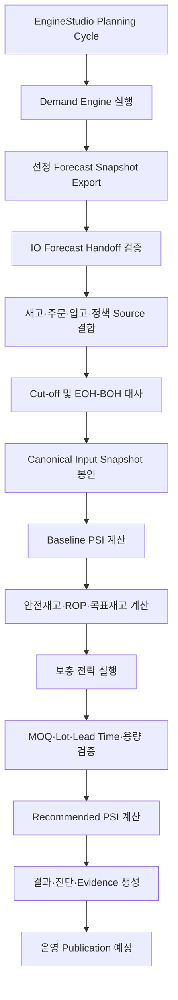
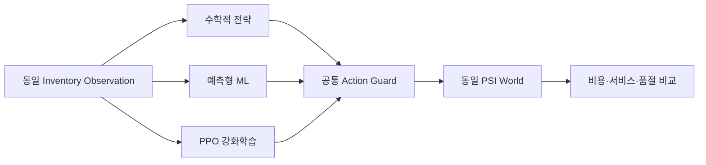

# DSIO Inventory Optimization Engine 설명 보고서

| 항목 | 내용 |
|---|---|
| 보고 대상 | SCM·재고관리·수요계획·구매 및 운영 전문가 |
| 대상 시스템 | `InventoryEngine` |
| 기준 버전 | 로컬 패키지 `0.10.0` |
| 기준일 | 2026-09-07 |
| 문서 성격 | 업무 설명, 구현 현황, 검증 결과 및 운영 도입 판단 보고 |
| 현재 판정 | 개발 기준선 구현, 운영 적용 전 데이터·통합·승인 단계 필요 |

---

## 1. Executive Summary

DSIO Inventory Optimization Engine은 Demand Engine이 생성한 확정 수요예측과 현재 재고, 고객 주문, 입고예정, 조달 Lead Time 및 품목별 재고정책을 결합하여 향후 재고 흐름과 품절 위험을 계산하고 보충 권고를 생성하는 엔진이다.

핵심 목적은 예측값 자체를 제공하는 데 있지 않다. 예측된 수요가 현재 재고와 확정 공급에 미치는 영향을 주차별 PSI로 계산하고, 안전재고·재주문점·목표재고와 MOQ·발주배수·용량 등의 제약을 적용하여 다음 판단으로 연결하는 데 목적이 있다.

```text
Demand Forecast
    + 현재 재고와 고객 주문
    + 확정 입고예정
    + Lead Time과 재고정책
    ↓
Baseline PSI와 품절 위험
    ↓
보충 필요량과 권고 발주시점
    ↓
Recommended PSI와 의사결정 근거
```

현재 `0.10.0` 기준으로 다음 개발 기능이 구현되어 있다.

- Demand Forecast의 독립 Parquet 전달과 Canonical 입력 변환
- 재고 Cut-off, Snapshot 봉인 조건과 전기 EOH·당기 BOH 대사
- 주간 Baseline PSI와 보충 권고 반영 PSI
- 이력 기반 안전재고·ROP·목표재고 계산
- MOQ, Lot Multiple, Lead Time, 주문 가능일, 용량 제약 검증
- 수학적 전략, 예측형 ML, PPO 기반 강화학습 전략의 공통 실행 계약
- 합성 Scenario 기반 독립 평가와 다중 Seed 학습 안정성 검증
- 실제 개발 PostgreSQL의 Forecast·Network 읽기 전용 검증

그러나 현재 결과를 운영 발주 권고로 즉시 사용해서는 안 된다. 실제 재고·입고·고객 주문·정책 Source의 업무 의미와 완전성이 확보되지 않았고, EngineStudio의 공통 Run, 승인된 Configuration, Artifact·`TB_IO_*` Evidence 영속화, 운영 결과 Publication이 아직 연결되지 않았다.

현 시점의 권장 기준은 다음과 같다.

> 수학적 재고정책을 개발 기준선으로 유지하고, ML/PPO는 Shadow 평가 대상으로 운영하며, 실제 Source와 운영 통제 계약이 완료된 이후 단계적으로 활성화

---

## 2. 엔진이 해결하는 SCM 의사결정

수요예측만으로는 실제 보충 의사결정을 내릴 수 없다. 동일한 Forecast라도 현재 재고, 이미 발주한 물량, 조달 Lead Time, 최소 발주량과 재고정책에 따라 필요한 행동이 달라진다.

Inventory Engine은 다음 질문에 답하도록 설계되어 있다.

1. 현재 확정된 재고와 공급만으로 계획기간의 수요를 충족할 수 있는가
2. 어느 품목이 어느 주차에 품절 또는 Backorder 위험에 진입하는가
3. 이미 발주했지만 아직 입고되지 않은 수량을 고려했는가
4. 추가 보충이 필요하다면 언제 얼마를 주문해야 하는가
5. 권고량이 MOQ, Lot Multiple, 용량과 주문 가능일을 만족하는가
6. 권고 적용 시 재고와 서비스 수준이 어떻게 변하는가
7. 어떤 입력·정책·모델·제약으로 해당 결과가 만들어졌는가

따라서 엔진의 업무 결과는 단순한 `권고 발주량`이 아니라 다음 세 묶음으로 이해해야 한다.

| 결과 영역 | 설명 |
|---|---|
| 재고 전망 | 주차별 BOH, 입고, 수요, 출고, Backorder, EOH |
| 정책 및 권고 | 안전재고, ROP, 목표재고, 발주량, 발주·입고 주차 |
| 근거와 통제 | 입력 Snapshot, 정책 출처, 제약 적용, 조정·거부 사유, Hash와 Run 계보 |

---

## 3. 업무 범위와 비범위

### 3.1 현재 포함 범위

- 단일 Company 기준 실행
- 한 Run에서 하나의 Site 처리
- `POSM`, `TGSM` Plan Type 동시 지원
- 주간 `YYYYWW` Calendar 기반 PSI
- Demand Engine에서 선정한 Forecast 결과 소비
- 실제 또는 합성 BOH 기반 재고 Simulation
- 확정 고객 주문과 실제 주문 Backorder 처리
- 확정·운송 중 입고예정 반영
- 수학적 재고정책과 보충 권고
- ML/PPO 후보 정책의 로컬 학습·추론·동일 조건 비교
- Run별 입력·중간·결과 Evidence 계약

### 3.2 현재 비범위

- Demand Forecast 모델 학습과 Winner 선정
- ERP 발주서 자동 생성 및 승인 Workflow
- 생산 Capacity, Resource, BOM, BOR를 이용한 생산계획
- 공급업체별 Allocation과 구매계약 최적화
- Site 간 재고 이동 최적화
- Multi-Echelon Network 전체 최적화
- 운송 Route와 Mode 자동 선택
- 운영 DSIM Agent와 조회 API

향후 Multi-Echelon과 공급망 Network 기능을 확장할 수 있도록 계약은 준비하고 있으나, 현재 Core는 **단일 Site 재고 전망과 보충 권고**다. 이를 포괄적인 Supply Planning Engine으로 표현하는 것은 현재 범위를 과장하는 설명이다.

---

## 4. 전체 업무 흐름



현재 구현은 Forecast 전달, Source 검증, Canonical 입력, PSI, 정책 계산과 로컬 결과 생성까지 제공한다. EngineStudio Run 연결, Evidence 영속 저장과 운영 Publication은 후속 단계다.

### 4.1 실행 순서의 업무 의미

| 단계 | SCM 의미 | 주요 통제 |
|---|---|---|
| Forecast 고정 | 사용할 예측 결과와 품목·주차 Universe 확정 | Demand Run, Selection ID, Snapshot Hash |
| 재고 고정 | 계획 시작 직전 실제 가용재고 확정 | Cut-off, Watermark, EOH-BOH 대사 |
| 공급 고정 | 반영 가능한 미입고 공급 범위 확정 | 확약 상태, Due Date, 수량, 중복 여부 |
| Baseline PSI | 추가 권고가 없을 때의 재고 위험 산출 | 수불 보존식, 실제 BO와 Forecast Shortage 구분 |
| 정책 계산 | 품목별 재고 기준선 산출 | 이력 기간, Service Level, Lead Time, UOM |
| 보충 권고 | 필요한 주문량과 시점 산출 | MOQ, Lot, 주문 가능일, 용량, Horizon |
| Recommended PSI | 권고가 도착할 경우의 재고 흐름 산출 | 공급 대기열과 입고시점 1회 반영 |
| Evidence | 결과의 재현 및 설명 근거 생성 | Version, Hash, Source, 조정·거부 사유 |

---

## 5. 주요 입력 데이터

| 입력 | 주요 내용 | 업무상 확인사항 |
|---|---|---|
| Plan Context | Planning Cycle, Plan Type, W0, Horizon, Site | 동일 Cycle·Revision 여부 |
| Calendar | 주차, 시작·종료일, 월 귀속, Bucket 순서 | Demand와 IO가 같은 Revision 사용 |
| Forecast | 품목·주차별 선정 POINT 수량 | Gross/Net 의미, Selection 완료 여부 |
| Customer Order | 고객 확정 주문 및 계획 시작 전 Backorder | Forecast와 중복 여부 |
| Inventory | 가용 BOH, 물리 BOH, Reserved | Cut-off와 상태 정의 |
| Scheduled Receipt | 발주·운송 중 수량과 입고예정일 | 확약 상태와 지연 여부 |
| Item Policy | Lead Time, MOQ, Lot Multiple, 용량, 주문 가능일 | 단위·유효기간·승인 근거 |
| Demand History | W0 이전 13주 또는 26주 수요 | 결품으로 검열된 판매량 제외 여부 |
| Network | Site, Location, Buffer와 승인 Network Revision | 초기 단일 Site 실행에는 후보 경로만 제공 |

### 5.1 Demand Forecast 전달 원칙

- IO Engine은 Forecast를 다시 선택하거나 평균·P50으로 임의 변환하지 않음
- Demand Engine에서 선정된 `POINT=yhat` 결과를 그대로 소비
- Forecast 행에 Demand Run, Model Run, Selection Decision과 Result ID 보존
- 계획 수량은 소수 최대 6자리 유지
- 실제 BOH, 확정 주문, 확정 입고와 같은 물리 EA 수량은 정수 계약 적용
- Demand와 IO가 동일 Calendar 및 Master Revision 사용
- Forecast Export와 IO 소비 Snapshot의 Content Hash·Manifest Hash 대조

Forecast 전달 성공은 IO Run 성공을 의미하지 않는다. 재고·공급·정책 Snapshot이 준비되고 전체 입력 대사가 완료돼야 PSI를 실행할 수 있다.

### 5.2 현재 개발 DB 데이터 준비상태

2026-09-03에 수행한 개발 PostgreSQL 읽기 전용 증적은 다음과 같다. 이 수치는 2026-09-07 현재 DB Freshness를 재검증한 값이 아니다.

| 항목 | 당시 확인값 |
|---|---:|
| Forecast 대상 품목 | 4,270개 |
| Forecast Row | 12,810행 |
| 조회 기간 | 3주, `202510~202512` |
| 품목 Master | 7,000행 |
| 소수 EA Forecast | 9,213행 |
| MOQ·Lot·Stock LT·Service Level | Master 7,000행에서 모두 NULL |

당시 Forecast의 품목 고아는 없었으나 재고·입고·고객 주문·정책 Source와 Forecast 출력 봉인이 준비되지 않아 `canonical_ready=false`, `snapshot_sealed=false`로 판정했다.

즉, Forecast 조회 가능성과 운영 IO 입력 준비 완료를 동일하게 해석하면 안 된다.

---

## 6. Canonical 입력과 재고 Snapshot

Legacy 프로시저의 `TB_ENG_*` 구조를 그대로 Python으로 복제하지 않고, IO 업무 의미를 기준으로 Canonical Snapshot을 구성한다.

```text
원천 테이블과 Demand Export
    ↓ Plan Type별 Adapter
Canonical Forecast / Inventory / Demand / Supply / Policy / Calendar
    ↓ Scope·Hash·Cut-off·대사 검증
SEALED Inventory Input
```

### 6.1 재고 Cut-off 원칙

- `business_occurred_at`: 실제 업무 발생시각
- `erp_posted_at`: ERP 확정시각
- `ingested_at`: IO 수집시각
- Site별 업무 Timezone과 Cut-off 시각 고정
- Cut-off 이후 Late Posting은 기존 Snapshot 수정 금지
- 변경 발생 시 기존 Snapshot을 `SUPERSEDED` 처리하고 새 Cycle Revision 생성
- 기술적 Retry는 동일 Snapshot ID와 Hash 재사용

실제 마감 연속성은 다음 개념으로 대사한다.

```text
reported BOH[t]
= sealed actual EOH[t-1]
+ approved adjustment[t]
```

승인 조정 없이 전기 EOH와 당기 BOH가 일치하지 않으면 해당 Snapshot으로 PSI를 시작하지 않는다.

### 6.2 POSM과 TGSM 차이

| 항목 | POSM | TGSM |
|---|---|---|
| 수요 | Forecast + 실제 주문 Backorder | Forecast 중심 |
| 기초재고 | 실제 BOH 및 입고예정 | 운영 Source 준비 전 합성 BOH 사용 |
| 정책 Source | 품목·계획 정책 | Segmentation 정책 |
| Legacy `MAX_QTY` | 정책값 | 목표재고로 해석 |

TGSM의 `MAX_QTY`는 목표 구조에서 실제 기초재고로 사용하지 않는다. Legacy 비교용 `POLICY_PROXY`와 목표 개발용 `SYNTHETIC_BOH`를 분리하여 결과와 Evidence를 혼합하지 않는다.

---

## 7. PSI 계산 원리

PSI는 각 주차에서 재고가 어떻게 변하는지를 계산하는 기본 원장이다.

```text
기말 물리재고
= 기초 물리재고
+ 당주 확정 입고
+ 당주 권고 입고
- 당주 실제 출고
```

가용재고와 물리재고는 Reserved를 구분한다.

```text
physical EOH = available EOH + reserved quantity
BOH[t+1] = EOH[t]
```

### 7.1 주차 처리 순서

1. 당주 도착 공급 반영
2. 기존 실제 Backorder 처리
3. 당주 고객 확정 주문 처리
4. 중복 소비를 방지한 순 Forecast 처리
5. 기말 재고와 신규 Backorder 산출

실제 고객 주문의 미충족 수량만 Backorder로 다음 주차에 이월한다. Forecast Shortage는 계획 위험으로 기록하지만 실제 주문 채무처럼 이월하지 않는다.

### 7.2 Baseline과 Recommended Scenario

| Scenario | 의미 |
|---|---|
| `BASELINE` | 신규 보충 권고 없이 현재 재고와 확정 공급만 반영 |
| `RECOMMENDED` | 승인된 권고 주문이 Lead Time 이후 입고된다고 가정 |
| `UNVERIFIED_DUE_IN_SENSITIVITY` | 미확약 공급이 도착한다고 가정한 별도 민감도 |
| `LEGACY_ASSUMED_CONFIRMED` | 기존 시스템 동등성 비교를 위한 Legacy 가정 |

운영 Baseline에는 `CONFIRMED`, `IN_TRANSIT` 등 근거가 확인된 공급만 포함한다. `ORDERED`, `UNVERIFIED_DUE_IN`은 조용히 가산하지 않고 제외 사유를 남긴다.

---

## 8. 수학적 재고정책

현재 개발 기준 전략은 `HISTORICAL_NORMAL_R_S_V1`이다. W0 이전 13주 또는 26주의 검열되지 않은 수요 이력으로 안전재고, ROP와 목표재고를 계산한다.

```text
L = ceil(Lead Time Days / 7)
R = Replenishment Cycle Weeks

Safety Stock = z × 주간수요 표준편차 × sqrt(L)
ROP          = 주간평균수요 × L + Safety Stock
Target Stock = ROP + 주간평균수요 × R
```

모든 결과는 UOM 정밀도에 따라 순차 올림한다. EA는 정수이며 중량·부피 단위는 승인된 Decimal Scale을 적용한다.

예제 입력에서 다음 결과를 검증했다.

| 항목 | 결과 |
|---|---:|
| 평균 주간수요 | 10 |
| 주간 표준편차 | 2 |
| Cycle Service Level | 95% |
| Lead Time | 1주 |
| 안전재고 | 4 |
| ROP | 14 |
| 목표재고 | 24 |
| 권고 주문 | 14, 10 |
| 기말재고 | `0 → 4 → 4` |

이 정책은 정규분포와 고정 Lead Time을 가정하는 기준 전략이다. 간헐수요, 계절성, 수요 상관, 가변 Lead Time과 공급 차질을 최적으로 해결한다고 볼 수 없다. 설정한 95%가 실제 운영에서 달성된다는 의미도 아니다.

### 8.1 정책 적용 우선순위

```text
승인된 수동 Override
    ↓ 없으면
Python 계산 정책 + Source Hard Constraint
    ↓ 계산 불가 시
승인된 Source Fallback
    ↓ 명시적 허용 시
Legacy Fallback
    ↓ 모두 없으면
권고 제외 및 사유 기록
```

Source 값, Python 계산값과 최종 적용값은 각각 보존한다. 수동 Override도 MOQ, 용량, 발주 금지와 같은 물리 제약을 우회할 수 없다.

---

## 9. 보충 권고와 제약조건

기본 수학적 행동은 Inventory Position이 ROP 이하일 때 목표재고까지 보충하는 `(s,S)` 방식이다.

```text
inventory position
= available BOH
+ 아직 도착하지 않은 확정·권고 공급
- actual backorder

if inventory position <= ROP and inventory position < Target:
    ORDER_UP_TO(Target)
else:
    HOLD
```

전략이 제안한 수량은 다음 공통 Guard를 통과해야 한다.

- 허용 행동: `HOLD`, `ORDER_QTY`, `ORDER_UP_TO`
- MOQ와 Lot Multiple
- 품목별 최대 주문량
- 물리 저장 Capacity
- 주문 가능일
- Lead Time과 Horizon
- Item·Site·UOM Scope
- 음수, 비유한 값과 정밀도 위반

예를 들어 필요량 137, MOQ 100, 발주배수 50, 가용 Capacity 120이면 후보 150을 120으로 자르지 않는다. MOQ와 배수를 모두 만족하는 최대 가능 수량 100을 승인하고 미충족 37을 Evidence로 남긴다.

신규 주문의 예정 도착일은 다음 방식으로 계산한다.

```text
원래 도착일 = 판단일 + Lead Time Days
시뮬레이션 입고일 = 원래 도착일 이상인 최초 Calendar Bucket 시작일
```

주중 도착 수량을 해당 주의 시작으로 앞당기지 않는다. Horizon 밖 도착은 `ARRIVAL_OUTSIDE_PLAN_HORIZON`으로 거부한다.

---

## 10. 수학적·ML·PPO 전략 구조

세 전략은 동일한 Observation, 행동 계약, PSI와 제약 검증기를 사용한다.



ML/PPO가 다른 PSI 수식을 사용하거나 물리 제약을 우회하지 않는다. 모델은 목표재고 조정 후보를 제안하고, 최종 행동은 공통 Guard가 결정한다.

### 10.1 로컬 학습 검증

2026-09-03의 소규모 학습 검증에서는 다음을 확인했다.

- ML Pinball Loss: `0.1687593461 → 0.0111932669`
- PPO: 26주 × 5품목 × 12 Episode, 총 1,560 Item-week 학습
- ML/PPO Model Version 및 Content Hash 생성
- Torch 없이 JSON 가중치만 사용하는 별도 추론 프로세스 검증
- 미래 VALIDATION/TEST Actual 변경이 학습 결과에 영향을 주지 않는 누출 방어

이는 학습 Pipeline 작동 검증이며 모델 수렴이나 운영 우월성 판정이 아니다.

### 10.2 다중 Seed 안정성 결과

다중 Seed와 비반복 장기 Holdout 결과, ML/PPO 모두 연구용 승격 Gate를 통과하지 못했다.

| 전략 | 평가 결과 | 현재 판정 |
|---|---|---|
| 수학적 | 검증 기준선 | 개발 기본 전략 유지 |
| ML | 평균 서비스 개선 사례가 있으나 비용·최악 품목·안정성 Gate 미달 | 연구 후보 |
| PPO | 비용과 서비스가 모두 크게 악화되고 Seed 편차 발생 | 운영 사용 금지 |

새 104주 Holdout의 수학적 전략 대비 비용 비율은 다음과 같다.

| 전략 | Data Seed 81001 | 81002 | 81003 |
|---|---:|---:|---:|
| ML | 1.0604 | 1.0029 | 1.0746 |
| PPO | 16.8187 | 12.0583 | 15.9688 |

ML의 평균 서비스가 개선된 경우에도 최악 Cell에서 정시 충족률이 `-21.06%p` 저하됐다. PPO 최악 Cell은 비용 `126.95배`, 서비스 `-77.74%p`가 관측됐다. 합성 데이터 결과이지만 현재 모델을 운영 후보로 승격하지 않기에 충분한 위험 신호다.

권장 운영 구조는 다음과 같다.

```text
Active Strategy: 수학적 정책
Shadow Strategy: 개선된 ML/PPO 후보
Fallback: 승인 Source 정책 또는 명시적 Legacy 정책
```

---

## 11. EngineStudio와 Configuration

EngineStudio는 계산을 수행하지 않고 IO Engine 실행을 통제하는 Control Plane이다.

| EngineStudio 및 Platform | Inventory Engine |
|---|---|
| Tenant·Project·RBAC 검증 | 입력 Scope 재검증 |
| Engine 및 Version 선택 | 선택된 Version 실행 |
| Configuration 작성·승인·발행 | 불변 Configuration Snapshot 검증 |
| Planning Cycle과 Site 실행 관리 | Site별 Plan Claim과 계산 |
| Run·Event·Artifact 조회 | 단계별 Event와 Result 생성 |
| Model 승격·비활성화 | 승인된 Model Artifact만 로드 |

Configuration은 실행 시점에 불변 Snapshot으로 고정해야 한다.

```text
Engine Default
    < Tenant Configuration
    < Project Configuration
    < 허용된 Run Override
```

업무 정책과 자재별 Master를 혼합하지 않는다.

| Configuration | Master/Snapshot |
|---|---|
| 전략 종류, Horizon, 비용 Profile, Fallback 정책 | 품목별 MOQ, Lead Time, Lot, Capacity |
| 허용 행동, 평가 Gate, Model Version | BOH, 고객 주문, 입고예정, Demand History |

현재 EngineStudio의 실제 공통 Run·Planning Cycle·Configuration Binding 연결은 완료되지 않았다. 현 로컬 CLI의 Configuration Reference는 구조 검증값이며 실제 승인 인증을 대신하지 않는다.

---

## 12. 결과와 Evidence

운영자가 결과를 신뢰하려면 권고량뿐 아니라 계산 근거를 조회할 수 있어야 한다.

### 12.1 목표 Evidence

- 사용한 Demand Run과 Forecast Selection
- Forecast·재고·공급·정책 Snapshot ID와 Hash
- Cut-off, Watermark와 EOH-BOH 대사 결과
- 품목별 Source·Python·Effective 정책
- 보충 전 Inventory Position
- 전략이 제출한 Raw Action
- MOQ·Lot·Capacity 조정 전후 수량
- 주문일, 원래 도착일과 Simulation 입고 Bucket
- Baseline 및 Recommended PSI
- 제외·조정·거부 사유
- Engine, Configuration, Model Version

### 12.2 목표 저장 구조

```text
불변 Parquet Artifact
    +
PostgreSQL dsim.TB_IO_* Evidence
    +
dsai Run / Event / Input Binding
```

성공한 Run의 Evidence는 Append-only로 보존하고 수정하지 않는다. Artifact를 먼저 봉인한 뒤 DB에 짧은 Transaction으로 게시하고, Row Count와 Hash를 대사한 Receipt가 확인돼야 Run을 완료한다.

현재 로컬 실행은 JSON 결과와 Hash를 반환하지만 Artifact 서비스 봉인과 `TB_IO_*` 영속 저장은 아직 구현되지 않았다.

---

## 13. 현재 구현 및 검증 현황

### 13.1 현재 코드 기준선

| 항목 | 상태 |
|---|---|
| Python 3.12 패키지·CLI | 구현 완료 |
| Canonical 입력·Schema | 구현 완료 |
| Forecast Parquet Handoff | 로컬 구현 및 오프라인 검증 완료 |
| Source JSON/PostgreSQL Reader | 구현 완료, 일부 개발 DB 읽기 검증 |
| Cut-off·Snapshot·Baseline PSI | 로컬 구현 완료 |
| 수학적 정책·Recommended PSI | 로컬 구현 완료 |
| ML/PPO 학습·추론 | 개발 로컬 구현 완료 |
| 다중 Seed 안정성 평가 | 완료, 승격 후보 없음 |
| EngineStudio 공통 Run 연결 | 미구현 |
| Artifact·`TB_IO_*` 영속화 | 미구현 |
| 운영 Publication | 미구현 |
| DSIM 조회·Agent | 미구현 |
| 운영 모델 승인·배포 | 미실시 |

### 13.2 2026-09-07 현재 재실행 검증

| 검증 | 결과 |
|---|---:|
| 단위 테스트 | 238건 통과 |
| 계약 테스트 | 19건 통과 |
| 오프라인 통합 테스트 | 31건 실행, 23건 통과·8건 조건부 Skip |
| 총계 | 288건 실행, 280건 통과·8건 Skip |

Skip된 항목은 실제 DB 또는 외부 실행 조건이 필요한 Opt-in 테스트다. 이번 보고서 작성 과정에서는 DB 접속, Migration, DML, Full Load, 실제 E2E Write와 Runtime 배포를 수행하지 않았다.

현재 `ai_env`에는 Ruff가 설치되어 있지 않아 정적 Lint·Format 검사는 이번 기준일에 재실행하지 않았다. 과거 버전별 검증 문서의 Ruff·Mypy·Bandit 결과는 해당 버전 당시의 증적으로만 해석한다.

### 13.3 규모 검증의 해석

- Forecast Handoff와 Canonical Admission에서 111,020행 오프라인 검증 수행
- Canonical v2 전체 요청 상한 200,000행·128MB 적용
- 현재 계산은 상한이 있는 메모리 Batch 방식
- 대형 Recommended PSI, 스트리밍 처리와 운영 SLA는 미검증

따라서 대형 입력 전달 성공을 전체 IO 계산 성능 검증으로 해석하면 안 된다.

---

## 14. 기대 업무효과

현재 단계에서 금액 절감률이나 서비스 수준 향상률을 운영 효과로 제시할 수는 없다. 다만 목표 구조가 제공하는 업무 변화는 명확하다.

| 현재 업무 문제 | 목표 변화 |
|---|---|
| Forecast와 재고계획의 연결 근거 부족 | Forecast Snapshot부터 권고까지 계보 연결 |
| 품목별 계산 방식과 수동 조정의 혼재 | Source·Python·Override·최종값 분리 |
| 예정 입고의 신뢰상태 불명확 | 확약·미확약 공급을 Scenario별 분리 |
| 동일 Plan 재실행 시 결과 변동 | 입력·Configuration·Model Hash 고정 |
| 품절 원인 설명 어려움 | PSI와 공급 대기열 기반 원인 추적 |
| 권고량의 실행 가능성 확인 부담 | MOQ·Lot·Capacity·발주일 공통 검증 |
| ML 결과의 무조건적 적용 위험 | 수학적 기준선과 Shadow 비교 및 승격 Gate |
| Legacy 프로시저 오류·시간 기준 혼재 | Canonical 시간·수량·상태 계약 적용 |

운영 효과는 실제 Source와 합의된 비용·서비스 KPI를 사용한 Pilot 이후 산정해야 한다.

---

## 15. 운영 도입 전 주요 위험

| 위험 | SCM 영향 | 필요한 조치 |
|---|---|---|
| 실제 BOH·Reserved 의미 미확정 | 가용재고 과대·과소 계산 | ERP 재고 상태별 포함 규칙 승인 |
| Forecast Gross/Net 의미 미확정 | 주문과 Forecast 중복 차감 | Forecast Consumption 계약 확정 |
| Due-in 확약 상태 미확정 | 존재하지 않는 공급 선반영 | 공급 상태·수량·납기 Source 확정 |
| MOQ·Lot·Lead Time NULL | 실행 불가능한 권고 생성 | Master 보완 또는 승인 Fallback |
| Cycle Service Level과 Fill Rate 혼동 | 정책 목표와 KPI 불일치 | 지표 정의와 계산주기 승인 |
| Legacy 주차·Calendar 혼재 | 입고·수요 주차 Offset | 공유 Calendar Revision 의무화 |
| 수요 이력 검열 | 안전재고 과소 계산 | Lost Sales·품절 구간 보정 정책 |
| ML/PPO 분포 이탈 | 과잉재고·서비스 악화 | Shadow, OOD 진단, 승격 Gate 유지 |
| Evidence 미영속 | 결과 설명과 재현 불가 | Artifact·`TB_IO_*`·Run 연결 |
| 실제 E2E 미검증 | 운영 장애와 중복 게시 | 개발 환경 Publication 회귀 검증 |

---

## 16. 운영 도입 권고 단계

**현재 기준선 — 완료**

- `InventoryEngine 0.10.0`의 Canonical 입력, PSI, 수학적 정책, ML/PPO 실험 기반 확보
- Demand Forecast Handoff의 계획·물리 수량 정밀도와 Hash 계약 구현
- 실제 개발 PostgreSQL의 제한된 Forecast·Network 읽기 전용 검증
- 수학적·ML·PPO 동일 조건 평가와 다중 Seed 안정성 판정

**실제 Source 업무 계약 확정 — 다음 작업**

- InventoryEngine과 SCM 담당자가 BOH, Reserved, 고객 주문, Due-in, Lead Time, MOQ, Lot, Service Level의 업무 의미를 확정
- Forecast가 Gross인지 Net인지, 확정 주문과 어떤 순서로 소비하는지 결정
- POSM/TGSM 대표 Plan의 Source Row와 기대 PSI를 Golden Dataset으로 봉인
- 완료 조건은 대표 품목의 수불 원장을 SCM 담당자가 독립적으로 재계산해 Engine 결과와 일치하는 상태

**EngineStudio와 공통 실행 연결 — 다음 작업**

- dsai-platform Backend와 InventoryEngine 사이의 Planning Cycle, Site Attempt, Run, Configuration, Model Binding 구현
- Demand Export Receipt 검증 후에만 IO Run을 시작하도록 통제
- 실패 Site Retry와 입력 변경에 따른 새 Cycle Revision 구분
- 완료 조건은 동일 Run ID와 입력 Hash가 EngineStudio, IO Event, 결과 Evidence에서 일치하는 상태

**Artifact와 Evidence 영속화 — 다음 작업**

- InventoryEngine의 입력·PSI·정책·권고를 불변 Artifact와 `dsim.TB_IO_*`에 이중 기록
- Row Count, Content Hash와 Publication Receipt 대사
- DSIM용 Read-only View 또는 Query API 구현
- 완료 조건은 권고 결과에서 원천 Forecast·재고·정책까지 역추적 가능한 상태

**개발 환경 Publication 통합 검증 — 승인 필요**

- 대상: 개발 PostgreSQL `dsai`, `dsdm`, `dsim`
- Migration 적용, 실제 Run Row 생성, `TB_IO_*` 및 결과 테이블 Write
- 중복 실행, 부분 실패, 재게시, Rollback과 성능 검증
- 실제 DB Write와 Migration은 사용자 승인 이후 수행

**운영 Pilot과 전략 활성화 — 외부 작업 대기 / 승인 필요**

- 선정 Site와 품목군에서 수학적 전략을 Shadow로 우선 실행
- Planner 권고 수용률, Fill Rate, Stockout, 평균재고, 긴급발주, 폐기와 총비용 측정
- 기존 정책 대비 승인된 KPI Gate를 통과한 경우에만 수학적 권고 활성화
- ML/PPO는 별도 개선과 새로운 Holdout 검증 이후에도 승격 심사 필요
- Production 배포, 자동 발주 연계와 서비스 전체 활성화는 별도 승인 대상

### 병렬 진행 판단

- 실제 Source 의미 확인과 ML/PPO 개선 연구는 공통 DTO를 변경하지 않는 범위에서 병렬 가능
- EngineStudio 실행 계약, DB Migration, Evidence Schema와 E2E Publication은 의존관계가 있으므로 직렬 진행 필요
- Multi-Echelon과 Network Solver는 단일 Site Core 운영 검증 이후 별도 Capability로 진행

---

## 17. SCM 전문가 검토 요청사항

운영 구현 전에 다음 질문에 대한 업무 승인이 필요하다.

### 수요

- Forecast는 Gross Demand인가, 고객 주문을 차감한 Net Demand인가
- 확정 고객 주문과 Forecast가 겹치는 기간의 Consumption 우선순위는 무엇인가
- 품절 기간의 판매량을 실제 수요로 사용할 수 있는가
- Forecast가 없는 활성 품목을 0수요로 볼 것인가, 계산 제외할 것인가

### 재고

- 가용, 검사, 보류, 불량, Reserved, 운송 중 재고의 포함 기준은 무엇인가
- 계획 시작 BOH의 업무 Cut-off 시각과 Timezone은 무엇인가
- 전기 EOH와 당기 BOH 차이를 허용하는 조정 사유는 무엇인가
- 음수 재고와 실제 Backorder를 어떤 원장으로 관리하는가

### 공급

- 발주, 확약, 출하, 운송 중, 부분 입고 상태 중 어떤 수량을 Baseline에 포함하는가
- 공급 지연은 예정일 변경, 별도 상태 또는 확률분포 중 무엇으로 제공되는가
- Calendar Day와 Business Day 중 어떤 Lead Time을 사용하는가

### 정책과 성과

- Service Level은 Cycle Service Level, Fill Rate, OTIF 중 어떤 지표인가
- 품목별 목표 Service Level의 승인 주체와 적용기간은 무엇인가
- MOQ, Lot, Capacity가 충돌할 때 주문 축소와 주문 보류 중 어떤 규칙을 사용하는가
- 보유·품절·발주·긴급조달·폐기비용의 승인 Source는 무엇인가
- Planner Override의 승인자, 사유, 유효기간과 감사 기준은 무엇인가

위 항목이 승인되어야 엔진의 기술적 계산 결과를 SCM 운영 적합성으로 전환할 수 있다.

---

## 18. 주요 KPI 제안

운영 Pilot에서는 비용 하나로 전략을 평가하지 않는다.

| KPI 영역 | 지표 예시 |
|---|---|
| 서비스 | Fill Rate, Cycle Service Level, Stockout Week, Backorder 수량 |
| 재고 | 평균 가용재고, 평균 재고금액, 재고회전율, 초과·장기재고 |
| 조달 | 권고 발주량, 긴급발주, 발주 횟수, MOQ·Lot 조정량 |
| 예측 연계 | Forecast Error별 품절·과잉재고 영향 |
| 운영 | 권고 수용률, Planner Override율, 제외 품목률 |
| 품질 | Snapshot 대사 실패, Source 누락, 미확약 Due-in 비율 |
| 시스템 | Run 성공률, 처리시간, 재시도, Publication 실패율 |

모든 KPI는 Company, Site, Item Group, Demand Class, Plan Type과 Strategy Version별로 구분해 비교하는 것이 적절하다.

---

## 19. 용어 정리

| 용어 | 정의 |
|---|---|
| BOH | Beginning On Hand, 기간 시작 재고 |
| EOH | Ending On Hand, 기간 종료 재고 |
| PSI | Production/Purchase, Sales, Inventory 흐름. 본 Engine에서는 공급·수요·재고 원장 의미 |
| ROP | Reorder Point, 보충 판단을 시작하는 재주문점 |
| Safety Stock | 수요·공급 불확실성에 대응하기 위한 안전재고 |
| Target Stock | 보충 후 도달하려는 목표 Inventory Position |
| Inventory Position | 가용재고 + 미도착 공급 - 실제 Backorder |
| MOQ | Minimum Order Quantity, 최소 발주량 |
| Lot Multiple | 발주 가능한 수량 배수 |
| Lead Time | 발주 판단일부터 실제 입고까지의 기간 |
| Snapshot | 특정 시점과 Version으로 고정한 입력 데이터 집합 |
| Manifest | Snapshot과 Artifact의 구성, Row Count, Hash 및 계보 기록 |
| Evidence | 결과가 생성된 입력·정책·행동·제약·오류의 추적 근거 |
| Shadow | 결과를 계산·비교하지만 실제 운영 의사결정에는 반영하지 않는 방식 |
| POSM/TGSM | 서로 다른 Source와 재고정책 의미를 갖는 Legacy Plan Type |

---

## 20. 종합 의견

InventoryEngine은 현재 단순 개념 검증을 넘어 Forecast 전달, 입력 검증, 주간 PSI, 수학적 정책, 보충 행동 검증과 ML/PPO 비교가 실행 가능한 개발 기준선을 확보했다. 특히 입력 Hash, Cut-off, 수량 정밀도, 실제 주문과 Forecast Shortage 구분, 확정·미확정 공급 분리, Source·Python·Override 정책 계보를 명시한 점은 운영형 SCM Engine으로 발전하기 위한 중요한 기반이다.

반면 운영 적합성을 결정하는 핵심 요소는 알고리즘의 복잡도보다 실제 Source의 의미와 완전성, 비용·서비스 목표의 업무 승인, Run·Configuration·Evidence의 영속 통제다. 현재 ML/PPO 결과도 수학적 기준선보다 안정적이지 않으므로 AI 전략 자체를 성과로 제시하기보다, 검증되지 않은 전략을 운영에서 차단한 평가 체계를 성과로 보는 것이 타당하다.

따라서 다음 개발의 우선순위는 새로운 알고리즘 추가가 아니라 다음 세 항목이다.

1. 실제 재고·주문·공급·정책 Source 계약 확정
2. EngineStudio Planning Cycle과 IO Run·Configuration·Evidence 연결
3. 대표 POSM/TGSM Pilot을 통한 수학적 전략의 운영 KPI 검증

이 세 단계가 완료된 이후에야 InventoryEngine을 현업 보충 의사결정에 연결할 수 있으며, ML/PPO 활성화는 그 이후의 별도 승격 과제로 다루는 것이 적절하다.

---

## 21. 근거 문서

- [개발 기준선과 작업 순서](../architecture/IO_DEVELOPMENT_BASELINE.md)
- [목표 아키텍처](../architecture/IO_ENGINE_TARGET_ARCHITECTURE.md)
- [Legacy Inbound 역공학](../architecture/IO_LEGACY_INBOUND_PROCEDURE_CHARACTERIZATION.md)
- [Demand Forecast 전달 계약](../architecture/IO_FORECAST_HANDOFF_CONTRACT.md)
- [Source Read 계약](../architecture/IO_SOURCE_READ_CONTRACT.md)
- [Source Read 검증](../architecture/IO_SOURCE_READ_VERIFICATION.md)
- [Canonical PSI 계약](../architecture/IO_CANONICAL_PSI_CONTRACT.md)
- [보충 전략 공통 계약](../architecture/IO_REPLENISHMENT_STRATEGY_CONTRACT.md)
- [수학적 정책 계약](../architecture/IO_MATHEMATICAL_POLICY_CONTRACT.md)
- [수학적 정책 검증](../architecture/IO_MATHEMATICAL_POLICY_VERIFICATION.md)
- [생산 전략 평가 검증](../architecture/IO_PRODUCTION_EVALUATION_VERIFICATION.md)
- [ML/PPO 검증](../architecture/IO_LEARNED_STRATEGIES_VERIFICATION.md)
- [다중 Seed 안정성 검증](../architecture/IO_LEARNING_STABILITY_VERIFICATION.md)
- [Multi-Echelon Network 계약](../architecture/IO_MULTI_ECHELON_NETWORK_CONTRACT.md)
- [프로젝트 README](../../README.md)
